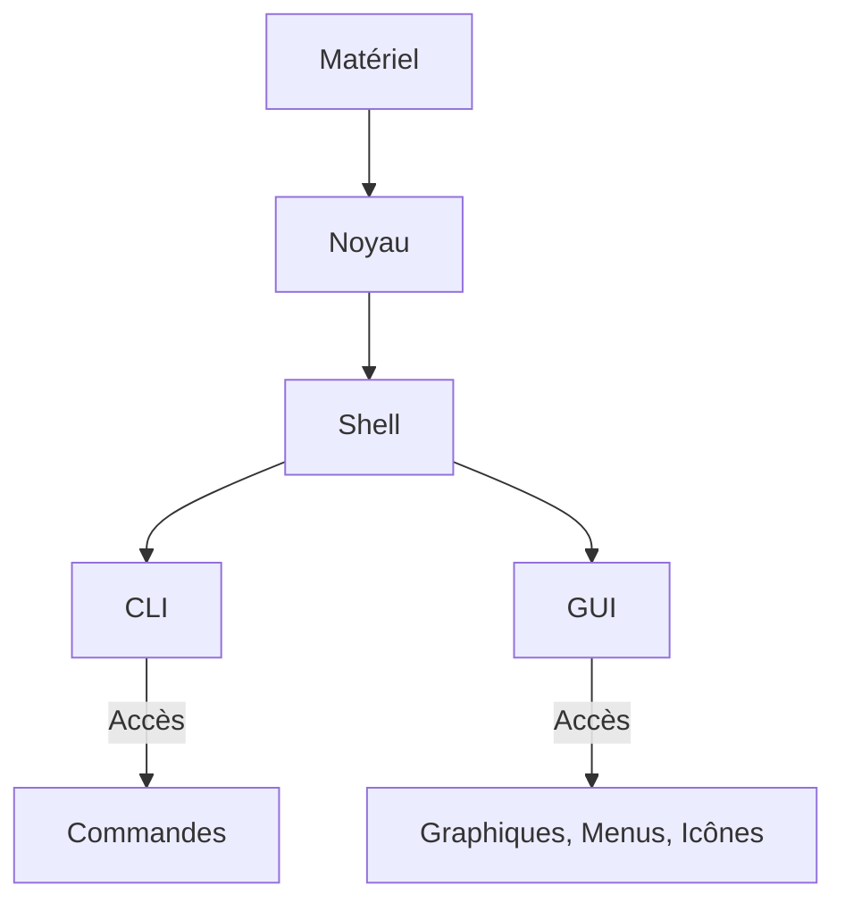

# Configuration de base IOS

**[[Les réseaux aujourd'hui]]**⬅️ - **[[#Ce que j'ai appris dans ce module|Résumé]]**⬇️ - **[[Modèles et protocoles]]**➡️ - Flashcard Anki🃏

---

## Accès à Cisco IOS
### Systèmes d'exploitation

Tous les périphériques finaux et de réseau nécessitent un système d'exploitation (SE). La partie du SE directement liée au matériel s'appelle le **noyau** (kernel en anglais), tandis que la partie liée aux applications et à l'utilisateur est appelée **interpréteur de commandes** (shell). L'utilisateur accède à l'interpréteur de commandes via une interface en ligne de commande (CLI) ou une interface utilisateur graphique (GUI).

#### Structure d'un Système d'exploitation



- **Interpréteur de commandes (Shell)** : Interface utilisateur qui permet aux utilisateurs de demander des tâches spécifiques à l'ordinateur, via CLI ou GUI.
- **Noyau (Kernel)** : Gère la communication entre le matériel et les logiciels, et administre l'utilisation des ressources matérielles pour répondre aux besoins logiciels.
- **Matériel (Hardware)** : Composants physiques d'un ordinateur, incluant l'électronique sous-jacente.

Lorsqu'un utilisateur utilise une interface en ligne de commande, il interagit directement avec le système dans un environnement textuel, en saisissant des commandes au clavier à l'invite de commandes. Par exemple :

```bash
analyst@secOps ~]$ ls
Desktop Downloads lab.support.files second_drive
[analyst@secOps ~]$

```

### Interface utilisateur

Une interface utilisateur graphique (GUI), telle que Windows, macOS, Linux KDE, Apple iOS ou Android, permet à l'utilisateur d'interagir avec le système à l'aide d'un environnement graphique, incluant des icônes, des menus et des fenêtres.

Bien que la GUI soit plus conviviale et accessible, elle ne propose pas toujours toutes les fonctionnalités disponibles dans la CLI. De plus, les interfaces graphiques peuvent être sujettes à des pannes ou des dysfonctionnements, ce qui explique pourquoi l'accès aux périphériques réseau se fait généralement via la CLI. La CLI est moins gourmande en ressources et offre une plus grande stabilité.

Le système d'exploitation des périphériques Cisco est connu sous le nom de **Cisco IOS** (Internetwork Operating System). Cisco IOS est utilisé par la plupart des routeurs et des commutateurs Cisco, quel que soit leur type ou leur taille. Chaque routeur ou type de commutateur utilise une version spécifique de Cisco IOS, tandis que d'autres systèmes d'exploitation de Cisco incluent **IOS XE**, **IOS XR**, et **NX-OS**.

**Note** : Le système d'exploitation des routeurs domestiques est souvent appelé **firmware**. La méthode la plus courante pour configurer un routeur domestique est d'utiliser une interface utilisateur graphique basée sur un navigateur web.

### Objectif d'un OS

Les systèmes d'exploitation réseau sont similaires aux systèmes d'exploitation d'ordinateurs. Grâce à une interface graphique, le système d'exploitation d'un PC permet à l'utilisateur de :

- Utiliser une souris pour faire des sélections et exécuter des programmes
- Saisir des commandes textuelles
- Afficher des images sur un écran

Un système d'exploitation réseau utilisant une CLI (comme Cisco IOS, installé sur un commutateur ou un routeur) permet à un technicien réseau de :

- Utiliser un clavier pour exécuter des programmes réseau basés sur CLI
- Saisir des commandes textuelles
- Afficher des images sur un écran

Les périphériques réseau exécutent des versions spécifiques de Cisco IOS, dont la version dépend du type de périphérique utilisé et des fonctions nécessaires. Bien que tous les périphériques possèdent une version d'IOS par défaut, il est possible de mettre à jour l'IOS ou d'ajouter des fonctionnalités pour bénéficier de fonctionnalités supplémentaires.

#### Exemple de téléchargement de logiciel Cisco


### Méthodes d'accès

Un commutateur transmet le trafic par défaut et n'a pas besoin d'être explicitement configuré pour fonctionner. Par exemple, deux hôtes configurés et connectés au même commutateur peuvent communiquer directement.

Malgré le comportement par défaut d'un nouveau commutateur, tous les commutateurs doivent être configurés et sécurisés.

|**Méthode**|**Description**|
|---|---|
|**Console**|Port de gestion permettant un accès hors réseau à un périphérique Cisco. L'accès hors bande est utilisé pour la maintenance. L'avantage d'utiliser un port de console est que le périphérique est accessible même sans configuration réseau. Nécessite un logiciel d'émulation de terminal et un câble de console.|
|**SSH (Secure Shell)**|Permet d'établir à distance une connexion CLI sécurisée via une interface virtuelle. Requiert des services réseau actifs sur le périphérique. La plupart des versions de Cisco IOS incluent un serveur et un client SSH.|
|**Telnet**|Méthode non sécurisée pour établir une session CLI à distance. Contrairement à SSH, Telnet n'est pas sécurisé et les informations sont envoyées en clair. À utiliser uniquement dans des environnements de laboratoire.|
|**Port auxiliaire**|Utilisé pour établir une session CLI à distance à l'aide d'un modem. Comme une connexion console, il ne nécessite pas de service réseau pour être configuré.|

**Remarque** : Certains périphériques, comme les routeurs, peuvent également prendre en charge un port auxiliaire ancien, qui était utilisé pour établir une session CLI à distance via un modem.

### Programmes d'émulation de terminal

Il existe d'excellents programmes d'émulation de terminal qui permettent de se connecter à un périphérique réseau via une connexion série sur un port de console ou via SSH ou Telnet. Ces programmes améliorent la productivité grâce à des fonctionnalités telles que la personnalisation de la taille des fenêtres, des polices et des jeux de couleurs.

---

Voici une version épurée de tes notes sur la navigation dans l'IOS, sans numérotation et en se concentrant sur l'essentiel :

---

## Navigation IOS

### Modes de commande principaux

Tous les périphériques réseau nécessitent un système d'exploitation (SE) configuré via une interface de ligne de commande (CLI) ou une interface graphique (GUI). La CLI offre un contrôle et une flexibilité supérieurs.

#### Modes de commande

- **Mode d'exécution utilisateur**  
  - **Description** : Fonctionnalités limitées pour les opérations de base, sans modification de configuration.  
  - **Invite** : `Switch>` ou `Router>`

- **Mode d'exécution privilégié**  
  - **Description** : Accès complet aux commandes et fonctionnalités, y compris la configuration.  
  - **Invite** : `Switch#` ou `Router#`

| Mode de commande                | Description                                                                                         | Invite par défaut   |
|----------------------------------|-----------------------------------------------------------------------------------------------------|----------------------|
| Mode d'exécution utilisateur      | Commandes de surveillance de base, mode "view-only".                                               | `Switch>` / `Router>` |
| Mode d'exécution privilégié       | Accès complet aux commandes de configuration et de gestion.                                        | `Switch#` / `Router#` |

### Mode de configuration et sous-modes

Pour configurer un périphérique, il faut accéder au **mode de configuration globale**. Ce mode permet des modifications affectant le périphérique dans son ensemble.

- **Mode de configuration globale** : `Switch(config)#`
- **Sous-modes courants** :
  - **Mode de configuration de ligne** : Pour configurer l'accès par la console, SSH, Telnet, ou AUX.  
    **Invite** : `Switch(config-line)#`
  - **Mode de configuration d'interface** : Pour configurer l'interface d'un port.  
    **Invite** : `Switch(config-if)#`

### Naviguer entre les différents modes IOS

#### Commandes de navigation

- **Passer au mode d'exécution privilégié** : `enable`
- **Retourner au mode d'exécution utilisateur** : `disable`
- **Accéder au mode de configuration globale** : `configure terminal`
- **Quitter le mode de configuration globale** : `exit`
- **Passer à un sous-mode de configuration de ligne** : `line [type] [numéro]`
- **Retour au mode de configuration globale** : `exit`
- **Passer au mode d'exécution privilégié** : `end` ou `Ctrl + Z`
- **Passer directement d'un sous-mode à un autre** : Sélectionner l'interface.

#### Exemple de navigation

```bash
Switch> enable
Switch# configure terminal
Switch(config)# line console 0
Switch(config-line)# exit
Switch(config)#
```

---
## Structure des commandes IOS

La syntaxe des commandes de Cisco IOS est cruciale pour configurer les périphériques via l'interface de ligne de commande (CLI).

### Syntaxe générale

- **Format** : `invite commande mot-clé [argument]`
  - **Mot-clé** : Paramètre prédéfini (ex. : `ip protocols`).
  - **Argument** : Valeur définie par l'utilisateur (ex. : `192.168.10.5`).

**Exemples** :
```bash
Switch> show ip protocols
Switch> ping 192.168.10.5
```

### Vérification de la syntaxe

- **Texte en gras** : Commandes et mots-clés à saisir tels quels.
- **Texte en italique** : Arguments à définir par l'utilisateur.
- **[x]** : Élément facultatif.
- **{x}** : Élément requis.

**Exemple** :
- `ping ip-address` → `ping 10.10.10.5`

### Aide contextuelle

- Tapez `?` pour obtenir des informations sur les commandes disponibles.
- L'interpréteur valide les commandes et fournit des retours en cas d'erreur.

### Raccourcis et touches d'accès rapide

| Touche          | Description                             |
|-----------------|-----------------------------------------|
| Tabulation      | Complète un nom de commande partiellement. |
| Ctrl + K        | Efface jusqu'à la fin de la ligne.    |
| Ctrl + W        | Efface le mot à gauche du curseur.    |
| Haut ou Ctrl + P| Rappelle les commandes antérieures.    |

### Quitter une opération

| Touche      | Description                                |
|-------------|--------------------------------------------|
| Ctrl + C    | Quitte le mode de configuration.           |
| Ctrl + Z    | Retourne au mode d'exécution.              |
| Ctrl + Maj + 6 | Interrompt les commandes en cours.      |

---
## Configuration de base des périphériques

### Noms de périphériques

Chaque périphérique doit avoir un nom d'hôte unique pour faciliter son identification. Par défaut, les périphériques reçoivent un nom générique (ex. : "Switch"). Pour une gestion efficace, remplace ce nom par un identifiant descriptif.

**Directives de dénomination** :
- Doit commencer par une lettre.
- Pas d'espaces.
- Se termine par une lettre ou un chiffre.
- Limité à 64 caractères.

**Exemple de noms** :
- Sw-Floor-1 (premier étage)
- Sw-Floor-2 (deuxième étage)
- Sw-Floor-3 (troisième étage)

Pour configurer le nom, accède au mode de configuration globale avec `configure terminal` et utilise `hostname <nom>`.

### Recommandations pour des mots de passe forts

Les mots de passe doivent être complexes pour protéger l'accès aux périphériques. Suivez ces recommandations :
- Plus de 8 caractères.
- Combinaison de lettres majuscules, minuscules, chiffres et caractères spéciaux.
- Évitez les mots courants et les mots de passe identiques sur plusieurs appareils.

**Exemple** : Utiliser un générateur de mots de passe en ligne pour créer des mots de passe robustes.

### Configuration des mots de passe

1. **Mode d'exécution utilisateur** : Accédez à la configuration de la console avec `line console 0`, définissez le mot de passe avec `password <mot de passe>` et activez-le avec `login`.

   ```plaintext
   Sw-Floor-1# configure terminal
   Sw-Floor-1(config)# line console 0
   Sw-Floor-1(config-line)# password <mot de passe>
   Sw-Floor-1(config-line)# login
   ```

2. **Accès privilégié** : Sécurisez l'accès avec `enable secret <mot de passe>`.

3. **Lignes VTY** : Configurez l'accès à distance avec `line vty 0 15`, définissez le mot de passe et activez-le.

   ```plaintext
   Sw-Floor-1# configure terminal
   Sw-Floor-1(config)# line vty 0 15
   Sw-Floor-1(config-line)# password <mot de passe>
   Sw-Floor-1(config-line)# login
   ```

### Chiffrer les mots de passe

Pour sécuriser les mots de passe dans les fichiers de configuration, utilisez `service password-encryption`.

```plaintext
Sw-Floor-1# configure terminal
Sw-Floor-1(config)# service password-encryption
```

### Messages de bannière

Ajoutez une bannière pour informer des accès autorisés. Utilisez la commande suivante :

```plaintext
Sw-Floor-1# configure terminal
Sw-Floor-1(config)# banner motd #Authorized Access Only#
```

Cette bannière s'affichera lors de chaque tentative d'accès au périphérique.

---

## Fichiers de configuration

La configuration des périphériques est stockée dans deux fichiers :

- **startup-config** : Fichier de configuration enregistré dans la NVRAM (mémoire non volatile). Il contient les commandes utilisées au démarrage. La NVRAM conserve les données même après une coupure de courant.
- **running-config** : Stocké dans la RAM (mémoire volatile), il reflète la configuration actuelle. Les modifications apportées ici affectent immédiatement le fonctionnement du périphérique.

Pour afficher la configuration en cours, utilisez la commande :

```bash
Sw-Floor-1# show running-config
```

Pour afficher la configuration initiale, utilisez :

```bash
Sw-Floor-1# show startup-config
```

**Note** : Les modifications non enregistrées dans la configuration initiale seront perdues en cas de panne de courant. Pour sauvegarder la configuration en cours, utilisez :

```bash
Sw-Floor-1# copy running-config startup-config
```

### Modifier la configuration en cours

Si des modifications non désirées ont été apportées à la configuration en cours, vous pouvez :

- Les supprimer individuellement.
- Redémarrer le périphérique avec la commande `reload` pour revenir à la configuration initiale. Notez que cela entraîne une interruption temporaire.

Si des modifications indésirables ont été enregistrées, vous pouvez effacer la configuration initiale avec :

```bash
Sw-Floor-1# erase startup-config
```

Après cela, rechargez le périphérique pour restaurer la configuration d'origine.

### Capturer la configuration dans un fichier texte

Pour archiver les fichiers de configuration, vous pouvez les enregistrer dans un document texte. Voici les étapes :

1. **Ouvrir un logiciel d'émulation de terminal** (ex. : PuTTY).
2. **Activer l'enregistrement** et spécifier un nom de fichier (ex. : MySwitchLogs).
3. **Exécuter la commande** pour afficher la configuration :

   ```bash
   Switch# show running-config
   ```

4. **Désactiver l'enregistrement** une fois terminé.

Pour restaurer une configuration à partir d'un fichier texte :

1. Accédez au mode de configuration globale sur le périphérique.
2. Copiez et collez le contenu du fichier texte dans le terminal.

Les commandes contenues dans le fichier seront appliquées à la configuration du périphérique.

---
## Ports et adresses

### Adresses IP

Félicitations, tu as terminé la configuration de base de ton appareil ! Cependant, pour permettre la communication entre les périphériques finaux, il est essentiel que chacun possède une adresse IP appropriée et soit correctement connecté. Cette section va te familiariser avec les adresses IP, les ports des périphériques et les supports de connexion.

Les adresses IP jouent un rôle crucial dans l'identification et la localisation des périphériques sur un réseau, permettant ainsi une communication fluide de bout en bout sur Internet. Chaque périphérique final d'un réseau doit être configuré avec une adresse IP unique. Voici quelques exemples de périphériques finaux :

- **Ordinateurs** : stations de travail, ordinateurs portables, serveurs de fichiers, serveurs web.
- **Imprimantes réseau** : pour imprimer des documents depuis n'importe quel ordinateur sur le réseau.
- **Téléphones VoIP** : pour passer des appels sur Internet.
- **Caméras de surveillance** : pour la sécurité à distance.
- **Smartphones et tablettes** : pour la connectivité mobile.
- **Périphériques portables** : comme les lecteurs de codes à barres sans fil.

#### Notation d'une adresse IPv4

La structure d'une adresse IPv4 est appelée « notation décimale à point » et se compose de quatre nombres décimaux, chacun compris entre 0 et 255, séparés par des points. Ces adresses sont attribuées aux périphériques connectés à un réseau. Par exemple, une adresse IPv4 pourrait ressembler à ceci :

```bash
Adresse IP : 192.168.1.10
```

**Remarque** : Dans ce cours, « IP » fait référence aux protocoles IPv4 et IPv6. L'IPv6 est la version la plus récente de l'IP et remplace progressivement l'IPv4, offrant une capacité d'adressage beaucoup plus grande.

#### Masque de sous-réseau

Avec une adresse IPv4, un masque de sous-réseau est également nécessaire. Ce dernier est une valeur de 32 bits qui différencie la partie réseau de l'adresse de la partie hôte. Associé à l'adresse IPv4, le masque de sous-réseau détermine à quel sous-réseau spécifique le périphérique appartient. Par exemple :

```bash
Masque de sous-réseau : 255.255.255.0
```

L'adresse de passerelle par défaut, qui permet à l'hôte d'accéder à des réseaux distants (y compris Internet), pourrait être :

```bash
Passerelle par défaut : 192.168.1.1
```

### Interfaces et ports

Les communications réseau dépendent des interfaces des périphériques utilisateurs finaux, des interfaces des périphériques réseau, ainsi que des câbles de connexion. Chaque interface possède des caractéristiques spécifiques qui la définissent. Il est donc crucial que le câble de connexion soit conforme aux normes physiques de l'interface.

Les supports de transmission peuvent inclure :

- **Câbles en cuivre à paires torsadées** : couramment utilisés dans les réseaux locaux (LAN).
- **Câbles à fibres optiques** : utilisés pour des transmissions à haute vitesse sur de longues distances.
- **Câbles coaxiaux** : souvent utilisés pour les réseaux câblés et la télévision par câble.
- **Connexions sans fil** : pour une flexibilité et une mobilité accrues.

#### Avantages et caractéristiques des supports

Chaque type de support réseau présente des avantages et des inconvénients. Voici quelques facteurs à considérer lors du choix d'un support :

- **Distance** : La portée maximale pour transporter un signal. Par exemple, les câbles en cuivre ont une portée limitée, tandis que les câbles à fibres optiques peuvent transmettre des signaux sur des kilomètres.
- **Environnement** : Le milieu dans lequel les supports seront installés. Par exemple, les câbles en cuivre sont sensibles aux interférences électromagnétiques, tandis que les câbles à fibres optiques sont plus résistants à ce type d'interférences.
- **Débit de transmission** : La quantité de données que le support peut transporter. Par exemple, les câbles à fibres optiques peuvent supporter des vitesses de transmission beaucoup plus élevées que les câbles en cuivre.
- **Coût** : Le coût des supports et de leur installation. Les câbles à fibres optiques, par exemple, peuvent être plus coûteux à installer que les câbles en cuivre.

### Ports de commutateur et interfaces virtuelles

Les commutateurs Cisco IOS de couche 2 sont équipés de ports physiques permettant à des périphériques de s'y connecter. Cependant, ces ports ne prennent pas en charge les adresses IP de couche 3. Pour cette raison, les commutateurs disposent de interfaces de commutateur virtuelles (SVI). Ces interfaces sont créées au niveau logiciel et n'ont pas de matériel associé.

L'interface virtuelle permet de gérer à distance un commutateur sur un réseau via IPv4 et IPv6. Chaque commutateur a par défaut une interface SVI, qui est généralement VLAN1.

**Remarque** : Bien qu'un commutateur de couche 2 n'ait pas besoin d'une adresse IP pour fonctionner correctement, l'adresse IP attribuée à l'interface SVI est nécessaire pour accéder au commutateur à distance.

---

Voici une version améliorée de tes notes sur la configuration de l'adressage IP. J'ai clarifié les concepts, corrigé des fautes et structuré les informations pour les rendre plus accessibles.

---

## Configuration de l'adressage IP

### Configuration manuelle des adresses IP des périphériques finaux

Tout comme tu as besoin des numéros de téléphone de tes amis pour leur envoyer des SMS ou les appeler, les périphériques de ton réseau ont besoin d'une adresse IP pour communiquer entre eux. Dans cette section, tu apprendras à configurer manuellement l'adressage IP sur des ordinateurs et des commutateurs.

Les informations d'adresse IPv4 peuvent être saisies manuellement sur les périphériques finaux ou attribuées automatiquement à l'aide du protocole DHCP (Dynamic Host Configuration Protocol).

#### Étapes pour configurer manuellement une adresse IPv4 sur un hôte Windows :

1. Ouvre le **Panneau de configuration**.
2. Sélectionne **Centre Réseau et partage**.
3. Clique sur **Modifier les paramètres de la carte**.
4. Choisis la carte réseau concernée, puis fais un clic droit et sélectionne **Propriétés**.
5. Surligne **Protocole Internet version 4 (TCP/IPv4)** et clique sur **Propriétés** pour ouvrir la fenêtre de configuration.

Voici un exemple de la fenêtre de propriétés TCP/IPv4, où tu pourras entrer l'adresse IP, le masque de sous-réseau et la passerelle par défaut.

```plaintext
Adresse IP : 192.168.1.10
Masque de sous-réseau : 255.255.255.0
Passerelle par défaut : 192.168.1.1
```

**Remarque :** Les adresses des serveurs DNS (Domain Name System) sont utilisées pour convertir des adresses IP en noms de domaine, par exemple, www.cisco.com. Les options de configuration IPv6 sont similaires à celles d'IPv4.

### Configuration automatique des adresses IP des périphériques finaux

La plupart des périphériques finaux utilisent par défaut le protocole DHCP pour la configuration automatique de leurs adresses IPv4. Ce protocole est omniprésent sur presque tous les réseaux. 

Imagine le temps que cela prendrait si chaque fois que tu te connectes au réseau, tu devais entrer manuellement l'adresse IPv4, le masque de sous-réseau, la passerelle par défaut et le serveur DNS. Dans une entreprise, cela pourrait rapidement devenir ingérable. De plus, la configuration manuelle augmente le risque de doublons d'adresses IP.

Pour configurer DHCP sur un PC Windows, suis ces étapes :

1. Ouvre la fenêtre de propriétés TCP/IPv4.
2. Sélectionne **Obtenir une adresse IP automatiquement** et **Obtenir les adresses des serveurs DNS automatiquement**.

Ton ordinateur recherchera alors un serveur DHCP et se verra attribuer les paramètres nécessaires pour communiquer sur le réseau.

**Remarque :** IPv6 utilise DHCPv6 et SLAAC (Stateless Address Auto-Configuration) pour l'allocation dynamique d'adresses.

### Vérification de la configuration IP sur un PC Windows

Pour afficher les paramètres de configuration IP d'un ordinateur Windows, utilise la commande `ipconfig` depuis l'invite de commandes. Cela te montrera les informations concernant l'adresse IPv4, le masque de sous-réseau et la passerelle, qui ont été reçues du serveur DHCP.

**Commande à entrer :**

```plaintext
C:\> ipconfig
```

### Configuration de l'interface de commutateur virtuelle

Pour accéder à distance à un commutateur, il est nécessaire de configurer une adresse IP et un masque de sous-réseau sur l'interface SVI (Switch Virtual Interface). Voici comment procéder :

1. Accède au mode de configuration globale du commutateur.
2. Utilise la commande `interface vlan 1` pour accéder à l'interface virtuelle.
3. Attribue une adresse IPv4 à l'interface avec la commande `ip address ip-address subnet-mask`.
4. Active l'interface avec la commande `no shutdown`.

Voici un exemple de configuration :

```plaintext
Sw-Floor-1# configure terminal
Sw-Floor-1(config)# interface vlan 1
Sw-Floor-1(config-if)# ip address 192.168.1.20 255.255.255.0
Sw-Floor-1(config-if)# no shutdown
Sw-Floor-1(config-if)# exit
Sw-Floor-1(config)# ip default-gateway 192.168.1.1
```

Une fois ces commandes exécutées, le commutateur sera configuré pour communiquer correctement sur le réseau.

---
## Ce que j'ai appris dans ce module

### Système d'exploitation des périphériques

- Tous les périphériques finaux et réseau requièrent un système d'exploitation (SE).
- L'utilisateur interagit avec le shell via une interface de ligne de commande (CLI) en utilisant un clavier pour entrer des commandes textuelles et afficher les résultats sur un moniteur.

### Modes de commande dans Cisco IOS

- **Sécurité** : Cisco IOS sépare l'accès aux fonctionnalités de gestion en deux modes de commande :
  - **Mode d'exécution utilisateur** : Accès limité aux commandes.
  - **Mode d'exécution privilégié** : Accès complet aux commandes de configuration.

- **Accès aux modes de configuration** :
  - Le mode de configuration globale est accessible à partir du mode d'exécution privilégié.
  - À partir du mode de configuration globale, l'utilisateur peut accéder à divers sous-modes de configuration, notamment :
    - Mode de configuration de ligne
    - Mode de configuration d'interface

- **Navigation entre les modes** :
  - Pour entrer en mode de configuration globale : `configure terminal` (depuis le mode d'exécution privilégié).
  - Pour quitter le mode de configuration : `exit` (depuis le mode de configuration globale).
  - Pour revenir en mode d'exécution privilégié : entrer `exit` à partir du mode de configuration.

### Syntaxe et commandes IOS

- Chaque commande IOS a une syntaxe spécifique qui doit être respectée selon le mode.
- La structure générale d'une commande consiste en un nom de commande suivi de mots-clés et d'arguments appropriés.
- **Aide contextuelle** : IOS propose deux formes d'aide pour les commandes :
  - Aide contextuelle : fournit des informations sur les commandes en fonction du mode actuel.
  - Vérification de la syntaxe : aide à valider la syntaxe des commandes.

### Configuration initiale et sécurité

- **Nom d'hôte** : La première commande de configuration sur un périphérique doit être l'attribution d'un nom d'hôte unique.
- **Mots de passe** : Toujours configurer des mots de passe pour limiter l'accès administratif. Utiliser des mots de passe de mode hiérarchique pour établir différents niveaux de privilèges d'accès.
- **Chiffrement des mots de passe** : Toujours chiffrer les mots de passe configurés.
- **Bannière de sécurité** : Ajouter une bannière pour signaler que l'accès est réservé au personnel autorisé.

### Fichiers de configuration

- Deux fichiers système stockent la configuration des périphériques :
  - **startup-config** : Configuration sauvegardée qui est chargée au démarrage.
  - **running-config** : Configuration en cours qui peut être modifiée sans être enregistrée.
- Les fichiers de configuration peuvent être enregistrés et archivés dans un document texte.

### Configuration des adresses IP

- **Adresses IP** : Chaque périphérique final d'un réseau doit être configuré avec une adresse IP pour établir la communication.
- **Notation décimale à point** : Une adresse IPv4 est composée de quatre nombres décimaux compris entre 0 et 255.
- **Attribution d'adresses IP** : 
  - Manuelle : Saisie manuelle des informations d'adresse.
  - Automatique : Utilisation du protocole DHCP (Dynamic Host Configuration Protocol) pour configurer automatiquement les adresses IPv4 des périphériques.

### Interfaces virtuelles et connectivité

- Pour accéder à distance au commutateur, configure une adresse IP et un masque de sous-réseau sur l'interface SVI (Switch Virtual Interface).
  - Utiliser la commande `interface vlan 1` pour configurer la SVI, qui est une interface virtuelle.

### Vérification de la configuration réseau

- Utilisation de commandes pour vérifier la configuration réseau sur les hôtes PC et les périphériques intermédiaires (commutateurs et routeurs).
- **Commandes de vérification** :
  - `show ip interface brief` : Vérifie l'état des interfaces des commutateurs.
  - `ping` : Teste la connectivité vers un autre périphérique sur le réseau ou vers un site web sur Internet.

---
**[[Les réseaux aujourd'hui]]**⬅️ - **[[#Configuration de base IOS|Retour]]**⬆️ - **[[Modèles et protocoles]]**➡️
