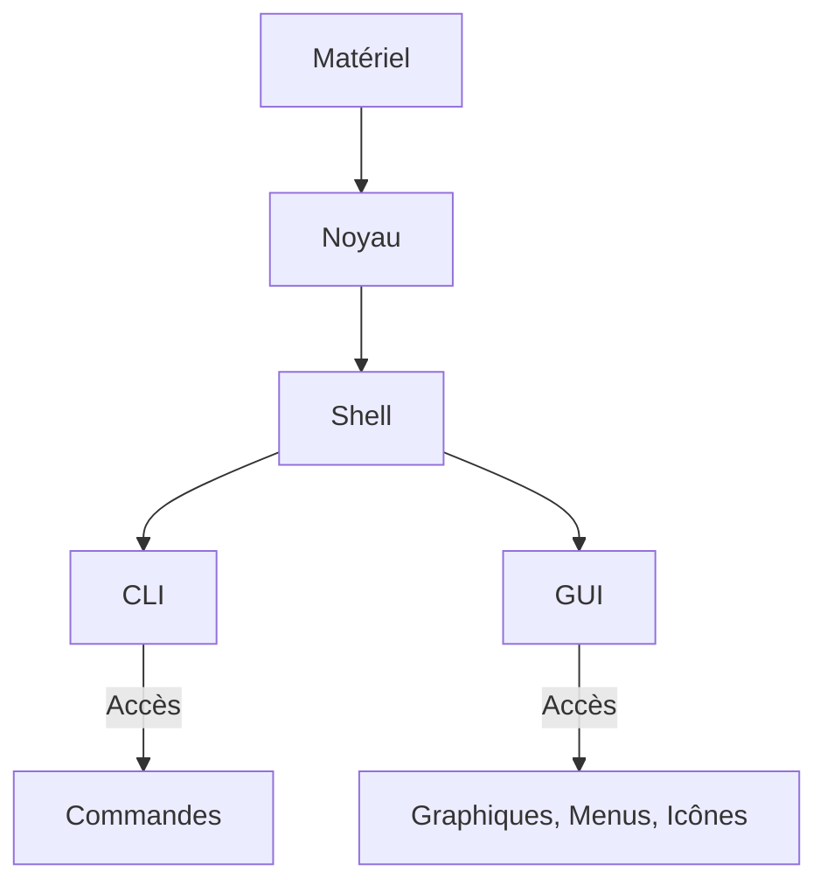

# Configuration de base IOS

[[Les réseaux aujourd'hui]]⬅️ - [[#Ce que j'ai appris dans ce module|Résumé]]⬇️ - [[Modèles et protocoles]]➡️ - [Flashcard Anki](https://drive.google.com/file/d/1oyqbi4pTTAc7pzTfQ-V0IJi-5HmR7hDw/view?usp=sharing)🃏

---
## Accès à Cisco IOS

### Systèmes d'exploitation

Tous les périphériques, qu'ils soient finaux ou de réseau, nécessitent un système d'exploitation (SE). Le SE se compose de deux parties :

- **Noyau (Kernel)** : Partie liée au matériel, qui gère la communication entre le matériel et les logiciels.
- **Interpréteur de commandes (Shell)** : Interface utilisateur qui permet d’exécuter des commandes, soit via une interface en ligne de commande (CLI), soit via une interface utilisateur graphique (GUI).

#### Structure d'un Système d'exploitation



### Types d'interfaces

- **CLI (Interface en ligne de commande)** : Permet d'interagir avec le système par des commandes textuelles. Par exemple :

```bash
analyst@secOps ~]$ ls
Desktop Downloads lab.support.files second_drive
[analyst@secOps ~]$
```

- **GUI (Interface utilisateur graphique)** : Interface conviviale avec des icônes et des menus, utilisée dans des systèmes comme Windows ou macOS. Elle est généralement moins stable et moins performante que la CLI.

### Cisco IOS

Le système d'exploitation des périphériques Cisco est **Cisco IOS** (Internetwork Operating System), utilisé par la plupart des routeurs et des commutateurs Cisco. D'autres variantes incluent **IOS XE**, **IOS XR**, et **NX-OS**.

**Remarque** : Le logiciel des routeurs domestiques est souvent appelé **firmware**.

### Objectifs d'un Système d'exploitation

Les systèmes d'exploitation réseau, comme Cisco IOS, permettent aux techniciens de :

- Exécuter des commandes réseau via la CLI.
- Configurer et surveiller des périphériques réseau.
- Afficher des informations sur l'écran.

### Méthodes d'accès

Pour configurer un commutateur ou un routeur Cisco, plusieurs méthodes d'accès existent :

| **Méthode**         | **Description**                                                                                                                                                                     |
|---------------------|-------------------------------------------------------------------------------------------------------------------------------------------------------------------------------------|
| **Console**         | Accès hors réseau via un port de gestion, utile pour la maintenance. Nécessite un logiciel d'émulation de terminal et un câble de console.                                         |
| **SSH (Secure Shell)** | Connexion sécurisée à distance via CLI. Requiert que des services réseau soient actifs sur le périphérique.                                                                        |
| **Telnet**          | Connexion à distance non sécurisée. À utiliser uniquement dans des environnements de laboratoire, car les données sont envoyées en clair.                                        |
| **Port auxiliaire** | Accès à distance via un modem, ne nécessite pas de configuration réseau. Ce port peut être utilisé pour établir une session CLI sans accès réseau.                                   |

### Programmes d'émulation de terminal

Les programmes d'émulation de terminal permettent de se connecter aux périphériques réseau via une connexion série (port de console) ou des protocoles comme SSH et Telnet. Ils offrent des fonctionnalités utiles telles que :

- Personnalisation de l'affichage (taille des fenêtres, polices, couleurs).
- Amélioration de la productivité lors de la configuration des périphériques.

---
## Navigation IOS

### Modes de commande principaux

Tous les périphériques réseau utilisent un système d'exploitation (SE) qui se configure via une interface de ligne de commande (CLI) ou une interface graphique (GUI). La CLI offre un contrôle et une flexibilité supérieurs.

#### Modes de commande

1. **Mode d'exécution utilisateur**  
   - **Description** : Accès limité aux fonctionnalités de base, sans possibilité de modifier la configuration.  
   - **Invite** : `Switch>` ou `Router>`

2. **Mode d'exécution privilégié**  
   - **Description** : Accès complet aux commandes, y compris la configuration.  
   - **Invite** : `Switch#` ou `Router#`

| Mode de commande                | Description                                                             | Invite par défaut       |
|----------------------------------|-------------------------------------------------------------------------|--------------------------|
| Mode d'exécution utilisateur      | Commandes de surveillance de base, mode "view-only".                   | `Switch>` / `Router>`     |
| Mode d'exécution privilégié       | Accès complet aux commandes de configuration et de gestion.             | `Switch#` / `Router#`    |

### Mode de configuration et sous-modes

Pour configurer un périphérique, il est nécessaire d'accéder au **mode de configuration globale**, qui permet des modifications affectant le périphérique dans son ensemble.

- **Mode de configuration globale** : `Switch(config)#`
- **Sous-modes courants** :
  - **Mode de configuration de ligne** : Pour configurer l'accès par la console, SSH, Telnet, ou AUX.  
    **Invite** : `Switch(config-line)#`
  - **Mode de configuration d'interface** : Pour configurer une interface de port.  
    **Invite** : `Switch(config-if)#`

### Naviguer entre les différents modes IOS

#### Commandes de navigation

- **Passer au mode d'exécution privilégié** : `enable`
- **Retourner au mode d'exécution utilisateur** : `disable`
- **Accéder au mode de configuration globale** : `configure terminal`
- **Quitter le mode de configuration globale** : `exit`
- **Passer à un sous-mode de configuration de ligne** : `line [type] [numéro]`
- **Retourner au mode de configuration globale** : `exit`
- **Passer au mode d'exécution privilégié** : `end` ou `Ctrl + Z`
- **Passer directement d'un sous-mode à un autre** : Sélectionner l'interface.

#### Exemple de navigation

Voici un exemple typique de navigation entre les modes :

```bash
Switch> enable
Switch# configure terminal
Switch(config)# line console 0
Switch(config-line)# exit
Switch(config)#
```

---
## Structure des commandes IOS

La syntaxe des commandes de Cisco IOS est essentielle pour configurer les périphériques via l'interface de ligne de commande (CLI).

### Syntaxe générale

- **Format** : `invite commande mot-clé [argument]`
  - **Mot-clé** : Paramètre prédéfini (ex. : `ip protocols`).
  - **Argument** : Valeur définie par l'utilisateur (ex. : `192.168.10.5`).

**Exemples** :
```bash
Switch> show ip protocols
Switch> ping 192.168.10.5
```

### Vérification de la syntaxe

- **Texte en gras** : Commandes et mots-clés à saisir tels quels.
- **Texte en italique** : Arguments à définir par l'utilisateur.
- **[x]** : Élément facultatif.
- **{x}** : Élément requis.

**Exemple** :
- `ping ip-address` → `ping 10.10.10.5`

### Aide contextuelle

- Tapez `?` pour obtenir des informations sur les commandes disponibles.
- L'interpréteur valide les commandes et fournit des retours en cas d'erreur.

### Raccourcis et touches d'accès rapide

| Touche           | Description                                         |
|------------------|-----------------------------------------------------|
| **Tabulation**    | Complète un nom de commande partiellement.          |
| **Ctrl + K**      | Efface jusqu'à la fin de la ligne.                 |
| **Ctrl + W**      | Efface le mot à gauche du curseur.                 |
| **Haut ou Ctrl + P** | Rappelle les commandes antérieures.              |

### Quitter une opération

| Touche          | Description                                      |
|-----------------|--------------------------------------------------|
| **Ctrl + C**    | Quitte le mode de configuration.                 |
| **Ctrl + Z**    | Retourne au mode d'exécution.                    |
| **Ctrl + Maj + 6** | Interrompt les commandes en cours.             |

---
## Configuration de base des périphériques

### Noms de périphériques

Chaque périphérique doit avoir un nom d'hôte unique pour faciliter son identification. Par défaut, les périphériques reçoivent un nom générique (ex. : "Switch"). Pour une gestion efficace, remplace ce nom par un identifiant descriptif.

**Directives de dénomination** :
- Doit commencer par une lettre.
- Pas d'espaces.
- Se termine par une lettre ou un chiffre.
- Limité à 64 caractères.

**Exemples de noms** :
- `Sw-Floor-1` (premier étage)
- `Sw-Floor-2` (deuxième étage)
- `Sw-Floor-3` (troisième étage)

**Configuration** :
Accédez au mode de configuration globale avec `configure terminal` et utilisez `hostname <nom>`.

### Recommandations pour des mots de passe forts

Les mots de passe doivent être complexes pour protéger l'accès aux périphériques. Suivez ces recommandations :
- Plus de 8 caractères.
- Combinaison de lettres majuscules, minuscules, chiffres et caractères spéciaux.
- Évitez les mots courants et les mêmes mots de passe sur plusieurs appareils.

**Exemple** : Utiliser un générateur de mots de passe en ligne pour créer des mots de passe robustes.

### Configuration des mots de passe

1. **Mot de passe de la console** :
   - Accédez à la configuration de la console avec `line console 0`.
   - Définissez le mot de passe avec `password <mot_de_passe>`.
   - Activez-le avec `login`.

   ```plaintext
   Sw-Floor-1# configure terminal
   Sw-Floor-1(config)# line console 0
   Sw-Floor-1(config-line)# password <mot_de_passe>
   Sw-Floor-1(config-line)# login
   ```

2. **Mot de passe d'accès privilégié** :
   - Sécurisez l'accès avec `enable secret <mot_de_passe>`.

3. **Lignes VTY (Virtual Terminal Lines)** :
   - Configurez l'accès à distance avec `line vty 0 15`.
   - Définissez le mot de passe et activez-le.

   ```plaintext
   Sw-Floor-1# configure terminal
   Sw-Floor-1(config)# line vty 0 15
   Sw-Floor-1(config-line)# password <mot_de_passe>
   Sw-Floor-1(config-line)# login
   ```

### Chiffrer les mots de passe

Pour sécuriser les mots de passe dans les fichiers de configuration, utilisez la commande suivante :

```plaintext
Sw-Floor-1# configure terminal
Sw-Floor-1(config)# service password-encryption
```

### Messages de bannière

Ajoutez une bannière pour informer des accès autorisés. Utilisez la commande suivante :

```plaintext
Sw-Floor-1# configure terminal
Sw-Floor-1(config)# banner motd #Authorized Access Only#
```

Cette bannière s'affichera lors de chaque tentative d'accès au périphérique.

---
## Fichiers de configuration

La configuration des périphériques est stockée dans deux fichiers principaux :

- **startup-config** : Fichier de configuration enregistré dans la NVRAM (mémoire non volatile). Il contient les commandes utilisées au démarrage et est conservé même en cas de coupure de courant.
  
- **running-config** : Stocké dans la RAM (mémoire volatile), il reflète la configuration actuelle. Les modifications apportées ici prennent effet immédiatement.

### Afficher les configurations

- Pour afficher la configuration en cours :
  ```bash
  Sw-Floor-1# show running-config
  ```

- Pour afficher la configuration initiale :
  ```bash
  Sw-Floor-1# show startup-config
  ```

**Note** : Les modifications non enregistrées dans la configuration initiale seront perdues en cas de coupure de courant. Pour sauvegarder la configuration en cours, utilisez :
```bash
Sw-Floor-1# copy running-config startup-config
```

### Modifier la configuration en cours

Si des modifications non désirées ont été apportées à la configuration en cours, vous pouvez :

- Les supprimer individuellement.
- Redémarrer le périphérique avec la commande `reload` pour revenir à la configuration initiale. Attention, cela entraîne une interruption temporaire.

Si des modifications indésirables ont été enregistrées, vous pouvez effacer la configuration initiale avec :
```bash
Sw-Floor-1# erase startup-config
```

Après cela, rechargez le périphérique pour restaurer la configuration d'origine.

### Capturer la configuration dans un fichier texte

Pour archiver les fichiers de configuration, vous pouvez les enregistrer dans un document texte. Voici les étapes :

1. **Ouvrir un logiciel d'émulation de terminal** (ex. : PuTTY).
2. **Activer l'enregistrement** et spécifier un nom de fichier (ex. : MySwitchLogs).
3. **Exécuter la commande** pour afficher la configuration :
   ```bash
   Switch# show running-config
   ```
4. **Désactiver l'enregistrement** une fois terminé.

### Restaurer une configuration à partir d'un fichier texte

1. Accédez au mode de configuration globale sur le périphérique.
2. Copiez et collez le contenu du fichier texte dans le terminal.

Les commandes contenues dans le fichier seront appliquées à la configuration du périphérique.

---
## Configuration de l'adressage IP

### Introduction aux adresses IP

Pour permettre la communication entre les périphériques d'un réseau, chaque appareil doit avoir une adresse IP unique. Cette section te familiarisera avec les adresses IP, les ports des périphériques et les supports de connexion.

Les adresses IP permettent d'identifier et de localiser les périphériques sur un réseau. Voici quelques exemples de périphériques finaux nécessitant une adresse IP :

- **Ordinateurs** : stations de travail, ordinateurs portables, serveurs.
- **Imprimantes réseau** : pour imprimer des documents depuis n'importe quel ordinateur.
- **Téléphones VoIP** : pour passer des appels sur Internet.
- **Caméras de surveillance** : pour la sécurité à distance.
- **Smartphones et tablettes** : pour la connectivité mobile.

### Notation d'une adresse IPv4

Une adresse IPv4 est exprimée en notation décimale à point, composée de quatre nombres décimaux (0-255) séparés par des points. Par exemple :
```plaintext
Adresse IP : 192.168.1.10
```

**Remarque** : Le terme « IP » fait référence à la fois aux protocoles IPv4 et IPv6, ce dernier offrant une capacité d'adressage plus importante.

### Masque de sous-réseau

Le masque de sous-réseau, également nécessaire avec une adresse IPv4, détermine la partie réseau et la partie hôte de l'adresse. Par exemple :
```plaintext
Masque de sous-réseau : 255.255.255.0
```

La passerelle par défaut permet aux hôtes d'accéder à d'autres réseaux :
```plaintext
Passerelle par défaut : 192.168.1.1
```

### Interfaces et ports

Les communications réseau reposent sur les interfaces des périphériques et les câbles de connexion. Voici quelques supports de transmission courants :

- **Câbles en cuivre à paires torsadées** : utilisés dans les réseaux locaux (LAN).
- **Câbles à fibres optiques** : pour des transmissions à haute vitesse sur de longues distances.
- **Câbles coaxiaux** : souvent utilisés pour la télévision par câble.
- **Connexions sans fil** : pour une plus grande flexibilité.

#### Avantages et caractéristiques des supports

Lors du choix d'un support réseau, il est important de considérer :

- **Distance** : Portée maximale pour transporter un signal.
- **Environnement** : Sensibilité aux interférences électromagnétiques.
- **Débit de transmission** : Capacité à transporter des données.
- **Coût** : Coût des supports et de leur installation.

### Ports de commutateur et interfaces virtuelles

Les commutateurs Cisco IOS de couche 2 disposent de ports physiques, mais ces derniers ne prennent pas en charge les adresses IP de couche 3. Pour gérer un commutateur à distance, on utilise des interfaces de commutateur virtuelles (SVI), qui n'ont pas de matériel associé.

Par défaut, chaque commutateur a une interface SVI, généralement VLAN1. L'adresse IP attribuée à cette interface est nécessaire pour l'accès à distance.

---

## Configuration manuelle des adresses IP des périphériques finaux

Pour configurer manuellement une adresse IP sur un périphérique, suis ces étapes pour un hôte Windows :

1. Ouvre le **Panneau de configuration**.
2. Sélectionne **Centre Réseau et partage**.
3. Clique sur **Modifier les paramètres de la carte**.
4. Fais un clic droit sur la carte réseau et sélectionne **Propriétés**.
5. Sélectionne **Protocole Internet version 4 (TCP/IPv4)** et clique sur **Propriétés**.

Dans la fenêtre de configuration, entre les informations suivantes :

```plaintext
Adresse IP : 192.168.1.10
Masque de sous-réseau : 255.255.255.0
Passerelle par défaut : 192.168.1.1
```

**Remarque** : Les serveurs DNS permettent de convertir des adresses IP en noms de domaine (ex. : www.cisco.com).

### Configuration automatique des adresses IP avec DHCP

La plupart des périphériques finaux utilisent DHCP (Dynamic Host Configuration Protocol) pour obtenir automatiquement leur adresse IP. Pour activer DHCP sur un PC Windows :

1. Ouvre la fenêtre de propriétés TCP/IPv4.
2. Sélectionne **Obtenir une adresse IP automatiquement** et **Obtenir les adresses des serveurs DNS automatiquement**.

### Vérification de la configuration IP sur un PC Windows

Pour afficher les paramètres IP d'un ordinateur Windows, utilise la commande `ipconfig` depuis l'invite de commandes :

```plaintext
C:\> ipconfig
```

### Configuration de l'interface de commutateur virtuelle (SVI)

Pour configurer l'accès à distance sur un commutateur, attribue une adresse IP à l'interface SVI :

1. Accède au mode de configuration globale :
   ```plaintext
   Sw-Floor-1# configure terminal
   ```
2. Accède à l'interface VLAN 1 :
   ```plaintext
   Sw-Floor-1(config)# interface vlan 1
   ```
3. Attribue une adresse IP :
   ```plaintext
   Sw-Floor-1(config-if)# ip address 192.168.1.20 255.255.255.0
   ```
4. Active l'interface :
   ```plaintext
   Sw-Floor-1(config-if)# no shutdown
   ```
5. Configure la passerelle par défaut :
   ```plaintext
   Sw-Floor-1(config)# ip default-gateway 192.168.1.1
   ```

Une fois ces commandes exécutées, le commutateur sera configuré pour communiquer sur le réseau.

---
## Ce que j'ai appris dans ce module

### Système d'exploitation des périphériques

- **Importance d'un système d'exploitation (SE)** : Tous les périphériques finaux et de réseau nécessitent un SE pour fonctionner.
- **Interface de ligne de commande (CLI)** : L'utilisateur interagit avec le système via un shell, en entrant des commandes textuelles à l'aide d'un clavier et en visualisant les résultats sur un moniteur.

### Modes de commande dans Cisco IOS

- **Sécurité des accès** : Cisco IOS sépare l'accès aux fonctionnalités de gestion en deux modes :
  - **Mode d'exécution utilisateur** : Accès limité aux commandes.
  - **Mode d'exécution privilégié** : Accès complet aux commandes de configuration.

- **Accès aux modes de configuration** :
  - Le mode de configuration globale est accessible depuis le mode d'exécution privilégié.
  - On peut accéder à divers sous-modes de configuration, notamment :
    - Mode de configuration de ligne
    - Mode de configuration d'interface

- **Navigation entre les modes** :
  - Entrer en mode de configuration globale : `configure terminal` (depuis le mode d'exécution privilégié).
  - Quitter le mode de configuration : `exit` (depuis le mode de configuration globale).
  - Revenir en mode d'exécution privilégié : `exit` à partir du mode de configuration.

### Syntaxe et commandes IOS

- **Syntaxe des commandes** : Chaque commande IOS suit une syntaxe spécifique selon le mode.
- **Structure des commandes** : Composée d'un nom de commande suivi de mots-clés et d'arguments.
- **Aide contextuelle** :
  - Fournit des informations sur les commandes selon le mode actuel.
  - Aide à valider la syntaxe des commandes.

### Configuration initiale et sécurité

- **Nom d'hôte** : La première commande de configuration doit attribuer un nom d'hôte unique.
- **Mots de passe** : Toujours configurer des mots de passe pour sécuriser l'accès administratif et établir différents niveaux de privilèges.
- **Chiffrement des mots de passe** : Il est crucial de chiffrer les mots de passe configurés.
- **Bannière de sécurité** : Ajouter une bannière pour indiquer que l'accès est réservé au personnel autorisé.

### Fichiers de configuration

- **Types de fichiers de configuration** :
  - **startup-config** : Configuration sauvegardée, chargée au démarrage.
  - **running-config** : Configuration en cours, modifiable sans être enregistrée.
- **Archivage** : Les fichiers de configuration peuvent être enregistrés dans un document texte pour archivage.

### Configuration des adresses IP

- **Adresses IP** : Chaque périphérique final d'un réseau doit avoir une adresse IP pour communiquer.
- **Notation décimale à point** : Une adresse IPv4 se compose de quatre nombres décimaux compris entre 0 et 255.
- **Attribution d'adresses IP** :
  - **Manuelle** : Saisie directe des informations d'adresse.
  - **Automatique** : Utilisation de DHCP (Dynamic Host Configuration Protocol) pour configurer automatiquement les adresses IP.

### Interfaces virtuelles et connectivité

- **Interface SVI (Switch Virtual Interface)** : Pour accéder à distance à un commutateur, configure une adresse IP et un masque de sous-réseau sur l'interface SVI.
  - Commande pour configurer la SVI : `interface vlan 1`.

### Vérification de la configuration réseau

- **Commandes de vérification** : Utiliser des commandes pour vérifier la configuration réseau sur les hôtes PC et les périphériques intermédiaires.
  - **Exemples de commandes** :
    - `show ip interface brief` : Vérifie l'état des interfaces des commutateurs.
    - `ping` : Teste la connectivité vers un autre périphérique sur le réseau ou vers un site web.

---
[[Les réseaux aujourd'hui]]⬅️ - [[#Configuration de base IOS|Retour]]⬆️ - [[Modèles et protocoles]]➡️
