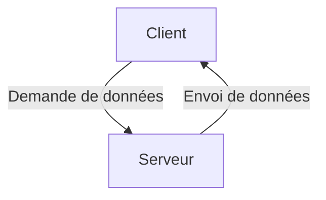
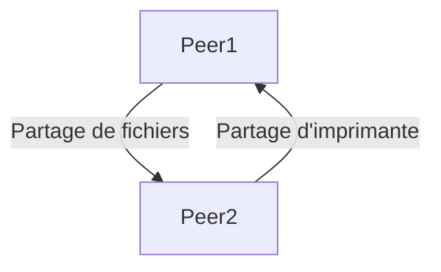
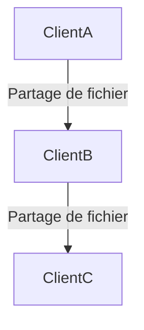

# Couche Application

[[Couche de Transport]]⬅️ - [[#Résumé| Résumé]]⬇️ - [[Fondamentaux de la Sécurité Réseau]]➡️ - [Flashcards](https://drive.google.com/file/d/16jO1fym2W2_u71CpyixgiMm2aRtRQ_nb/view?usp=sharing)🃏

---

## Table des matières

1. [[#Application, Présentation, et Session]]
2. [[#Peer-to-Peer]]
3. [[#Résumé]]

---

## Application, Présentation, et Session

### Couche Application

Dans les modèles OSI et TCP/IP, la couche application est la plus proche de l'utilisateur final. Elle fournit l'interface entre les applications utilisées pour communiquer et le réseau sous-jacent sur lequel les messages sont transmis. Les protocoles de la couche application échangent des données entre les programmes exécutés sur les hôtes source et destination.

Les trois couches supérieures du modèle OSI (application, présentation et session) définissent les fonctions de la couche application TCP/IP. De nombreux protocoles existent à cette couche, comme HTTP, FTP, TFTP, IMAP et DNS.

![[OsiModelApplicationLayer.png|Image montrant le modèle OSI en mettant l'accent sur la couche application ]]

### Couche Présentation

La couche présentation a trois fonctions principales :
- Formater les données pour qu'elles soient compatibles avec le dispositif de destination.
- Compresser les données de manière à ce qu'elles puissent être décompressées par le dispositif de destination.
- Chiffrer les données pour la transmission et les déchiffrer à la réception.

Elle formate les données pour la couche application et définit des normes pour les formats de fichiers. Exemples : MKV, MPG, MOV pour la vidéo; GIF, JPG, PNG pour les images.

![[OsiModelPresentationLayer.png|Image montrant le modèle OSI avec un focus sur la couche Présentation]]

### Couche Session

La couche session crée et maintient des dialogues entre les applications source et destination. Elle gère l'échange d'informations pour initier des dialogues, les maintenir actifs et redémarrer les sessions interrompues ou inactives.

### Protocoles de la Couche Application TCP/IP

Les protocoles de la couche application TCP/IP spécifient le format et les informations de contrôle nécessaires pour de nombreuses fonctions de communication internet. Ils sont utilisés par les dispositifs source et destination pendant une session de communication. Pour que les communications soient réussies, les protocoles doivent être compatibles entre l'hôte source et l'hôte destination.

**Tableau récapitulatif des protocoles de la couche application :**

| Fonction              | Protocole | Description                                    |
| --------------------- | --------- | ---------------------------------------------- |
| Système de Noms       | [[DNS]]   | Résolution de noms de domaine en adresses IP   |
| Config des Hôtes      | [[BOOTP]] | Configuration initiale des hôtes               |
|                       | [[DHCP]]  | Protocole de configuration dynamique des hôtes |
| Email                 | [[SMTP]]  | Envoi de courriels                             |
|                       | [[POP3]]  | Récupération de courriels                      |
|                       | [[IMAP]]  | Accès aux courriels                            |
| Transfert de Fichiers | [[FTP]]   | Transfert de fichiers                          |
|                       | [[TFTP]]  | Transfert de fichiers trivial                  |
| Web                   | [[HTTP]]  | Protocole de transfert hypertexte              |
|                       | [[HTTPS]] | Protocole de transfert hypertexte sécurisé     |

---
## Peer-to-Peer

### Modèle Client-Serveur

Le modèle client-serveur est fondamental pour comprendre comment les protocoles de la couche application du TCP/IP fonctionnent. Dans ce modèle :

- **Client** : L'appareil qui demande des informations.
- **Serveur** : L'appareil qui répond à cette demande.

Le client et le serveur communiquent via des processus de la couche application. Le client commence en demandant des données au serveur, qui répond en envoyant les données demandées. Cet échange peut également inclure une authentification de l'utilisateur et la spécification du fichier à transférer.

**Exemple :** Utiliser le service de messagerie d'un fournisseur d'accès à Internet (FAI) pour envoyer, recevoir et stocker des emails. Le client de messagerie sur un ordinateur demande au serveur de messagerie du FAI les emails non lus, et le serveur répond en envoyant les emails demandés.

### Réseaux Peer-to-Peer (P2P)

Dans un modèle de réseau peer-to-peer (P2P), les données sont accessibles directement entre appareils pairs sans serveur dédié.

#### Réseaux P2P

Dans un réseau P2P :

- Deux ou plusieurs ordinateurs sont connectés et peuvent partager des ressources sans serveur dédié.
- Chaque appareil connecté (pair) peut fonctionner à la fois comme serveur et comme client, selon la demande.

**Exemple :** Partager des fichiers, jouer en réseau, ou partager une connexion Internet.

#### Applications P2P

Une application P2P permet à un appareil d'agir à la fois comme client et serveur dans la même communication. Chaque client est également un serveur.

Certaines applications P2P utilisent un système hybride où le partage des ressources est décentralisé, mais les index pointant vers les ressources sont stockés dans un annuaire centralisé. Les pairs accèdent à un serveur d'index pour obtenir l'emplacement d'une ressource sur un autre pair.

**Applications P2P courantes :**
- BitTorrent
- Direct Connect
- eDonkey
- Freenet

Certaines applications P2P, basées sur le protocole Gnutella, permettent aux utilisateurs de partager des fichiers entiers entre eux. Les clients utilisent un fichier torrent pour localiser d'autres utilisateurs ayant les morceaux de fichier dont ils ont besoin et se connectent directement à eux. Ce processus est appelé un **essaim** et la technologie utilisée est BitTorrent.

**Note :** Les fichiers partagés peuvent être protégés par des droits d'auteur. Télécharger ou distribuer des fichiers protégés sans permission est illégal et peut entraîner des poursuites judiciaires.

---
## Résumé

### Couche Application, Présentation et Session
- **Couche Application :** C'est la couche la plus proche de l'utilisateur dans les modèles OSI et TCP/IP. Elle permet l'échange de données entre les programmes sur les hôtes source et destination.
- **Couche Présentation :** Elle formate les données, les compresse pour transmission et les crypte pour sécuriser leur transfert.
- **Couche Session :** Elle gère les dialogues entre les applications, initiant et maintenant des sessions.

### Peer-to-Peer (P2P)
- **Modèle Client-Serveur :** Le client demande des informations au serveur, qui répond avec les données. 
- **Réseaux P2P :** Plusieurs ordinateurs partagent des ressources sans serveur dédié. Chaque appareil (pair) peut être à la fois client et serveur.
- **Applications P2P :** Les applications comme BitTorrent utilisent des fichiers torrent pour partager des morceaux de fichiers entre utilisateurs.

### Protocoles Web et Email
- **HTTP :** Protocole de communication entre navigateurs web et serveurs, utilisant des messages GET, POST et PUT. HTTPS ajoute une couche de sécurité avec SSL.
- **SMTP, POP, IMAP :** SMTP envoie des emails, POP télécharge des emails (les supprime du serveur), tandis qu’IMAP permet de conserver les emails sur le serveur tout en accédant à des copies sur le client.

### Services d'Adressage IP
- **DNS :** Résout les noms de domaine en adresses IP et utilise une hiérarchie de serveurs pour gérer ces résolutions.
- **DHCP :** Automatise l'attribution d'adresses IP et d'autres paramètres de réseau. DHCPv4 et DHCPv6 permettent de configurer les appareils sur un réseau.

### Services de Partage de Fichiers
- **FTP :** Un client FTP connecte un serveur FTP pour télécharger (pull) ou télécharger (push) des fichiers. Le port TCP 21 est utilisé pour le contrôle, et le port 20 pour le transfert de données.
- **SMB :** Permet l'accès à distance aux fichiers et imprimantes, en maintenant une connexion à long terme avec le serveur.

---
[[Couche de Transport]]⬅️ - [[#Couche de Transport|Retour]]⬆️ - [[Fondamentaux de la Sécurité Réseau]]➡️