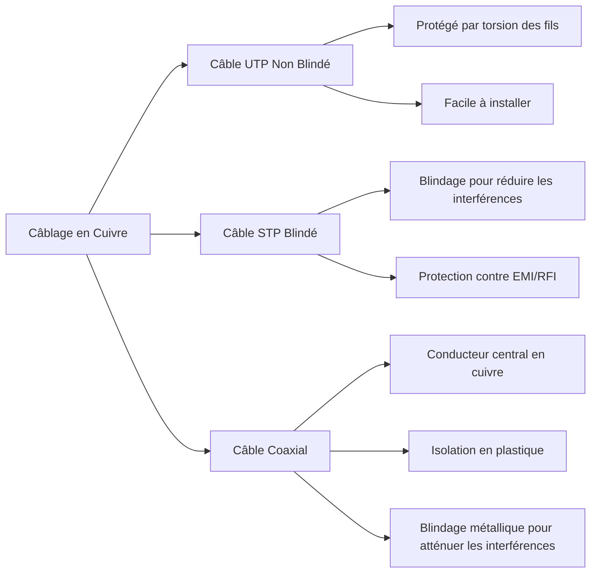
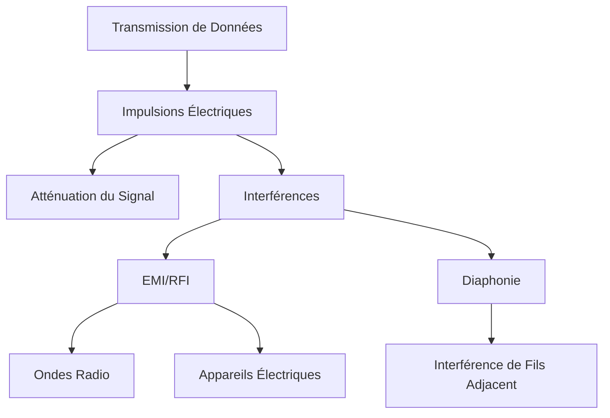

# Couche Physique (Physical Layer)

[[Modèles et protocoles]]⬅️ - [[#Résumé|Résumé]]⬇️ - [[]]➡️ - 🃏

---

## Objectif de la Couche Physique

### La Connexion Physique

Pour que toute communication réseau puisse avoir lieu, une connexion physique à un réseau local doit d'abord être établie. Cette connexion physique peut être soit filaire, utilisant un câble, soit sans fil, utilisant des ondes radio.

- **Connexion Filaire** : Dans de nombreux bureaux d'entreprises, les employés utilisent des ordinateurs de bureau ou portables connectés via des câbles à un commutateur partagé. Dans ce cas, les données sont transmises à travers un câble physique.
- **Connexion Sans Fil** : De nombreuses entreprises offrent également des connexions sans fil pour les ordinateurs portables, les tablettes et les smartphones. Les données sont alors transmises en utilisant des ondes radio. La connectivité sans fil est de plus en plus courante grâce à ses avantages pratiques.

### Composants d'un Point d'Accès (Access Point - AP)

Les composants typiques d'un point d'accès sans fil incluent :
- **Antennes sans fil** : Intégrées dans le routeur.
- **Ports de commutation Ethernet** : Plusieurs ports pour les connexions câblées.
- **Port Internet** : Pour la connexion à l'internet.

La plupart des foyers offrent à la fois une connectivité filaire et sans fil au réseau, permettant une flexibilité maximale pour divers appareils.

### Cartes d'Interface Réseau (Network Interface Cards - NIC)

Les NIC permettent de connecter un appareil au réseau :
- **NIC Ethernet** : Utilisées pour les connexions filaires.
- **NIC WLAN (Wireless Local Area Network)** : Utilisées pour les connexions sans fil.

Un appareil utilisateur peut inclure un ou les deux types de NIC. Par exemple :
- Une imprimante réseau peut n'avoir qu'une NIC Ethernet et nécessite donc une connexion câblée.
- Des appareils comme les tablettes et les smartphones peuvent n'avoir qu'une NIC WLAN et nécessitent une connexion sans fil.

### La Couche Physique

La couche physique du modèle OSI est responsable du transport des bits constituant une trame de la couche liaison de données à travers les supports réseau. Voici le processus en détail :
1. **Réception d'une Trame** : La couche physique reçoit une trame complète de la couche liaison de données.
2. **Encodage des Bits** : La trame est encodée en une série de signaux (électriques, optiques, ou radio).
3. **Transmission des Signaux** : Les signaux sont transmis sur le média physique, un bit à la fois.
4. **Récupération des Signaux** : À la destination, la couche physique récupère les signaux, les restaure en bits et les transmet à la couche liaison de données.

Ce processus permet de convertir les données numériques en signaux transmis sur divers types de médias physiques, assurant ainsi une communication efficace et fiable.

---

## Caractéristiques de la Couche Physique

### Normes de la Couche Physique

Dans le sujet précédent, vous avez eu un aperçu général de la couche physique et de sa place dans un réseau. Ce sujet approfondit les spécificités de la couche physique, y compris les composants et les médias utilisés pour construire un réseau, ainsi que les normes requises pour que tout fonctionne ensemble.

Les protocoles et opérations des couches supérieures du modèle OSI sont réalisés grâce à des logiciels conçus par des ingénieurs en logiciels et des informaticiens. Les services et protocoles de la suite TCP/IP sont définis par l'Internet Engineering Task Force (IETF).

La couche physique est composée de circuits électroniques, de supports et de connecteurs développés par des ingénieurs. Par conséquent, il est approprié que les normes régissant ce matériel soient définies par les organisations pertinentes en génie électrique et en communications.

De nombreuses organisations internationales et nationales, des organismes de réglementation gouvernementaux et des entreprises privées participent à l'établissement et au maintien des normes de la couche physique. Par exemple, les normes de matériel, de médias, de codage et de signalisation de la couche physique sont définies et régies par les organisations de normalisation suivantes :

- Organisation internationale de normalisation (ISO)
- Association des industries des télécommunications/Association des industries électroniques (TIA/EIA)
- Union internationale des télécommunications (UIT)
- Institut national américain de normalisation (ANSI)
- Institut des ingénieurs électriciens et électroniciens (IEEE)
- Autorités nationales de réglementation des télécommunications, y compris la Commission fédérale des communications (FCC) aux États-Unis et l'Institut européen des normes de télécommunications (ETSI)

En plus de ces organisations, il existe souvent des groupes régionaux de normalisation des câbles tels que la Canadian Standards Association (CSA), le Comité européen de normalisation électrotechnique (CENELEC) et l'Association des normes japonaises (JSA/JIS), qui développent des spécifications locales.

Les normes de la couche physique sont mises en œuvre dans le matériel et sont régies par de nombreuses organisations, notamment :

- ISO
- ANSI/TIA
- UIT-T
- ANSI
- IEEE

Les normes TCP/IP sont mises en œuvre dans les logiciels et régies par l'IETF.

### Composants Physiques

Les normes de la couche physique abordent trois domaines fonctionnels :

- Composants Physiques
- Codage
- Signalisation

**Composants Physiques** : Les composants physiques sont les dispositifs matériels électroniques, les supports et autres connecteurs qui transmettent les signaux représentant les bits. Les composants matériels tels que les cartes réseau (NIC), les interfaces et connecteurs, les matériaux de câbles et les conceptions de câbles sont tous spécifiés dans les normes associées à la couche physique. Les différents ports et interfaces sur un routeur Cisco 1941 sont également des exemples de composants physiques avec des connecteurs et des brochages spécifiques résultant des normes.

### Codage

Le codage, ou codage de ligne, est une méthode de conversion d'un flux de bits de données en un "code" prédéfini. Les codes sont des groupements de bits utilisés pour fournir un modèle prévisible qui peut être reconnu à la fois par l'émetteur et le récepteur. En d'autres termes, le codage est la méthode ou le modèle utilisé pour représenter l'information numérique. C'est similaire à la façon dont le code Morse encode un message en utilisant une série de points et de tirets.

Par exemple, le codage Manchester représente un bit 0 par une transition de tension haute à basse, et un bit 1 par une transition de basse à haute tension. La transition se produit au milieu de chaque période de bit. Ce type de codage est utilisé dans l'Ethernet 10 Mbps. Des débits de données plus élevés nécessitent un codage plus complexe. Le codage Manchester est utilisé dans les anciennes normes Ethernet telles que 10BASE-T. Ethernet 100BASE-TX utilise le codage 4B/5B et 1000BASE-T utilise le codage 8B/10B.

### Signalisation

La couche physique doit générer les signaux électriques, optiques ou sans fil qui représentent les "1" et les "0" sur le support. La façon dont les bits sont représentés est appelée méthode de signalisation. Les normes de la couche physique doivent définir quel type de signal représente un "1" et quel type de signal représente un "0". Cela peut être aussi simple qu'un changement de niveau de signal électrique ou une impulsion optique. Par exemple, une longue impulsion peut représenter un 1 tandis qu'une courte impulsion peut représenter un 0.

C'est similaire à la méthode de signalisation utilisée dans le code Morse, qui peut utiliser une série de tonalités, de lumières ou de clics pour envoyer du texte sur des fils téléphoniques ou entre des navires en mer.

### Bande Passante

Différents médias physiques supportent le transfert de bits à différentes vitesses. Le transfert de données est généralement discuté en termes de bande passante. La bande passante est la capacité à laquelle un support peut transporter des données. La bande passante numérique mesure la quantité de données qui peut circuler d'un endroit à un autre dans un laps de temps donné. La bande passante est typiquement mesurée en kilobits par seconde (kbps), mégabits par seconde (Mbps), ou gigabits par seconde (Gbps). La bande passante est parfois perçue comme la vitesse à laquelle les bits voyagent, cependant cela n'est pas exact. Par exemple, dans Ethernet 10Mbps et 100Mbps, les bits sont envoyés à la vitesse de l'électricité. La différence réside dans le nombre de bits transmis par seconde.

Une combinaison de facteurs détermine la bande passante pratique d'un réseau :

- Les propriétés des médias physiques
- Les technologies choisies pour la signalisation et la détection des signaux réseau

Les propriétés des médias physiques, les technologies actuelles et les lois de la physique jouent tous un rôle dans la détermination de la bande passante disponible.

**Tableau des Unités de Bande Passante** :

| Unité de Bande Passante  | Abbreviation | Equivalence |
|-------------------------|--------------|-------------|
| Bits par seconde        | bps          | 1 bps = unité fondamentale de bande passante |
| Kilobits par seconde    | Kbps         | 1 Kbps = 1,000 bps = 10^3 bps |
| Mégabits par seconde    | Mbps         | 1 Mbps = 1,000,000 bps = 10^6 bps |
| Gigabits par seconde    | Gbps         | 1 Gbps = 1,000,000,000 bps = 10^9 bps |
| Terabits par seconde    | Tbps         | 1 Tbps = 1,000,000,000,000 bps = 10^12 bps |

### Terminologie de la Bande Passante

Les termes utilisés pour mesurer la qualité de la bande passante incluent :

- Latence
- Débit
- Goodput

**Latence** : La latence se réfère au temps nécessaire, y compris les délais, pour que les données voyagent d'un point donné à un autre.

Dans un internetwork ou un réseau avec plusieurs segments, le débit ne peut pas être plus rapide que le lien le plus lent sur le chemin de la source à la destination. Même si tous, ou la plupart, des segments ont une haute bande passante, un seul segment avec un débit faible peut créer un goulot d'étranglement dans le débit du réseau entier.

**Débit** : Le débit est la mesure du transfert de bits à travers le média sur une période donnée.

En raison de divers facteurs, le débit ne correspond généralement pas à la bande passante spécifiée dans les mises en œuvre de la couche physique. Le débit est habituellement inférieur à la bande passante. Il existe de nombreux facteurs qui influencent le débit :

- La quantité de trafic
- Le type de trafic
- La latence créée par le nombre de dispositifs réseau rencontrés entre la source et la destination

Il existe de nombreux tests de vitesse en ligne qui peuvent révéler le débit d'une connexion internet. 

**Goodput** : Le goodput est la mesure des données utilisables transférées sur une période donnée. Le goodput est le débit moins les surcharges de trafic pour l'établissement des sessions, les accusés de réception, l'encapsulation et les bits retransmis. Le goodput est toujours inférieur au débit, qui est généralement inférieur à la bande passante.

---

## Câblage en Cuivre

### Caractéristiques du Câblage en Cuivre

Le câblage en cuivre est couramment utilisé dans les réseaux en raison de son coût abordable et de sa facilité d'installation. Cependant, il est limité par la distance et la susceptibilité aux interférences.

#### Avantages

- **Coût** : Peu coûteux par rapport à d'autres types de câblage.
- **Installation** : Facile à installer.
- **Résistance** : Faible résistance au courant électrique.

#### Limitations

- **Distance** : La qualité du signal se dégrade sur de longues distances (atténuation du signal).
- **Interférences** : Susceptible aux interférences électromagnétiques (EMI) et aux interférences de radiofréquence (RFI).

#### Interférences

- **EMI/RFI** : Interférences causées par des signaux électromagnétiques, comme les ondes radio ou les appareils électriques.
- **Diaphonie** : Interférence entre les signaux des fils adjacents.

Pour contrer les effets négatifs des interférences, certaines techniques et types de câbles sont utilisés, tels que le blindage métallique et les paires de fils torsadées.

### Types de Câblage en Cuivre

#### Câble à Paires Torsadées Non Blindées (UTP)

Le câble UTP est le plus courant dans les réseaux locaux (LAN). Il est constitué de quatre paires de fils torsadés et codés par couleur, protégés par une gaine en plastique.

**Avantages** :
- Protection contre les interférences grâce à la torsion des fils.
- Facilité d'utilisation et de déploiement.

**Utilisation** : Interconnexion des dispositifs réseau avec des connecteurs RJ-45.

#### Câble à Paires Torsadées Blindées (STP)

Le câble STP offre une meilleure protection contre les interférences que l'UTP en ajoutant un blindage supplémentaire.

**Avantages** :
- Protection accrue contre les EMI et RFI.
- Réduction de la diaphonie grâce à un blindage métallique.

**Inconvénients** :
- Coût plus élevé.
- Installation plus complexe.

**Utilisation** : Environnements avec un niveau élevé d'interférences électromagnétiques.

#### Câble Coaxial

Le câble coaxial est utilisé dans les installations sans fil et les connexions Internet par câble. Il est composé d'un conducteur central en cuivre entouré d'une isolation plastique, d'un blindage métallique et d'une gaine extérieure.

**Avantages** :
- Réduction des interférences externes.
- Utilisé pour les connexions longue distance et haute fréquence.

**Utilisation** : Connexions d'antennes sans fil, installations de câbles Internet.

### Recommandations pour Réduire les Interférences

1. **Choix du Câble** : Sélectionner le type de câble le mieux adapté à l'environnement réseau.
2. **Éviter les Sources d'Interférences** : Concevoir une infrastructure de câblage en tenant compte des sources potentielles d'interférences.
3. **Techniques de Câblage** : Utiliser des techniques de manipulation et de terminaison appropriées pour minimiser les interférences.

### Schéma Illustratif

---

### Caractéristiques de Transmission et Interférences

**Explication des Caractéristiques de Transmission et Interférences** 

Ce schéma décrit les caractéristiques essentielles de la transmission de données sur des câbles en cuivre et les types d'interférences qui peuvent affecter le signal.

#### Transmission de Données

- **Transmission de Données** : Représente le processus par lequel des informations sont envoyées à travers un réseau. Dans le cas des câbles en cuivre, cela se fait principalement par le biais d'impulsions électriques.
    
- **Impulsions Électriques** : Ce sont les signaux électriques qui représentent les données numériques. Chaque bit de données est codé en tant qu'impulsion électrique qui circule dans le câble.
    

#### Atténuation du Signal

- **Atténuation du Signal** : Au fur et à mesure que les impulsions électriques se déplacent sur de longues distances, elles perdent de la force (ou de l'amplitude) en raison de la résistance du câble. Cela signifie que le signal peut devenir plus faible et plus difficile à décoder à mesure qu'il s'éloigne de sa source. L'atténuation est un défi majeur pour les câbles en cuivre et impose des limites de distance pour leur utilisation.

#### Interférences

- **Interférences** : Ce terme désigne les perturbations qui peuvent altérer ou corrompre le signal lors de sa transmission. Il existe plusieurs sources d'interférences, qui peuvent dégrader la qualité des données reçues.
    
- **EMI/RFI (Interférences Électromagnétiques/Radiofréquences)** :
    
    - **EMI** : Ces interférences proviennent de champs électromagnétiques émis par des appareils électriques et électroniques.
    - **RFI** : Ce sont des interférences causées par des ondes radio qui peuvent perturber le signal.
    - **Sources** : Les ondes radio (comme celles des stations de radio ou de télévision) et les appareils électriques (comme les moteurs, les fluorescents, etc.) peuvent toutes deux causer ces types d'interférences.
- **Diaphonie** :
    
    - **Interférence de Fils Adjacent** : La diaphonie se produit lorsque les signaux électriques d'un fil interfèrent avec ceux d'un autre fil à proximité dans le même câble. Cela peut entraîner des erreurs dans la transmission des données, où un signal peut être mal interprété en raison de l'influence d'un autre.

---

## Câblage en Fibre Optique

### Propriétés du Câblage en Fibre Optique

Le câblage en fibre optique est une alternative au câblage en cuivre. Bien qu'il soit plus coûteux, il présente des caractéristiques qui le rendent idéal pour certaines applications.

Le câble en fibre optique permet la transmission de données sur de plus longues distances et avec des largeurs de bande plus élevées que tout autre média de réseau. Contrairement aux câbles en cuivre, il présente une atténuation minimale du signal et est complètement immunisé contre les interférences électromagnétiques (EMI) et les interférences radiofréquences (RFI). La fibre optique est généralement utilisée pour interconnecter des appareils réseau.

Une fibre optique est une très fine mèche de verre transparent, semblable à un cheveu humain. Les données sont codées sur la fibre sous forme d'impulsions lumineuses. Le câble en fibre optique agit comme un guide d'onde, permettant la transmission de la lumière d'une extrémité à l'autre avec une perte de signal minimale.

Pour illustrer son fonctionnement, imagine un rouleau de papier essuie-tout vide avec l'intérieur recouvert d'un miroir. Si tu envoies des signaux Morse avec un laser à l'intérieur, tu obtiens une analogie de la façon dont fonctionne un câble en fibre optique.

### Types de Fibre

Les câbles en fibre optique se divisent en deux catégories principales :

- **Fibre Monomode (SMF)** :
    
    - Cette fibre possède un très petit cœur et utilise une technologie laser coûteuse pour envoyer un seul rayon de lumière. Elle est utilisée pour des distances longues, comme dans les télécommunications et la télévision par câble.
    - **Caractéristiques** :
        - Diamètre du cœur : 9 micromètres
        - Diamètre de la gaine : 125 micromètres
        - Permet un chemin unique pour la lumière, ce qui réduit la dispersion.
- **Fibre Multimode (MMF)** :
    
    - Elle possède un cœur plus large, ce qui permet à plusieurs rayons de lumière de voyager simultanément. Elle est généralement utilisée pour des distances plus courtes (jusqu'à 500 mètres) en raison d'une plus grande dispersion.

### Utilisation du Câblage en Fibre Optique

Le câblage en fibre optique est utilisé dans plusieurs secteurs :

- **Réseaux d'Entreprise** : Pour les applications de câblage de backbone et l'interconnexion des dispositifs d'infrastructure.
- **Fibre jusqu'au Domicile (FTTH)** : Pour fournir des services Internet à haut débit aux foyers et petites entreprises.
- **Réseaux Longs** : Utilisés par les fournisseurs de services pour connecter des pays et des villes.
- **Réseaux Sous-Marins** : Fournissent des solutions fiables à haute vitesse, capables de résister à des environnements sous-marins difficiles.

### Connecteurs en Fibre Optique

Un connecteur en fibre optique termine l'extrémité d'une fibre optique. Il existe divers types de connecteurs, qui diffèrent par leurs dimensions et leurs méthodes de couplage. Les entreprises choisissent les types de connecteurs à utiliser en fonction de leur équipement.

Les connecteurs ST, par exemple, utilisent un mécanisme de verrouillage de type baïonnette qui se fixe en tournant. Récemment, des connecteurs duplex ont été introduits, permettant d'utiliser une seule fibre pour la transmission dans les deux sens.

### Câbles de Raccordement en Fibre Optique

Les câbles de raccordement en fibre sont nécessaires pour interconnecter les dispositifs d'infrastructure. La couleur des câbles distingue entre la fibre monomode (jaune) et la fibre multimode (orange ou aqua).

### Comparaison entre Fibre Optique et Câblage en Cuivre

Il existe de nombreux avantages à utiliser des câbles en fibre optique par rapport aux câbles en cuivre. Voici quelques différences clés :

|Problèmes d'Implémentation|Câblage UTP|Câblage en Fibre Optique|
|---|---|---|
|Bande passante supportée|10 Mb/s - 10 Gb/s|10 Mb/s - 100 Gb/s|
|Distance|Relativement courte (1 - 100 mètres)|Relativement longue (1 - 100 000 mètres)|
|Immunité aux EMI/RFI|Faible|Élevée (complètement immunisée)|
|Immunité aux risques électriques|Faible|Élevée (complètement immunisée)|
|Coûts des médias et connecteurs|Les plus bas|Les plus élevés|
|Compétences d'installation requises|Les plus faibles|Les plus élevées|
|Précautions de sécurité|Les plus faibles|Les plus élevées|

Dans les environnements d'entreprise, la fibre optique est principalement utilisée comme câblage de backbone pour des connexions à fort trafic entre des installations de distribution de données et pour l'interconnexion de bâtiments dans des campus multi-bâtiments.

---

## Médias Sans Fil

### Propriétés des Médias Sans Fil

Le cours que tu suis peut être pris sur une tablette ou un smartphone, grâce aux médias sans fil, qui représentent le troisième moyen de se connecter à la couche physique d'un réseau.

Les médias sans fil transportent des signaux électromagnétiques qui représentent les chiffres binaires des communications de données à l'aide de fréquences radio ou micro-ondes.

Ces médias offrent les meilleures options de mobilité et le nombre de dispositifs compatibles avec le sans fil continue d'augmenter. Le sans fil est désormais le principal moyen de connexion aux réseaux domestiques et d'entreprise.

Cependant, le sans fil présente certaines limitations :

- **Zone de couverture** : Les technologies de communication de données sans fil fonctionnent bien dans les environnements ouverts, mais certains matériaux de construction et le terrain local peuvent limiter la couverture effective.
- **Interférences** : Le sans fil est sensible aux interférences, pouvant être perturbé par des dispositifs courants comme les téléphones sans fil, certains types de lumières fluorescentes, les fours à micro-ondes, et d'autres communications sans fil.
- **Sécurité** : La couverture de communication sans fil ne nécessite pas d'accès à un support physique. Par conséquent, des dispositifs non autorisés peuvent accéder au réseau. La sécurité du réseau est un élément majeur de l'administration des réseaux sans fil.
- **Support partagé** : Les WLAN fonctionnent en demi-duplex, ce qui signifie qu'un seul dispositif peut transmettre ou recevoir à la fois. Un grand nombre d'utilisateurs simultanés entraîne une réduction de la bande passante pour chacun.

Bien que le sans fil gagne en popularité pour la connectivité des ordinateurs de bureau, les câbles en cuivre et en fibre sont les médias physiques les plus utilisés pour déployer des dispositifs intermédiaires comme des routeurs et des commutateurs.

### Types de Médias Sans Fil

Les normes IEEE et celles de l'industrie des télécommunications pour les communications de données sans fil couvrent les couches de liaison de données et physique. Voici quelques normes sans fil importantes :

- **Wi-Fi (IEEE 802.11)** : Technologie de réseau local sans fil (WLAN). Utilise un protocole basé sur la contention appelé accès multiple par détection de porteuse/évitation de collision (CSMA/CA). La carte réseau doit d'abord écouter avant de transmettre pour déterminer si le canal radio est libre. Wi-Fi est une marque déposée de la Wi-Fi Alliance.
    
- **Bluetooth (IEEE 802.15)** : Standard de réseau personnel sans fil (WPAN) permettant de communiquer sur des distances allant de 1 à 100 mètres grâce à un processus d'appairage des dispositifs.
    
- **WiMAX (IEEE 802.16)** : Connue sous le nom de Worldwide Interoperability for Microwave Access, cette norme sans fil utilise une topologie point à multipoint pour fournir un accès Internet sans fil à large bande.
    
- **Zigbee (IEEE 802.15.4)** : Spécification pour des communications à faible débit de données et faible consommation, adaptée aux applications nécessitant une portée courte, un faible débit et une longue durée de vie des batteries, couramment utilisée dans l'IoT et les environnements industriels.
    

**Note** : D'autres technologies sans fil comme les communications cellulaires et par satellite peuvent également fournir une connectivité aux réseaux de données, mais elles ne sont pas couvertes dans ce module.

### Réseau Local Sans Fil (WLAN)

Une mise en œuvre courante des données sans fil consiste à permettre aux dispositifs de se connecter sans fil via un LAN. Un WLAN nécessite généralement les dispositifs suivants :

- **Point d'Accès Sans Fil (AP)** : Ces dispositifs concentrent les signaux sans fil des utilisateurs et se connectent à l'infrastructure réseau basée sur cuivre, comme l'Ethernet. Les routeurs sans fil pour foyers et petites entreprises intègrent les fonctions de routeur, de commutateur et de point d'accès en un seul appareil.
    
- **Adaptateurs NIC sans fil** : Ces dispositifs fournissent des capacités de communication sans fil aux hôtes du réseau.
    

Avec l'évolution de la technologie, plusieurs normes basées sur Ethernet pour WLAN ont émergé. Lors de l'achat de dispositifs sans fil, il est essentiel d'assurer la compatibilité et l'interopérabilité.

Les avantages des technologies de communication de données sans fil sont évidents, notamment l'économie sur le câblage coûteux et la commodité de la mobilité des hôtes. Les administrateurs réseau doivent développer et appliquer des politiques de sécurité strictes pour protéger les WLAN contre les accès non autorisés et les dommages.

---
## Résumé

### Objectif de la Couche Physique

Avant que toute communication réseau puisse avoir lieu, une connexion physique à un réseau local doit être établie. Cela peut se faire via une connexion câblée, utilisant un câble, ou une connexion sans fil, utilisant des ondes radio. Les cartes réseau (NIC) connectent un appareil au réseau. Les NIC Ethernet sont utilisées pour les connexions câblées, tandis que les NIC WLAN (réseau local sans fil) sont utilisées pour les connexions sans fil. La couche physique de l'OSI permet de transporter les bits qui composent une trame de la couche de liaison de données à travers les médias réseau. Cette couche accepte une trame complète de la couche de liaison de données et l'encode en une série de signaux qui sont transmis sur le média local. Les bits encodés qui constituent une trame sont reçus soit par un dispositif final, soit par un dispositif intermédiaire.

### Caractéristiques de la Couche Physique

La couche physique se compose de circuits électroniques, de médias et de connecteurs développés par des ingénieurs. Les normes de la couche physique traitent de trois domaines fonctionnels : les composants physiques, l'encodage et le signalement.

- **Bande passante** : Capacité d'un média à transporter des données.
- **Débit** : Mesure du transfert de bits à travers le média pendant une période donnée, généralement inférieure à la bande passante.
- **Latence** : Temps nécessaire pour qu'une donnée parcoure une distance donnée, y compris les délais.
- **Goodput** : Mesure des données utilisables transférées pendant une période donnée.

La couche physique produit la représentation et les regroupements de bits pour chaque type de média :

- **Câble en cuivre** : Signaux sous forme de motifs d'impulsions électriques.
- **Câble en fibre optique** : Signaux sous forme de motifs lumineux.
- **Sans fil** : Signaux sous forme de transmissions micro-ondes.

### Câblage en Cuivre

Les réseaux utilisent des médias en cuivre car ils sont peu coûteux, faciles à installer et ont une faible résistance au courant électrique. Cependant, le cuivre est limité par la distance et les interférences. Les impulsions électriques sont également sensibles à deux types d'interférences : les EMI et le diaphonie. Il existe trois types de câblage en cuivre : UTP, STP et câble coaxial.

- **UTP (Unshielded Twisted Pair)** : Comprend une gaine extérieure pour protéger les fils de cuivre, des paires torsadées pour protéger le signal des interférences, et une isolation en plastique colorée qui isole électriquement les fils et identifie chaque paire.
- **STP (Shielded Twisted Pair)** : Utilise des paires de fils enveloppées dans un blindage en feuille.
- **Câble coaxial** : Deux conducteurs partageant le même axe, utilisé pour connecter des antennes à des dispositifs sans fil.

### Câblage en Fibre Optique

Le câble en fibre optique transmet des données sur de plus longues distances et à des bandes passantes plus élevées que tout autre média de réseau. Il peut transmettre des signaux avec moins d'atténuation que le câble en cuivre et est complètement immunisé contre les EMI et RFI. La fibre optique est un brin de verre très pur, flexible et transparent. Les bits y sont encodés sous forme d'impulsions lumineuses.

Utilisations courantes de la fibre optique incluent :

- Réseaux d'entreprise
- FTTH (Fiber-to-the-Home)
- Réseaux longue distance
- Réseaux de câbles sous-marins

Il existe différents types de connecteurs en fibre optique : ST, SC, LC, et duplex multimode LC.

### Médias Sans Fil

Les médias sans fil transportent des signaux électromagnétiques qui représentent les chiffres binaires des communications de données à l'aide de fréquences radio ou micro-ondes. Cependant, ils présentent certaines limitations :

- **Zone de couverture**
- **Interférences**
- **Sécurité**
- **Problèmes liés à un support partagé**

Les normes sans fil comprennent :

- **Wi-Fi (IEEE 802.11)** : Technologie de réseau local sans fil.
- **Bluetooth (IEEE 802.15)** : Réseau personnel sans fil.
- **WiMAX (IEEE 802.16)** : Accès Internet sans fil à large bande.
- **Zigbee (IEEE 802.15.4)** : Pour les communications à faible débit et faible consommation.

Un réseau local sans fil (WLAN) nécessite un point d'accès sans fil et des adaptateurs NIC sans fil.

---