# Couche de Transport

[[]]⬅️ - [[#Résumé| Résumé]]⬇️ -  [[]]➡️ - []()🃏

---
## Table des Matières

- [[#Rôle de la Couche de Transport]]
- [[#Responsabilités de la Couche de Transport]]
- [[#Vue d'Ensemble de TCP]]
- [[#Vue d'Ensemble de UDP]]
- [[#Numéros de Port]]
- [[#Processus de Communication TCP]]
- [[#Fiabilité et Contrôle de Flux TCP]]
- [[#Communication UDP]]
- [[#Résumé]]


---
## Rôle de la Couche de Transport

La couche de transport est essentielle pour assurer la communication logique entre les applications exécutées sur différents hôtes. Elle gère l'échange de données générées par les programmes de la couche applicative entre un hôte source et un hôte destination. Cette couche est responsable de l'établissement de sessions temporaires, de la transmission fiable des informations, ainsi que du contrôle du flux de données.

### Responsabilités de la Couche de Transport

La couche de transport remplit plusieurs responsabilités clés :

###### Suivi des Conversations Individuelles

Chaque ensemble de données circulant entre une application source et une application destination est appelé une "conversation". La couche de transport maintient et suit ces multiples conversations, ce qui est essentiel pour des applications comme :

- Clients de messagerie électronique
- Clients de messagerie instantanée
- Navigateurs web
- Streaming vidéo
- Clients de visioconférence

###### Fragmentation des Données

De nombreux réseaux imposent une limite à la taille des paquets. Ainsi, les données doivent être divisées en morceaux gérables, appelés segments (pour TCP) ou datagrammes (pour UDP).

###### Protocoles de la Couche de Transport

Le protocole IP se concentre uniquement sur l'adressage et le routage des paquets, sans spécifier les méthodes de livraison. En revanche, les protocoles de la couche de transport, comme TCP (Transmission Control Protocol) et UDP (User Datagram Protocol), déterminent comment les messages sont transférés entre les hôtes tout en gérant les exigences de fiabilité.


### Transmission Control Protocol (TCP)

Le TCP est un protocole de transport fiable qui garantit que toutes les données arrivent à destination. Il segmente les données et utilise divers champs d'en-tête pour assurer une livraison efficace.

#### Fonctionnalités de TCP

TCP assure la fiabilité et le contrôle de flux grâce aux opérations suivantes :

- Numérotation et suivi des segments de données.
- Accusé de réception des données reçues.
- Retransmission des données non reconnues après un délai.
- Séquençage pour garantir que les données arrivent dans l'ordre correct.
- Ajustement du rythme d'envoi des données pour s'adapter au récepteur.

TCP est orienté connexion, nécessitant l'établissement préalable d'une connexion entre l'émetteur et le récepteur, ce qui est crucial pour maintenir l'état d'une conversation.


### User Datagram Protocol (UDP)

L'UDP est un protocole de transport plus simple, offrant moins de fonctionnalités que le TCP, ce qui se traduit par des en-têtes plus légers et un traitement plus rapide.

#### Caractéristiques d'UDP

- Protocole sans connexion (connectionless).
- Absence d'accusés de réception, ce qui le rend moins fiable.
- Idéal pour les applications nécessitant une rapidité d'exécution, comme la voix sur IP (VoIP).

UDP peut être comparé à l'envoi d'une lettre par la poste sans suivi ni garantie de réception.


### Choisir le Bon Protocole de Transport

Certaines applications peuvent tolérer une perte de données, mais pas de délais dans la transmission. Pour ces applications, l'UDP est préférable en raison de sa faible surcharge. Par exemple, les applications VoIP bénéficient d'UDP pour éviter les retards causés par les accusés de réception.

D'autres applications, comme les bases de données, les navigateurs web et les clients de messagerie, nécessitent une livraison complète et ordonnée des données. Dans ce cas, TCP est le protocole approprié.

#### Résumé des Différences entre UDP et TCP

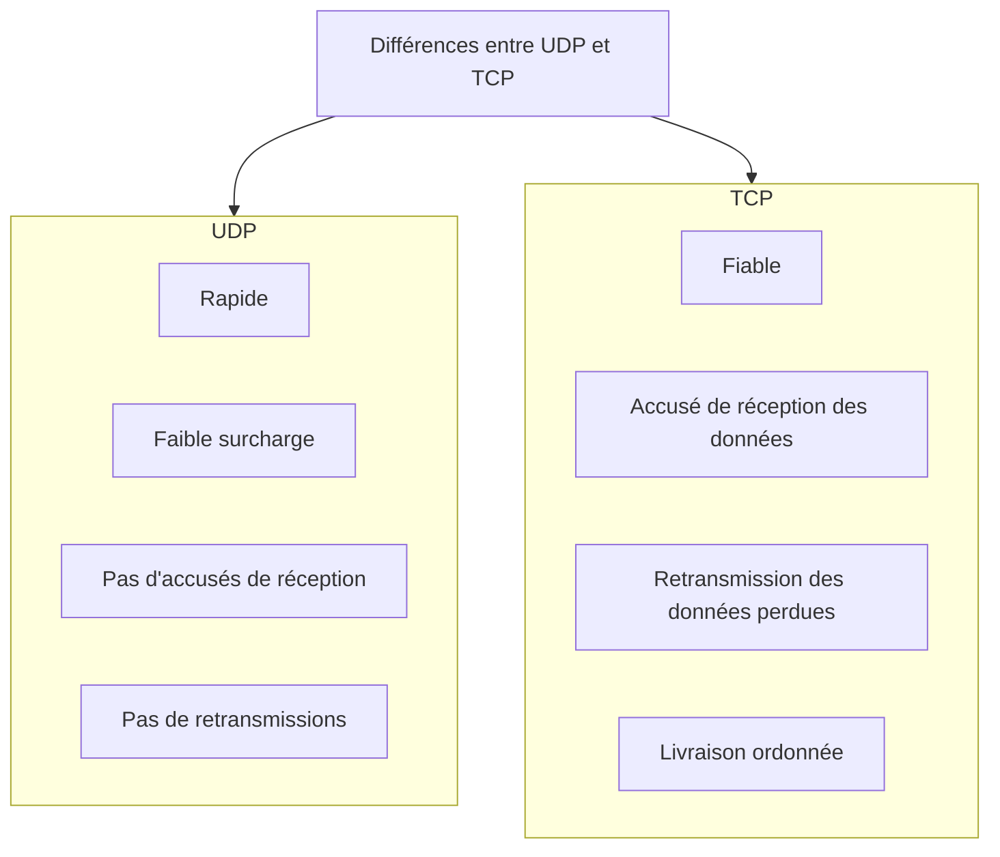
*Ce diagramme résume les différences entre UDP et TCP, soulignant les avantages et les inconvénients de chaque protocole.*

---
Voici une version améliorée et plus pédagogique de tes notes sur TCP, avec une meilleure fluidité, des clarifications et des schémas Mermaid intégrés. J'ai également veillé à respecter ta demande concernant les traductions et la terminologie. 

---

## Vue d'Ensemble de TCP

Dans le sujet précédent, tu as appris que TCP (Transmission Control Protocol) et UDP (User Datagram Protocol) sont les deux principaux protocoles de la couche de transport. Ce sujet fournit plus de détails sur le fonctionnement de TCP et les situations où il est préférable de l'utiliser plutôt qu'UDP.

### Principales Fonctions de TCP

Pour comprendre les différences entre TCP et UDP, examinons comment chaque protocole met en œuvre des fonctionnalités de fiabilité et de suivi des conversations :

1. **Établissement d'une Session** : 
   - TCP est un protocole **orienté connexion** qui négocie et établit une connexion permanente (ou session) entre les dispositifs source et destination avant de transmettre des données. Cela permet de gérer efficacement le trafic.

2. **Assurance de la Livraison Fiable** : 
   - TCP garantit que chaque segment envoyé par la source arrive à destination, même si certains segments sont corrompus ou perdus pendant la transmission.

3. **Fourniture d'une Livraison dans l'Ordre** : 
   - En numérotant et en séquençant les segments, TCP assure que les données sont réassemblées dans le bon ordre, même si elles arrivent dans le désordre à cause de chemins multiples.

4. **Soutien au Contrôle de Flux** : 
   - TCP ajuste le débit des données envoyées en fonction de la capacité de traitement de l'hôte récepteur, prévenant ainsi les problèmes de surcharge et de retransmission.

Pour plus d'informations sur TCP, consulte le **RFC 793**.

### En-tête TCP

TCP est un protocole à état, ce qui signifie qu'il suit l'état de la session de communication. Un segment TCP ajoute **20 octets (160 bits)** de surcharge lorsqu'il encapsule les données de la couche applicative. L'en-tête TCP comprend plusieurs champs importants.

:max_bytes(150000):strip_icc()/tcp-headers-f2c0881ea4c94e919794b7c0677ab90a.jpg)

#### Champs de l'En-tête TCP

- **Source Port** (Port source) : Champ de 16 bits identifiant l'application source.
- **Destination Port** (Port de destination) : Champ de 16 bits identifiant l'application destination.
- **Sequence Number** (Numéro de séquence) : Champ de 32 bits pour le réassemblage des données.
- **Acknowledgment Number** (Numéro d'accusé de réception) : Champ de 32 bits indiquant le prochain octet attendu.
- **Header Length** (Longueur de l'en-tête) : Champ de 4 bits indiquant la longueur de l'en-tête TCP.
- **Reserved** (Réservé) : Champ de 6 bits pour un usage futur.
- **Control Bits** (Bits de contrôle) : Champ de 6 bits indiquant la fonction du segment TCP.
- **Window Size** (Taille de la fenêtre) : Champ de 16 bits pour indiquer le nombre d'octets acceptés.
- **Checksum** (Contrôle de redondance) : Champ de 16 bits pour vérifier les erreurs dans l'en-tête et les données.
- **Urgent** (Urgent) : Champ de 16 bits indiquant si les données sont urgentes.


---

## Vue d'Ensemble de UDP

### Caractéristiques de UDP

Ce sujet aborde le **User Datagram Protocol (UDP)**, ses fonctionnalités et les situations où il est préférable de l'utiliser plutôt que TCP. UDP est un protocole de transport **à meilleur effort**, léger et rapide, qui offre les mêmes fonctions de segmentation et de réassemblage des données que TCP, mais sans la fiabilité et le contrôle de flux associés.

UDP est souvent décrit par ce qu'il ne fait pas par rapport à TCP. Ses principales caractéristiques incluent :

- **Pas de garantie de livraison** : Les segments perdus ne sont pas retransmis.
- **Pas d'établissement de session** : Aucun processus de négociation n'est nécessaire pour commencer à envoyer des données.
- **Pas de suivi des ressources** : L'expéditeur n'est pas informé de la disponibilité des ressources sur le récepteur.
- **Réception des données dans l'ordre** : Les données sont reconstruites dans l'ordre dans lequel elles sont reçues, bien que cela ne soit pas garanti dans des conditions de réseau moins fiables.

Pour plus d'informations sur UDP, consulte le **RFC 768**.

### En-tête UDP

UDP est un protocole **sans état**, ce qui signifie que ni le client ni le serveur ne suivent l'état de la session de communication. Si la fiabilité est nécessaire lors de l'utilisation d'UDP, elle doit être gérée par l'application.

Une exigence importante pour la diffusion de vidéos et de voix en direct est la continuité des données, même en cas de perte. Les applications de vidéo en direct et de voix tolèrent souvent une certaine perte de données avec peu ou pas d'effet perceptible, ce qui les rend parfaitement adaptées à UDP.

Les blocs de communication dans UDP sont appelés **datagrammes**. L'en-tête UDP est beaucoup plus simple que celui de TCP, car il ne comporte que quatre champs et nécessite **8 octets (64 bits)**. L'en-tête UDP comprend les champs suivants :

- **Source Port** (Port source) : Champ de 16 bits identifiant l'application source.
- **Destination Port** (Port de destination) : Champ de 16 bits identifiant l'application destination.
- **Length** (Longueur) : Champ de 16 bits indiquant la longueur de l'en-tête du datagramme UDP.
- **Checksum** (Contrôle de redondance) : Champ de 16 bits utilisé pour vérifier les erreurs dans l'en-tête et les données du datagramme.


### Applications qui Utilisent UDP

UDP est particulièrement adapté pour plusieurs types d'applications :

1. **Applications de vidéo et multimédia en direct** : 
   - Exemples : **Voix sur IP (VoIP)**, diffusion vidéo en direct.
   - Ces applications nécessitent peu ou pas de délai et peuvent tolérer une certaine perte de données.

2. **Applications simples de demande et réponse** : 
   - Exemples : **DNS (Domain Name System)**, **DHCP (Dynamic Host Configuration Protocol)**.
   - Ces applications gèrent des transactions simples où un hôte envoie une demande et peut ou non recevoir une réponse.

3. **Applications qui gèrent elles-mêmes la fiabilité** : 
   - Exemples : **SNMP (Simple Network Management Protocol)**, **TFTP (Trivial File Transfer Protocol)**.
   - Ces communications unidirectionnelles ne nécessitent pas de contrôle de flux, de détection d'erreurs ou d'accusés de réception.

Bien que DNS et SNMP utilisent UDP par défaut, ils peuvent également utiliser TCP. Par exemple, DNS passera à TCP si la demande ou la réponse DNS dépasse **512 octets**, comme dans le cas d'une réponse DNS avec de nombreuses résolutions de noms.

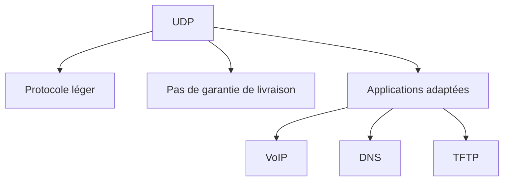

*Ce diagramme résume les caractéristiques clés d'UDP et les types d'applications qui en tirent parti.*

---
Voici une version améliorée de tes notes sur les numéros de port, avec des clarifications, une structure fluide, et des schémas Mermaid pour mieux visualiser les concepts.

---
## Numéros de Port

### Communications Multiples et Séparées

Les protocoles de transport **TCP (Transmission Control Protocol)** et **UDP (User Datagram Protocol)** utilisent des **numéros de port** pour gérer plusieurs conversations simultanées. Ces numéros permettent d’identifier à la fois l’application source et l’application de destination dans les champs d’en-tête de TCP et UDP.

- **Numéro de port source** : Associé à l’application d’origine sur l’hôte local.
- **Numéro de port de destination** : Associé à l’application de destination sur l’hôte distant.

#### Exemple de Communication

Imaginons qu’un hôte initie une demande de page web à un serveur. Lorsque cette demande est lancée, un numéro de port source est généré dynamiquement pour identifier cette conversation. Chaque demande utilise un numéro de port source unique, permettant ainsi plusieurs conversations simultanées.

Dans la demande, le numéro de port de destination (par exemple, 80 pour HTTP) indique au serveur le type de service requis. Ainsi, un serveur peut offrir plusieurs services, comme :

- Services web sur le port 80 (HTTP)
- Transferts de fichiers sur le port 21 (FTP)

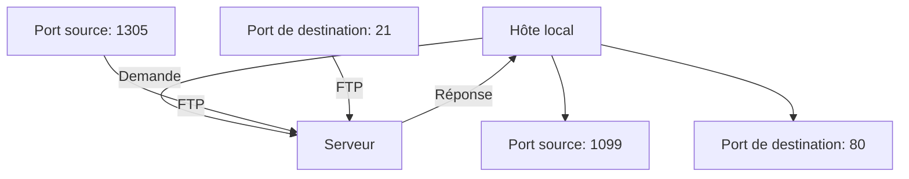

### Paires de Sockets

Les ports source et destination sont intégrés dans chaque segment de données, qui sont ensuite encapsulés dans un paquet IP. Ce paquet contient :

- **Adresse IP source** : Identifie l'hôte local.
- **Adresse IP de destination** : Identifie l'hôte distant.

La combinaison de l'adresse IP et du numéro de port est appelée **socket**. Par exemple, un socket client pourrait être représenté par `192.168.1.5:1099` et un socket serveur par `192.168.1.7:80`. Ensemble, ces deux sockets forment une paire de sockets :

- **Client** : `192.168.1.5:1099`
- **Serveur** : `192.168.1.7:80`

Les sockets permettent aux processus fonctionnant sur un client de se distinguer les uns des autres, tout en différenciant plusieurs connexions à un processus serveur. Le numéro de port source sert d'adresse de retour pour l'application demandeuse, garantissant que les réponses parviennent à la bonne application.

### Groupes de Numéros de Port

L'**Internet Assigned Numbers Authority (IANA)** est responsable de l'attribution des numéros de port, qui sont des identifiants de 16 bits. Cela offre une plage de ports allant de **0 à 65535**, divisée en trois groupes :

1. **Ports Bien Connus** (0 à 1023) : Réservés pour des services courants (ex. : HTTP sur le port 80).
2. **Ports Enregistrés** (1024 à 49151) : Attribués par l'IANA pour des applications spécifiques (ex. : port 1812 pour RADIUS).
3. **Ports Privés et Dynamiques** (49152 à 65535) : Attribués dynamiquement par le système d’exploitation lors d’une connexion.

#### Exemples de Ports Bien Connus

| Numéro de Port | Protocole  | Application                                   |
|----------------|------------|-----------------------------------------------|
| 20             | TCP        | FTP (Données)                                |
| 21             | TCP        | FTP (Contrôle)                               |
| 22             | TCP        | SSH (Secure Shell)                           |
| 23             | TCP        | Telnet                                        |
| 25             | TCP        | SMTP (Simple Mail Transfer Protocol)         |
| 53             | UDP, TCP   | DNS (Domain Name System)                     |
| 67             | UDP        | DHCP (Serveur)                               |
| 68             | UDP        | DHCP (Client)                                |
| 69             | UDP        | TFTP (Trivial File Transfer Protocol)        |
| 80             | TCP        | HTTP (Hypertext Transfer Protocol)           |
| 443            | TCP        | HTTPS (HTTP Secure)                          |

Certaines applications, comme DNS, utilisent UDP pour les requêtes, mais passent à TCP pour les communications entre serveurs si les réponses dépassent une certaine taille.

### La Commande `netstat`

Pour surveiller les connexions TCP actives sur un hôte, l'utilitaire `netstat` est essentiel. En tapant `netstat` dans le terminal, tu peux lister les protocoles, les adresses locales, les numéros de port, ainsi que l'état des connexions.

```bash
C:\> netstat

Active Connections

  Proto  Local Address          Foreign Address            State
  TCP    192.168.1.124:3126     192.168.0.2:netbios-ssn    ESTABLISHED
  TCP    192.168.1.124:3158     207.138.126.152:http       ESTABLISHED
  TCP    192.168.1.124:3159     207.138.126.169:http       ESTABLISHED
  TCP    192.168.1.124:3160     207.138.126.169:http       ESTABLISHED
  TCP    192.168.1.124:3161     sc.msn.com:http            ESTABLISHED
  TCP    192.168.1.124:3166     www.cisco.com:http         ESTABLISHED
(output omitted)
C:\>
```

Par défaut, `netstat` résout les adresses IP en noms de domaine et les numéros de port en applications bien connues. Pour afficher les adresses IP et les numéros de port sous leur forme numérique, utilise l'option `-n`.

---
## Processus de Communication TCP

### Fonctionnement des Serveurs TCP

#### Attribution des Ports

Chaque application sur un serveur utilise un numéro de port unique, qui peut être configuré manuellement ou attribué automatiquement par le système d'exploitation. 

- **Règle fondamentale :** Un serveur ne peut pas avoir deux services fonctionnant sur le même port. Par exemple, un serveur web (HTTP) ne peut pas utiliser le port 80 si un serveur FTP est également configuré pour ce port.

#### Ports Ouverts

Lorsqu'une application est active sur un port, ce port est considéré comme **ouvert**. Cela signifie que le protocole TCP accepte et traite les segments de données destinés à ce port.

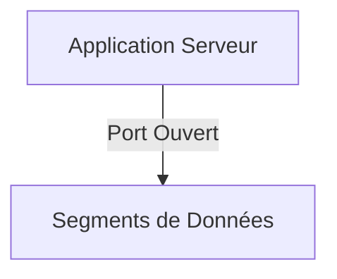

### Requêtes TCP des Clients

Imaginons deux clients se connectant au même serveur pour des services différents :

- **Client 1 (HTTP)** :
  - **Port source :** 49152
  - **Port destination :** 80 (port par défaut pour HTTP)
  
- **Client 2 (SMTP)** :
  - **Port source :** 51152
  - **Port destination :** 25 (port par défaut pour SMTP)

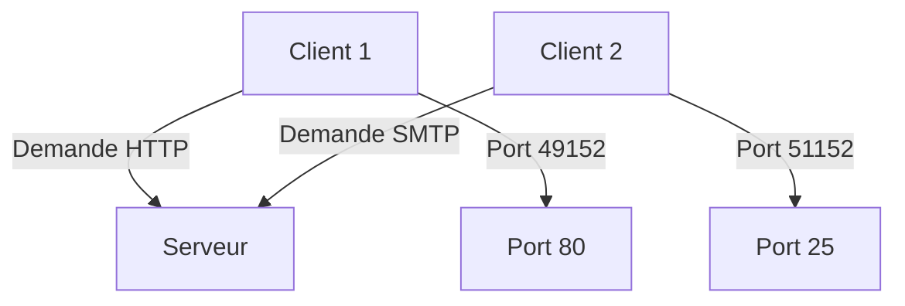

### Établissement de Connexion TCP

L’établissement d'une connexion TCP peut être comparé à une salutation, et se fait par le biais d'un processus connu sous le nom de **poignée de main en trois étapes**.

#### Étape 1 : SYN

Le client (Client 1) envoie un segment **SYN** au serveur pour demander l'établissement d'une session. Cela permet de vérifier la disponibilité de l'hôte de destination.

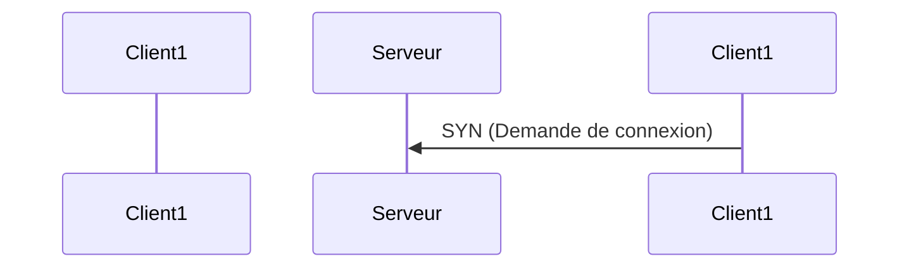

#### Étape 2 : SYN-ACK

Le serveur répond avec un segment **SYN-ACK**, confirmant qu'il est prêt à établir la connexion.

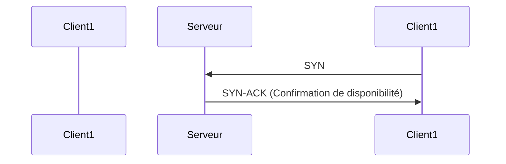

#### Étape 3 : ACK

Le client envoie un segment **ACK** pour finaliser l'établissement de la connexion.

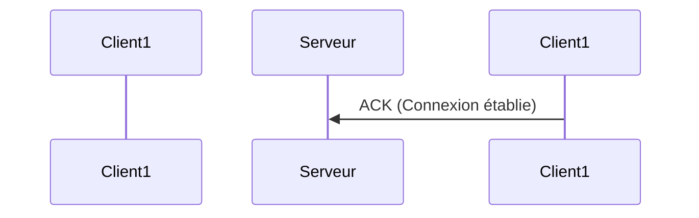

#### Résumé de la Poignée de Main

Le processus complet de la poignée de main en trois étapes se résume ainsi :

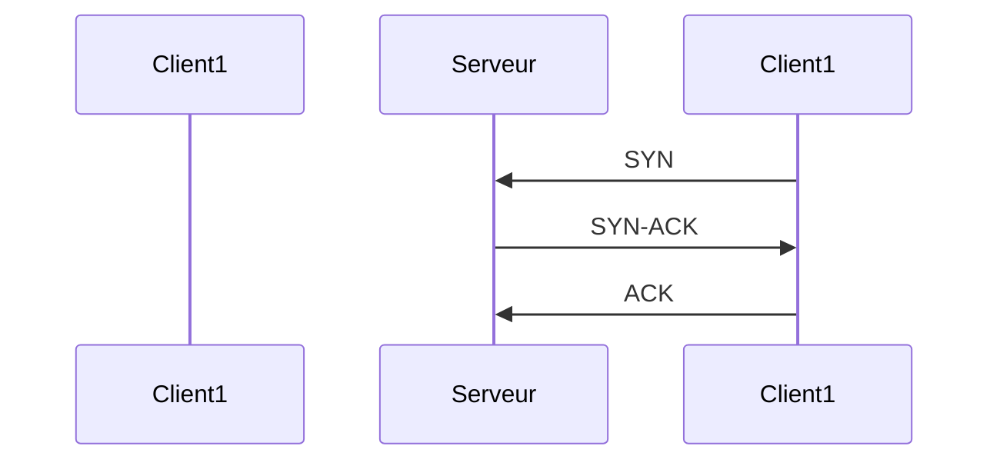

### Terminaison de Session

Pour fermer une connexion TCP, un processus de terminaison est nécessaire, impliquant l'envoi d'un segment **FIN** et un segment d'accusé de réception **ACK**.

#### Étape 1 : FIN

Lorsque le client n’a plus de données à envoyer, il envoie un segment **FIN** au serveur.

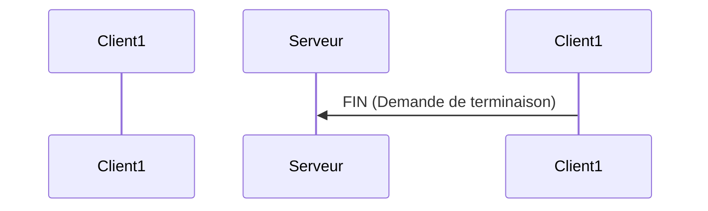

#### Étape 2 : ACK

Le serveur répond avec un segment **ACK**, accusant réception de la demande de terminaison. Ensuite, le serveur envoie également un segment **FIN** pour terminer sa propre session.

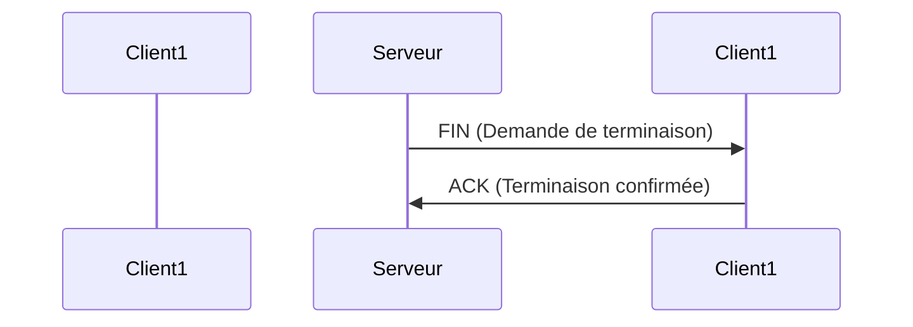

#### Résumé de la Terminaison

Le processus complet de terminaison de session se déroule comme suit :

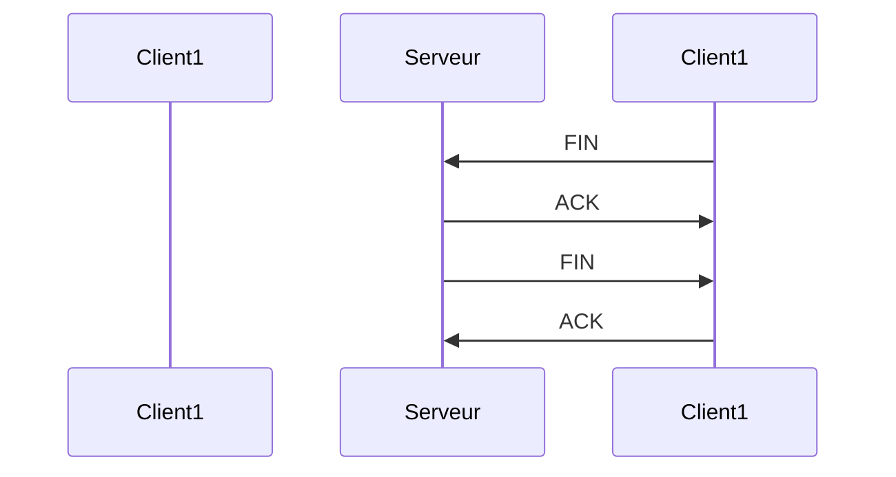

### Analyse de la Poignée de Main en Trois Étapes

Au cours de la poignée de main, les hôtes suivent chaque segment de données et gèrent l'état de la connexion à l'aide d'informations dans l'en-tête TCP.

#### Fonctions Clés

- **Vérification de la disponibilité** : Confirme que l'hôte de destination est accessible sur le réseau.
- **Service actif** : Vérifie que le service est en cours d'exécution sur le port destination.
- **Demande de session** : Informe le serveur que le client souhaite établir une session sur ce port.

### Drapeaux de Contrôle TCP

Les bits de contrôle dans l'en-tête TCP, appelés **drapeaux**, indiquent l'état de la connexion. Voici les principaux drapeaux :

- **URG** : Indique des données urgentes.
- **ACK** : Drapeau d'accusé de réception.
- **PSH** : Demande d'envoi immédiat des données.
- **RST** : Réinitialisation de la connexion.
- **SYN** : Synchronisation des numéros de séquence.
- **FIN** : Indique que l'expéditeur n’a plus de données à envoyer.

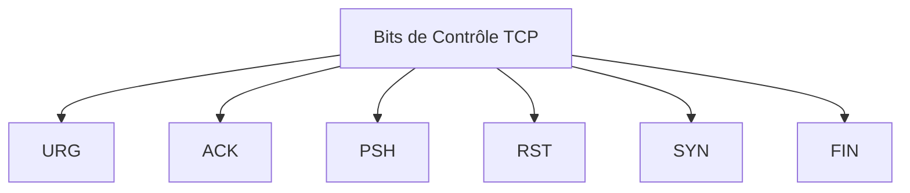

---

## Fiabilité et Contrôle de Flux TCP

### Fiabilité TCP - Livraison Garantie et Ordonnée

TCP est souvent considéré comme le meilleur protocole pour certaines applications, car contrairement à UDP, il renvoie les paquets perdus et numérote les paquets pour indiquer leur ordre correct avant livraison. TCP aide également à maintenir le flux de paquets afin d’éviter que les appareils ne soient submergés. Cette section couvre ces caractéristiques de TCP en détail.

Il peut arriver que des segments TCP n’arrivent pas à destination ou qu’ils arrivent dans le désordre. Pour que le message original soit compris par le destinataire, toutes les données doivent être reçues et réassemblées dans l’ordre d’origine. Des numéros de séquence sont attribués dans l’en-tête de chaque paquet pour atteindre cet objectif. Le numéro de séquence représente le premier octet de données du segment TCP.

Lors de la configuration de la session, un numéro de séquence initial (ISN) est défini. Cet ISN représente la valeur de départ des octets transmis à l'application réceptrice. Au fur et à mesure que les données sont transmises pendant la session, le numéro de séquence est incrémenté en fonction du nombre d'octets transmis. Ce suivi des octets de données permet d’identifier et d’accuser de réception chaque segment de manière unique. Les segments manquants peuvent alors être identifiés.

L’ISN ne commence pas à un, mais est effectivement un nombre aléatoire pour prévenir certains types d’attaques malveillantes. Pour simplifier, nous utiliserons un ISN de 1 pour les exemples dans ce chapitre.

Les numéros de séquence des segments indiquent comment réassembler et réordonner les segments reçus. Les segments peuvent prendre des routes différentes et arriver dans le désordre, mais TCP a la capacité de les réordonner à destination.

Le processus TCP réceptif place les données d'un segment dans un tampon de réception. Les segments sont ensuite placés dans le bon ordre séquentiel et transmis à la couche d'application une fois réassemblés. Les segments qui arrivent avec des numéros de séquence dans le désordre sont conservés pour un traitement ultérieur. Lorsque les segments avec les octets manquants arrivent, ces segments sont traités dans l'ordre.

### Fiabilité TCP - Perte de Données et Rétransmission

Peu importe la qualité d’un réseau, la perte de données se produit parfois. TCP fournit des méthodes pour gérer ces pertes de segments, notamment un mécanisme de retransmission pour les données non accusées.

Les numéros de séquence (SEQ) et d'accusé de réception (ACK) sont utilisés ensemble pour confirmer la réception des octets de données contenus dans les segments transmis. Le numéro SEQ identifie le premier octet de données dans le segment transmis. TCP utilise le numéro ACK renvoyé à la source pour indiquer le prochain octet que le récepteur s'attend à recevoir, ce qui est appelé accusé de réception expectatif.

Avant des améliorations ultérieures, TCP ne pouvait accuser réception que du prochain octet attendu. Par exemple, si l'hôte A envoie les segments 1 à 10 à l'hôte B et que tous les segments arrivent sauf les segments 3 et 4, l'hôte B répondrait avec un accusé de réception spécifiant que le prochain segment attendu est le segment 3. L'hôte A n'aurait aucune idée des autres segments qui auraient pu arriver. L'hôte A renverrait donc les segments 3 à 10, ce qui pourrait entraîner des retards et des congestions.

Les systèmes d'exploitation hôtes d'aujourd'hui utilisent généralement une fonctionnalité optionnelle de TCP appelée accusé de réception sélectif (SACK), négociée lors de la poignée de main en trois étapes. Si les deux hôtes prennent en charge SACK, le récepteur peut explicitement accuser réception des segments reçus, y compris des segments discontinus. L'hôte émetteur n'aurait donc besoin de retransmettre que les données manquantes.

TCP utilise également des minuteries pour savoir combien de temps attendre avant de retransmettre un segment. 

### Contrôle de Flux TCP - Taille de Fenêtre et Accusés de Réception

TCP fournit des mécanismes de contrôle de flux, qui désignent la quantité de données que la destination peut recevoir et traiter de manière fiable. Le contrôle de flux aide à maintenir la fiabilité de la transmission TCP en ajustant le taux d'écoulement des données entre la source et la destination pour une session donnée. Pour ce faire, l'en-tête TCP inclut un champ de 16 bits appelé taille de fenêtre.

La taille de fenêtre détermine le nombre d'octets pouvant être envoyés avant d'attendre un accusé de réception. La taille de fenêtre est incluse dans chaque segment TCP afin que la destination puisse la modifier à tout moment en fonction de la disponibilité du tampon. La taille de fenêtre initiale est convenue lors de l'établissement de la session TCP pendant la poignée de main en trois étapes.

En général, un hôte détermine la valeur de son champ MSS en soustrayant les en-têtes IP et TCP de l’unité de transmission maximale (MTU) Ethernet. Dans une interface Ethernet, la MTU par défaut est de 1500 octets. En soustrayant l’en-tête IPv4 de 20 octets et l’en-tête TCP de 20 octets, la taille MSS par défaut sera de 1460 octets.

### Contrôle de Flux TCP - Évitement de Congestion

Lorsque la congestion se produit sur un réseau, cela entraîne la suppression de paquets par le routeur surchargé. Lorsque des paquets contenant des segments TCP n’atteignent pas leur destination, ils restent non accusés. En déterminant le taux d’envoi des segments TCP sans accusé de réception, la source peut évaluer un certain niveau de congestion réseau.

Lorsqu'il y a congestion, la retransmission des segments TCP perdus de la source peut aggraver la situation. Pour éviter et contrôler la congestion, TCP emploie plusieurs mécanismes de gestion de la congestion, minuteries et algorithmes.

Si la source détermine que les segments TCP ne sont ni accusés de réception ni accusés dans un délai raisonnable, elle peut réduire le nombre d'octets qu'elle envoie avant de recevoir un accusé de réception. 

Les numéros d'accusé de réception sont pour le prochain octet attendu et non pour un segment. La note importante ici est que c'est la source qui réduit le nombre d'octets non accusés qu'elle envoie, et non la taille de fenêtre déterminée par la destination.

---

## Communication UDP

### Faible Surcharge UDP versus Fiabilité

UDP est idéal pour les communications nécessitant rapidité, comme la VoIP. Ce protocole se distingue par son faible overhead et sa petite taille d’en-tête de datagramme, n’ayant pas de trafic de gestion de réseau. UDP n’établit pas de connexion avant d’envoyer des données, ce qui le rend efficace pour les transmissions nécessitant un envoi rapide.

Lorsqu’un hôte émetteur doit envoyer des données audio et vidéo, ces données sont envoyées via UDP, sans nécessiter de connexion préalable.

### Réassemblage de Datagrammes UDP

Tout comme les segments dans TCP, lorsque les datagrammes UDP sont envoyés à une destination, ils peuvent emprunter des chemins différents et arriver dans le désordre. Contrairement à TCP, UDP ne suit pas les numéros de séquence et ne peut pas réorganiser les datagrammes dans l’ordre de leur transmission.

Ainsi, UDP réassemble simplement les données dans l’ordre dans lequel elles sont reçues et les transmet à l’application. Si la séquence des données est importante pour l’application, celle-ci doit gérer le bon ordre et déterminer comment les données doivent être traitées.

### Processus et Requêtes des Serveurs UDP

Tout comme les applications basées sur TCP, les applications serveur basées sur UDP se voient attribuer des numéros de port bien connus ou enregistrés. Lorsque ces applications fonctionnent sur un serveur, elles acceptent les données correspondant à leur numéro de port attribué. Lorsqu’UDP reçoit un datagramme destiné à l’un de ces ports, il transmet les données de l’application à l’application appropriée en fonction de son numéro de port.

Par exemple, un serveur RADIUS utilise UDP pour écouter les requêtes sur le port 1812.

### Processus Clients UDP

Tout comme pour TCP, la communication client-serveur est initiée par une application cliente qui demande des données à un processus serveur. Le processus client UDP sélectionne dynamiquement un numéro de port à partir de la plage de numéros de port et utilise ce numéro comme port source pour la conversation. Le port de destination est généralement le numéro de port bien connu ou enregistré attribué au processus serveur.

Après qu’un client a sélectionné les ports source et de destination, la même paire de ports est utilisée dans l’en-tête de tous les datagrammes de la transaction. Pour les données retournées au client par le serveur, les numéros de port source et de destination dans l’en-tête du datagramme sont inversés.

Par exemple, un client peut envoyer une requête DNS sur le port 53 et un autre client peut demander des services d'authentification RADIUS sur le port 1812.

---

## Résumé

### Transport de données

La couche de transport agit comme un intermédiaire entre la couche application et les couches inférieures responsables de la transmission des données sur le réseau. Elle gère les communications logiques entre les applications s'exécutant sur des hôtes différents et inclut les protocoles TCP et UDP. Les responsabilités de la couche de transport comprennent :

- **Transfert de messages** : Définit comment transférer des messages entre hôtes.
- **Gestion de la fiabilité** : S'assure que les exigences de fiabilité sont respectées lors des échanges.
- **Suivi des sessions** : Gère l'état des conversations en cours.
- **Segmentation des données** : Segmente les données et les réassemble à destination.
- **Ajout d'en-têtes** : Insère les informations nécessaires dans les segments.
- **Identification des applications** : Identifie les applications impliquées dans la communication.
- **Multiplexage** : Permet la simultanéité de plusieurs conversations.

**TCP** est un protocole orienté connexion, fiable, qui accuse réception des données, retransmet les données perdues et garantit une livraison séquencée, ce qui le rend adapté aux applications comme le courrier électronique et la navigation web. À l'inverse, **UDP** est sans état, rapide, avec peu de surcharge, ne nécessite pas d'accusés de réception, ne retransmet pas les données perdues et livre les données dans l'ordre où elles arrivent, ce qui le rend idéal pour la VoIP et le DNS.

### Vue d'ensemble de TCP

TCP offre plusieurs fonctionnalités essentielles :

- **Établissement de session** : Crée des sessions de communication.
- **Assurance de fiabilité** : Garantit la livraison fiable des données.
- **Livraison ordonnée** : S'assure que les données sont livrées dans l'ordre correct.
- **Contrôle de flux** : Gère le taux de transmission des données.

Un segment TCP inclut un en-tête de 20 octets, avec des champs clés tels que les ports source et destination, le numéro de séquence, le numéro d'accusé de réception, les bits de contrôle et la taille de la fenêtre. Les applications utilisant TCP comprennent HTTP, FTP, SMTP et Telnet.

### Vue d'ensemble de UDP

UDP fonctionne en mettant l'accent sur la rapidité et la faible surcharge. Ses caractéristiques comprennent :

- **Pas d'établissement de session** : Opère sans établir de session.
- **Réassemblage des données** : Reconstruit les données selon l'ordre de réception.
- **Pas d'accusés de réception** : Ne retransmet pas les segments perdus.
- **Structure d'en-tête simple** : Comprend des champs pour les ports source et destination, la longueur et la somme de contrôle.

Les applications courantes utilisant UDP incluent DHCP, DNS, SNMP, TFTP, VoIP et vidéoconférences.

### Numéros de port

Les protocoles de transport TCP et UDP utilisent des numéros de port pour gérer plusieurs conversations simultanées. Chaque en-tête identifie un port d'application source et destination. Les segments sont encapsulés dans un paquet IP contenant les adresses IP source et destination. La combinaison de l'adresse IP source et du numéro de port source, ou de l'adresse IP destination et du numéro de port destination, forme une socket qui identifie le serveur et le service demandé.

Les numéros de port vont de 0 à 65535 et sont classés en :

- **Ports bien connus** : Réservés pour des applications courantes (ex. : FTP, SSH, DNS, HTTP).
- **Ports enregistrés** : Utilisés par des applications logicielles.
- **Ports privés/dynamiques** : Généralement assignés dynamiquement aux applications clientes.

L'outil **netstat** peut être utilisé pour vérifier les connexions TCP actives sur un hôte réseau.

### Processus de communication TCP

Chaque application sur un serveur se voit attribuer un numéro de port, soit automatiquement, soit configuré manuellement. Le processus TCP implique :

- Des clients envoyant des requêtes vers des ports de destination.
- Des réponses aux requêtes comprenant les ports de destination et source.

Pour mettre fin à une conversation TCP, quatre échanges sont nécessaires, initiés par le client ou le serveur. La poignée de main en trois étapes garantit que le dispositif de destination est disponible et prêt à accepter les requêtes. Les bits de contrôle tels que URG, ACK, PSH, RST, SYN et FIN facilitent la communication.

### Fiabilité et contrôle de flux

Pour garantir que le message d'origine est correctement compris, toutes les données doivent être reçues et réassemblées dans le bon ordre. Les numéros de séquence dans les en-têtes de paquet aident à atteindre cet objectif. TCP gère les pertes de segments grâce à des mécanismes de retransmission et utilise l'**Accusé de réception sélectif (SACK)** pour une récupération efficace.

Le contrôle de flux est implémenté via un champ de taille de fenêtre de 16 bits dans l'en-tête TCP, permettant d'ajuster le flux de données entre la source et la destination, communément appelé fenêtres glissantes.

### Communication UDP

UDP est un protocole simple qui se concentre sur les fonctions de transport de base. Les aspects clés incluent :

- Les datagrammes peuvent arriver hors d'ordre ; UDP ne les réorganise pas.
- Les applications doivent gérer la séquence des données si nécessaire.
- Les applications serveur utilisent des numéros de port bien connus ou enregistrés pour recevoir des datagrammes.

Le client UDP sélectionne dynamiquement un port source et communique avec un serveur via un port de destination désigné. La même paire de ports est utilisée pour tous les datagrammes dans une transaction, inversant les numéros de port pour les données retournant au client.

---
[[]]⬅️ - [[#Couche de Transport|Retour]]⬆️ - [[]]➡️