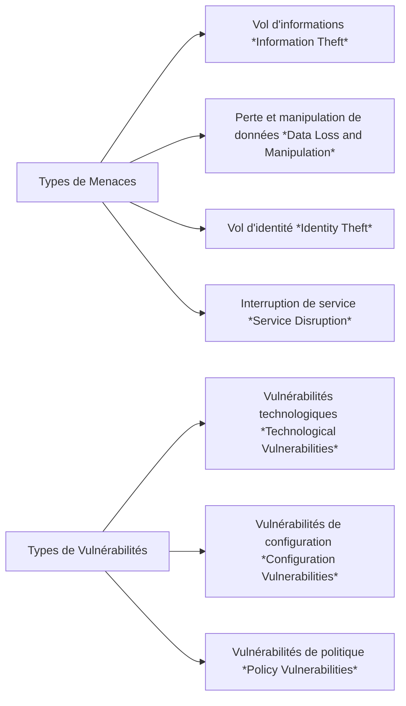
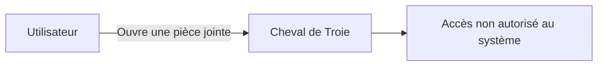
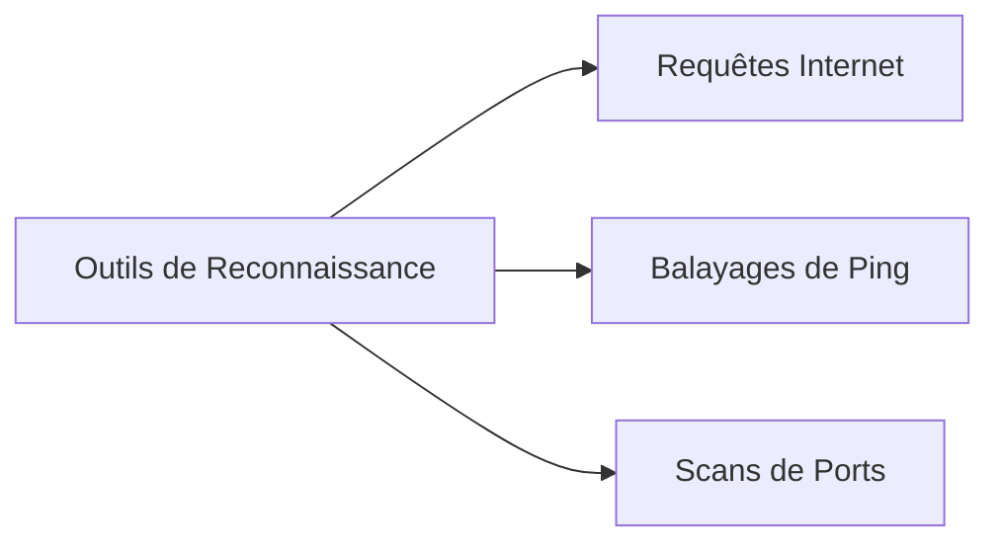
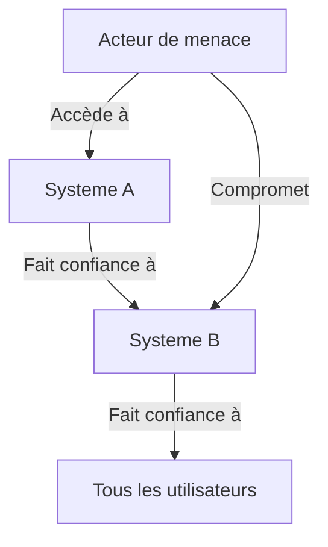
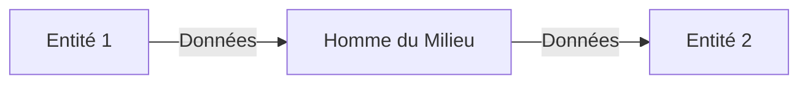
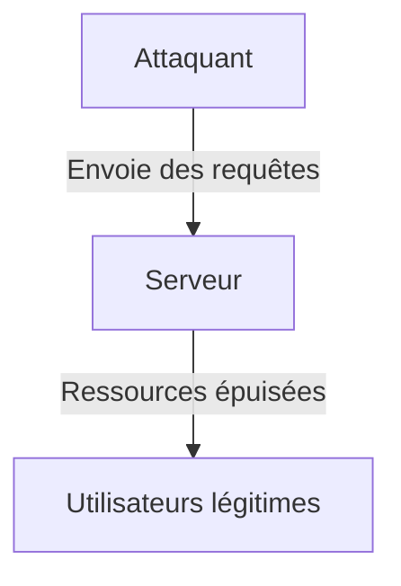
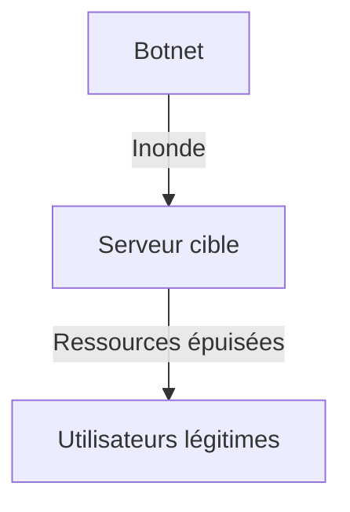
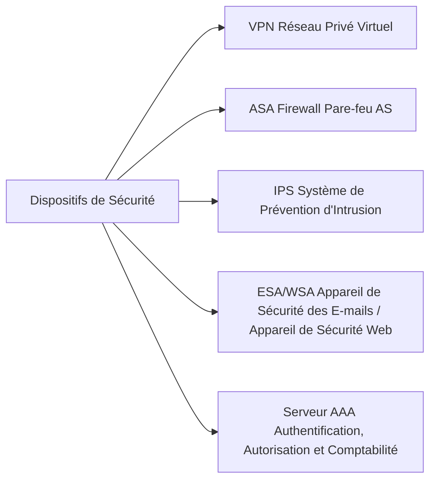
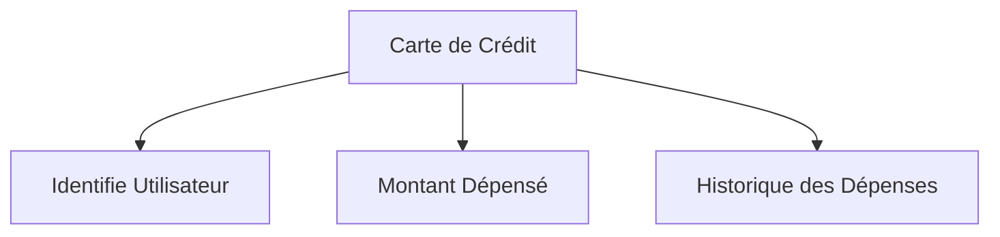

# Fondamentaux de la Sécurité Réseau

[[Couche Application]]⬅️ - [[#Résumé| Résumé]]⬇️ - [[Construire un petit réseau]]➡️ - [Fmashcards](https://drive.google.com/file/d/1YXfSHYn2XHkDPWRgprn-ic3nQDNQzKwE/view?usp=drive_link)🃏

---
## Table des matières 

- [[#Menaces et Vulnérabilités de Sécurité]]
- [[#Attaques Réseau]]
- [[#Atténuation des Attaques Réseau]]
- [[#Sécurité des Dispositifs]]
- [[#Laboratoires]]
- [[#Résumé]]

---

## Menaces et Vulnérabilités de Sécurité

### Types de Menaces

Les réseaux informatiques, qu'ils soient câblés ou sans fil, sont essentiels pour les activités quotidiennes des individus et des organisations. Une intrusion non autorisée peut entraîner des pannes coûteuses et la perte de travail. Les attaques sur un réseau peuvent être dévastatrices, causant des pertes de temps et d'argent en raison de dommages ou du vol d'informations ou d'actifs importants.

Les intrus peuvent accéder à un réseau via des vulnérabilités logicielles, des attaques matérielles ou en devinant des identifiants (nom d'utilisateur et mot de passe). Ces intrus, appelés **acteurs de menace** (*threat actors*), peuvent causer divers problèmes une fois à l'intérieur du réseau.

Voici les quatre types de menaces qui peuvent survenir :

1. **Vol d'informations** (*Information Theft*) : Pénétrer dans un ordinateur pour obtenir des données confidentielles, comme des informations de recherche et développement d'une organisation.

2. **Perte et manipulation de données** (*Data Loss and Manipulation*) : Détruire ou modifier des enregistrements de données. Par exemple, un acteur de menace peut envoyer un virus pour reformater un disque dur.

3. **Vol d'identité** (*Identity Theft*) : Voler des informations personnelles pour usurper l'identité d'une personne. Cela peut permettre d'obtenir des documents légaux, de demander un crédit ou d'effectuer des achats en ligne non autorisés.

4. **Interruption de service** (*Service Disruption*) : Empêcher les utilisateurs légitimes d'accéder aux services auxquels ils ont droit, par exemple à travers des attaques par déni de service (DoS).

### Types de Vulnérabilités

La **vulnérabilité** (*vulnerability*) est le degré de faiblesse d'un réseau ou d'un appareil. Les vulnérabilités peuvent exister dans des équipements comme les routeurs (*routers*), les commutateurs (*switches*), les ordinateurs de bureau, les serveurs et même dans des dispositifs de sécurité.

Il existe trois principales catégories de vulnérabilités :

#### 1. Vulnérabilités Technologiques (*Technological Vulnerabilities*)

| Vulnérabilité                       | Description                                                                                                                                                                                                                           |
| ----------------------------------- | ------------------------------------------------------------------------------------------------------------------------------------------------------------------------------------------------------------------------------------- |
| Faiblesse des protocoles            | - Les protocoles HTTP, FTP et ICMP sont intrinsèquement non sécurisés.<br>- SNMP et SMTP sont liés à la structure non sécurisée du protocole TCP.                                                                                     |
| Faiblesse du système d'exploitation | - Chaque système d'exploitation a des problèmes de sécurité à traiter : UNIX, Linux, Mac OS, Mac OS X, Windows Server 2012, Windows 7, Windows 8. Ces failles sont documentées sur le site de CERT ([cert.org](http://www.cert.org)). |
| Faiblesse des équipements réseau    | - Les routeurs, pare-feu et commutateurs présentent des failles de sécurité. Par exemple, la protection par mot de passe, le manque d'authentification, les failles dans les protocoles de routage et les failles des pare-feu.       |

#### 2. Vulnérabilités de Configuration (*Configuration Vulnerabilities*)

| Vulnérabilité                             | Description                                                                                                                                                                                                                                     |
|-------------------------------------------|-------------------------------------------------------------------------------------------------------------------------------------------------------------------------------------------------------------------------------------------------|
| Comptes utilisateurs non sécurisés        | - Les informations de compte peuvent être transmises de manière non sécurisée, exposant les noms d'utilisateur et mots de passe aux acteurs de menace.                                                                                         |
| Mots de passe faciles à deviner          | - Les mots de passe mal conçus sont une faiblesse courante.                                                                                                                                                                                |
| Services Internet mal configurés          | - L'activation de JavaScript dans les navigateurs permet des attaques. Les services mal configurés (FTP, serveurs web comme IIS ou Apache) peuvent également créer des failles.                                                                  |
| Paramètres par défaut non sécurisés      | - De nombreux produits ont des paramètres par défaut qui ouvrent des failles de sécurité.                                                                                                                                                     |
| Équipements réseau mal configurés        | - Les erreurs de configuration peuvent causer de sérieux problèmes de sécurité (par exemple, des listes d'accès mal configurées, des protocoles de routage incorrects, etc.).                                                                    |

#### 3. Vulnérabilités de Politique (*Policy Vulnerabilities*)

| Vulnérabilité                             | Description                                                                                                                                                                                                                                     |
|-------------------------------------------|-------------------------------------------------------------------------------------------------------------------------------------------------------------------------------------------------------------------------------------------------|
| Absence de politique de sécurité écrite   | - Une politique de sécurité doit être écrite pour être appliquée de manière cohérente.                                                                                                                                                       |
| Politique                               | - Des luttes internes peuvent entraver la mise en œuvre d'une politique de sécurité cohérente.                                                                                                                                                 |
| Manque de continuité de l'authentification | - Des mots de passe faibles ou par défaut permettent un accès non autorisé.                                                                                                                                                                   |
| Contrôles d'accès logiques non appliqués  | - Une surveillance insuffisante permet aux attaques de se poursuivre, gaspillant des ressources.                                                                                                                                               |
| Changements non conformes à la politique  | - Les modifications non autorisées de la topologie réseau ou l'installation de logiciels non approuvés peuvent ouvrir des failles de sécurité.                                                                                                |
| Absence de plan de reprise après sinistre | - Sans plan de reprise, le chaos peut s'installer en cas d'incident.                                                                                                                                                                          |

### Sécurité Physique (*Physical Security*)

Un autre aspect important est la sécurité physique des dispositifs. Si les ressources peuvent être compromises physiquement, elles peuvent être utilisées de manière malveillante.

Les menaces physiques incluent :

- **Menaces matérielles** (*Hardware Threats*) : Dommages physiques aux serveurs, routeurs, commutateurs, câblage et stations de travail.
- **Menaces environnementales** (*Environmental Threats*) : Températures ou humidité extrêmes.
- **Menaces électriques** (*Electrical Threats*) : Pannes de courant, pics de tension, et alimentation non conditionnée.
- **Menaces de maintenance** (*Maintenance Threats*) : Mauvaise gestion des composants électriques, manque de pièces de rechange, câblage de mauvaise qualité.

Un bon plan de sécurité physique doit être établi et mis en œuvre pour traiter ces problèmes.

### Schéma de Visualisation des Menaces et Vulnérabilités



---

## Attaques Réseau

### Types de Logiciels Malveillants (*Malware Types*)

Le sujet précédent a abordé les types de menaces réseau et les vulnérabilités qui les rendent possibles. Ce chapitre se concentre sur la manière dont les acteurs de menace accèdent aux réseaux ou restreignent l'accès des utilisateurs autorisés.

**Malware** est l'abréviation de *malicious software*. Il désigne tout code ou logiciel conçu pour endommager, perturber, voler ou causer des actions illicites sur des données, des hôtes ou des réseaux. Parmi les types de malware, on trouve les virus, les vers et les chevaux de Troie.

### 1. **Virus (*Viruses*)**

Un virus informatique est un type de malware qui se propage en s'insérant dans un autre programme, ce qui lui permet de se propager d'un ordinateur à un autre. Les virus peuvent avoir des effets allant de désagréments mineurs à des dommages graves, y compris la perte de données ou des conditions de déni de service (DoS). Voici comment ils fonctionnent :

- **Propagation** : Ils s'attachent à des fichiers exécutables, ce qui signifie qu'ils ne s'activent qu'une fois que l'utilisateur lance le fichier malveillant.
- **Infection** : Une fois exécuté, le code viral s'active et peut infecter d'autres fichiers ou programmes.
- **Dommages** : Certains virus remplacent complètement des programmes hôtes, les rendant inutilisables.


### 2. **Vers (*Worms*)**

Les vers informatiques, comme les virus, se répliquent et peuvent causer des dommages similaires, mais ils se distinguent par les points suivants :

- **Autonomie** : Contrairement aux virus, les vers sont des logiciels autonomes et n'ont pas besoin d'un fichier hôte pour se propager.
- **Propagation** : Ils exploitent des vulnérabilités du système pour infecter d'autres ordinateurs sur le réseau.


### 3. **Chevaux de Troie (*Trojan Horses*)**

Un cheval de Troie est un type de malware qui se présente comme un logiciel légitime. Les utilisateurs sont souvent trompés en le téléchargeant et en l'exécutant. Les caractéristiques des chevaux de Troie incluent :

- **Manipulation** : Une fois activé, un cheval de Troie peut provoquer diverses attaques, allant de la désactivation de la sécurité à la suppression de fichiers.
- **Propagation** : Ils nécessitent une interaction de l'utilisateur, comme l'ouverture d'une pièce jointe d'e-mail.

**Schéma de propagation d'un cheval de Troie :**  


### Attaques de Reconnaissance (*Reconnaissance Attacks*)

Les attaques de reconnaissance sont des tentatives de découverte et de cartographie des systèmes, services ou vulnérabilités. Ces attaques sont essentielles pour les acteurs de menace pour préparer d'autres types d'attaques. Elles se divisent en trois catégories :

1. **Attaques de reconnaissance** : Découverte des systèmes.
2. **Attaques d'accès** : Manipulation non autorisée des données.
3. **Attaques de déni de service** : Désactivation des réseaux.

#### Outils de Reconnaissance

- **Requêtes Internet (*Internet Queries*)** : Utilisation de moteurs de recherche comme Google pour obtenir des informations sur la cible.
- **Balayages de Ping (*Ping Sweeps*)** : Utilisation de commandes comme *ping* pour identifier les adresses IP actives.
- **Scans de Ports (*Port Scans*)** : Identification des ports ouverts sur un système, permettant de déterminer les services en cours d'exécution.

**Schéma de reconnaissance :**  


### Attaques d'Accès (*Access Attacks*)

Les attaques d'accès exploitent les vulnérabilités des services d'authentification, des services FTP et des services web pour accéder à des informations sensibles. Elles peuvent être classées en quatre types :

1. **Attaques par mot de passe (*Password Attacks*)**
2. **Exploitation de la confiance (*Trust Exploitation*)**
3. **Redirection de port (*Port Redirection*)**
4. **Homme du milieu (*Man-in-the-Middle*)**

#### 1. **Attaques par Mot de Passe (*Password Attacks*)**

Les acteurs de menace utilisent plusieurs méthodes pour réaliser des attaques par mot de passe :

- **Attaques par force brute (*Brute-force attacks*)** : Essai systématique de toutes les combinaisons possibles.
- **Attaques par cheval de Troie (*Trojan horse attacks*)** : Utilisation de chevaux de Troie pour voler des mots de passe.
- **Analyse de paquets (*Packet sniffers*)** : Interception des paquets de données pour récupérer des informations d'identification.

#### 2. **Exploitation de la Confiance (*Trust Exploitation*)**

Dans ce type d'attaque, un acteur utilise des privilèges non autorisés pour accéder à un système. Voici un schéma illustratif :



#### 3. **Redirection de Port (*Port Redirection*)**

Un acteur de menace utilise un système compromis pour attaquer d'autres cibles. Par exemple, il peut se connecter à un hôte compromis via SSH (port 22) et accéder à un autre système via Telnet (port 23).

#### 4. **Homme du Milieu (*Man-in-the-Middle*)**

Dans cette attaque, l'acteur se positionne entre deux parties pour intercepter ou modifier les données échangées. Voici un schéma d'une attaque homme du milieu :



### Attaques par Déni de Service (*Denial of Service Attacks*)

Les attaques par déni de service (DoS) sont parmi les plus difficiles à contrer. Elles visent à empêcher les utilisateurs autorisés d'accéder à un service en consommant les ressources système. Les attaques DoS peuvent être classées comme suit :

- **Attaques DoS** : Ciblent un seul système, empêchant l'accès des utilisateurs.
- **Attaques DDoS (Distributed Denial of Service)** : Proviennent de plusieurs sources, augmentant considérablement l'impact.

#### 1. **Attaque DoS (*DoS Attack*)**

Ces attaques perturbent la communication et entraînent des pertes de temps et d'argent. Voici un schéma illustratif :



#### 2. **Attaque DDoS (*DDoS Attack*)**

Une attaque DDoS utilise un réseau d'hôtes infectés, appelés zombies, formant un botnet. L'acteur utilise un programme de commande et de contrôle (CnC) pour coordonner l'attaque. Voici un schéma d'une attaque DDoS :




---

## Atténuation des Attaques Réseau

### L'Approche de Défense en Profondeur

Maintenant que vous comprenez mieux comment les acteurs de menace peuvent pénétrer dans les réseaux, il est crucial de savoir comment prévenir cet accès non autorisé. Ce chapitre décrit plusieurs actions que vous pouvez entreprendre pour rendre votre réseau plus sécurisé.

Pour atténuer les attaques réseau, il est essentiel de sécuriser d'abord les appareils, notamment les routeurs (routers), les commutateurs (switches), les serveurs (servers) et les hôtes (hosts). La plupart des organisations adoptent une approche de défense en profondeur (Defense-in-Depth) (également connue sous le nom d'approche en couches) en matière de sécurité, qui nécessite une combinaison de dispositifs et de services réseau fonctionnant en tandem.

![[MitigationMethodes.png]]

#### Dispositifs et Services de Sécurité

Considérons le réseau présenté ci-dessus. Plusieurs dispositifs et services de sécurité ont été mis en œuvre pour protéger les utilisateurs et les actifs contre les menaces TCP/IP.

Tous les dispositifs réseau, y compris les routeurs et les commutateurs, sont également durcis (hardened), comme l'indiquent les cadenas sur leurs icônes respectives. Cela signifie qu'ils ont été sécurisés pour empêcher les acteurs de menace d'accéder aux appareils et de les manipuler.



- **VPN (Virtual Private Network)** : Un routeur est utilisé pour fournir des services VPN sécurisés avec des sites d'entreprise et un support d'accès à distance pour les utilisateurs distants en utilisant des tunnels chiffrés.
- **ASA Firewall (Adaptive Security Appliance)** : Cet appareil dédié fournit des services de pare-feu stateful (pare-feu à état), garantissant que le trafic interne peut sortir et revenir, mais que le trafic externe ne peut pas initier des connexions vers les hôtes internes.
- **IPS (Intrusion Prevention System)** : Un système de prévention d'intrusion (IPS) surveille le trafic entrant et sortant à la recherche de logiciels malveillants, de signatures d'attaques réseau, etc. S'il reconnaît une menace, il peut immédiatement l'arrêter.
- **ESA/WSA (Email Security Appliance / Web Security Appliance)** : L'appareil de sécurité des e-mails (ESA) filtre les spams et les e-mails suspects. L'appareil de sécurité web (WSA) filtre les sites internet malveillants connus et suspects.
- **Serveur AAA (Authentication, Authorization, and Accounting)** : Ce serveur contient une base de données sécurisée des utilisateurs autorisés à accéder et gérer les dispositifs réseau. Les dispositifs réseau authentifient les utilisateurs administratifs à l'aide de cette base de données.

### Sauvegardes

La sauvegarde (backup) des configurations des appareils et des données est l'une des méthodes les plus efficaces pour protéger contre la perte de données. Une sauvegarde de données stocke une copie de l'information sur un ordinateur vers un support de sauvegarde amovible, qui peut être conservé en lieu sûr. Les dispositifs d'infrastructure doivent disposer de sauvegardes de fichiers de configuration et d'images IOS (Internetwork Operating System) sur un serveur FTP ou un serveur de fichiers similaire. En cas de défaillance matérielle d'un ordinateur ou d'un routeur, les données ou la configuration peuvent être restaurées à l'aide de la copie de sauvegarde.

Les sauvegardes doivent être effectuées régulièrement, comme spécifié dans la politique de sécurité. Les sauvegardes de données sont généralement stockées hors site (offsite) pour protéger le support de sauvegarde en cas d'incident dans l'installation principale. Les hôtes Windows disposent d'un utilitaire de sauvegarde et de restauration. Il est important que les utilisateurs sauvegardent leurs données sur un autre disque ou vers un fournisseur de stockage basé sur le cloud.

Voici un tableau présentant les considérations pour les sauvegardes :

| **Considération**   | **Description**                                                                                                                                      |
|---------------------|------------------------------------------------------------------------------------------------------------------------------------------------------|
| **Fréquence (Frequency)**       | Effectuer des sauvegardes régulièrement, comme défini dans la politique de sécurité.<br>- Les sauvegardes complètes peuvent être longues, donc effectuez des sauvegardes mensuelles ou hebdomadaires avec des sauvegardes partielles fréquentes des fichiers modifiés. |
| **Validation (Validation)**      | Toujours valider les sauvegardes pour assurer l'intégrité des données et vérifier les procédures de restauration des fichiers.                       |
| **Stockage (Storage)**        | Les sauvegardes doivent être transportées vers un emplacement de stockage approuvé hors site sur une rotation quotidienne, hebdomadaire ou mensuelle, selon les besoins de la politique de sécurité. |
| **Sécurité (Security)**        | Les sauvegardes doivent être protégées par des mots de passe forts. Le mot de passe est requis pour restaurer les données.                          |

### Mise à Niveau, Mise à Jour et Correctifs

Se tenir à jour avec les dernières évolutions peut conduire à une défense plus efficace contre les attaques réseau. Au fur et à mesure que de nouveaux logiciels malveillants sont publiés, les entreprises doivent maintenir leurs logiciels antivirus à jour.

La méthode la plus efficace pour atténuer une attaque par ver consiste à télécharger des mises à jour de sécurité (security updates) auprès du fournisseur du système d'exploitation et à appliquer tous les correctifs (patches) aux systèmes vulnérables. L'administration de plusieurs systèmes implique la création d'une image logicielle standard (standard software image) (système d'exploitation et applications accréditées autorisées sur les systèmes clients) qui est déployée sur de nouveaux systèmes ou des systèmes mis à niveau. Cependant, les exigences de sécurité changent, et les systèmes déjà déployés peuvent nécessiter l'installation de correctifs de sécurité mis à jour.

### Authentification, Autorisation et Comptabilité

Tous les dispositifs réseau doivent être configurés de manière sécurisée pour fournir l'accès uniquement aux personnes autorisées. Les services de sécurité réseau d'authentification, d'autorisation et de comptabilité (AAA, ou « triple A ») fournissent le cadre principal pour établir un contrôle d'accès sur les dispositifs réseau.

AAA est un moyen de contrôler qui est autorisé à accéder à un réseau (authenticate), quelles actions ils peuvent effectuer pendant qu'ils accèdent au réseau (authorize), et de garder une trace de ce qui a été fait pendant leur présence (accounting).

Le concept de AAA est similaire à l'utilisation d'une carte de crédit. La carte de crédit identifie qui peut l'utiliser, combien cet utilisateur peut dépenser et garde un compte des articles sur lesquels l'utilisateur a dépensé de l'argent.



### Pare-feu

Un pare-feu (firewall) est l'un des outils de sécurité les plus efficaces disponibles pour protéger les utilisateurs contre les menaces externes. Un pare-feu protège les ordinateurs et les réseaux en empêchant le trafic indésirable d'entrer dans les réseaux internes.

Les pare-feux réseau résident entre deux réseaux ou plus, contrôlent le trafic entre eux et aident à prévenir l'accès non autorisé. Par exemple, la topologie en haut de l'illustration suivante illustre comment le pare-feu permet au trafic d'un hôte du réseau interne de sortir et de revenir à l'intérieur du réseau. La topologie du bas illustre comment le trafic initié par le réseau externe (c'est-à-dire Internet) est refusé d'accéder au réseau interne.

#### Fonctionnement du Pare-feu

![[FirewallOperation.png]]
Un pare-feu pourrait permettre aux utilisateurs externes un accès contrôlé à des services spécifiques. Par exemple, les serveurs accessibles aux utilisateurs externes se trouvent généralement sur un réseau spécial appelé zone démilitarisée (DMZ, Demilitarized Zone), comme illustré dans le schéma suivant. La DMZ permet à un administrateur réseau d'appliquer des politiques spécifiques aux hôtes connectés à ce réseau.

**Topologie du Pare-feu avec DMZ**

![[FirewallTopologyWithDmz.png]] 

### Types de Pare-feux

Les produits pare-feux se présentent sous différentes formes. Ces produits utilisent différentes techniques pour déterminer ce qui sera autorisé ou refusé d'accès à un réseau. Ils incluent les suivants :

- **Filtrage de Paquets (Packet Filtering)** : Empêche ou autorise l'accès en fonction des adresses IP ou MAC.
- **Filtrage d'Applications (Application Filtering)** : Empêche ou autorise l'accès par types d'applications spécifiques en fonction des numéros de port.
- **Filtrage URL (URL Filtering)** : Empêche ou autorise l'accès à des sites web en fonction d'URL ou de mots-clés spécifiques.
- **Inspection de Paquets Stateful (Stateful Packet Inspection, SPI)** : Les paquets entrants doivent être des réponses légitimes aux demandes des hôtes internes. Les paquets non sollicités sont bloqués à moins d'être spécifiquement autorisés. SPI peut également inclure la capacité de reconnaître et de filtrer des types d'attaques spécifiques, comme les attaques par déni de service (DoS).

### Sécurité des Points de Terminaison

Un point de terminaison (endpoint), ou hôte, est un système ou un appareil informatique individuel qui agit comme un client réseau. Les points de terminaison courants sont les ordinateurs portables (laptops), les ordinateurs de bureau (desktops), les serveurs (servers), les smartphones et les tablettes (tablets). La sécurisation des dispositifs de point de terminaison est l'une des tâches les plus difficiles d'un administrateur réseau, car cela implique la nature humaine. Une entreprise doit avoir des politiques bien documentées en place et les employés doivent être conscients de ces règles. Les employés doivent être formés sur l'utilisation appropriée du réseau. Les politiques incluent souvent l'utilisation de logiciels antivirus et de prévention d'intrusion sur hôte. Des solutions de sécurité des points de terminaison plus complètes reposent sur le contrôle d'accès au réseau.

---

## Sécurité des Dispositifs

### Cisco AutoSecure

La sécurité des dispositifs réseau nécessite une attention particulière. Vous avez probablement déjà un mot de passe pour votre ordinateur, smartphone ou tablette. Est-il aussi fort qu'il pourrait l'être ? Utilisez-vous d'autres outils pour renforcer la sécurité de vos appareils ? Ce sujet explique comment améliorer cette sécurité.

Lorsqu'un nouveau système d'exploitation est installé sur un dispositif, les paramètres de sécurité sont souvent réglés par défaut. Dans la plupart des cas, ce niveau de sécurité est insuffisant. Pour les routeurs Cisco, la fonctionnalité **Cisco AutoSecure** peut être utilisée pour aider à sécuriser le système, comme illustré ci-dessous.

```bash
Router# auto secure
                --- Configuration AutoSecure ---
*** La configuration AutoSecure améliore la sécurité du routeur,
mais ne le rend pas absolument sécurisé contre toutes les attaques. ***
```

**Explication de la commande :**

- **But** : Lancer la configuration automatique des paramètres de sécurité du routeur.
- **Fonctionnement** : Lorsque cette commande est exécutée, le routeur évalue sa configuration actuelle et applique des paramètres de sécurité recommandés. Cela inclut, par exemple, le changement des mots de passe par défaut, la désactivation de services inutiles, et l'application de diverses restrictions d'accès.
- **Limitation** : Le message qui suit la commande indique que bien que la configuration AutoSecure améliore la sécurité, elle ne garantit pas une protection complète contre toutes les menaces. Les administrateurs réseau doivent toujours prendre des mesures supplémentaires pour sécuriser davantage leurs dispositifs.

En résumé, `auto secure` est un outil utile pour renforcer rapidement la sécurité d'un routeur, mais il doit être utilisé en complément d'autres pratiques de sécurité.

#### Étapes de Sécurisation

Voici quelques étapes simples à appliquer, qui s'appliquent à la plupart des systèmes d'exploitation :

- **Changer immédiatement les noms d'utilisateur et mots de passe par défaut**.
- **Restreindre l'accès aux ressources système** uniquement aux personnes autorisées.
- **Désactiver et désinstaller les services et applications inutiles** lorsque cela est possible.

Il est fréquent que les dispositifs expédiés par le fabricant aient été stockés dans un entrepôt pendant un certain temps et ne disposent pas des derniers correctifs de sécurité. Il est donc crucial de mettre à jour tout logiciel et d'installer les correctifs de sécurité avant la mise en service.


### Mots de Passe

Pour protéger les dispositifs réseau, il est essentiel d'utiliser des mots de passe forts. Voici quelques directives standard à suivre :

- Utilisez un mot de passe d'au moins **huit caractères**, de préférence dix ou plus. Plus un mot de passe est long, plus il est sécurisé.
- Rendre les mots de passe complexes : inclure un mélange de **lettres majuscules et minuscules**, de **nombres**, de **symboles** et d'espaces si possible.
- Évitez les mots de passe basés sur la répétition, les mots courants, les séquences de lettres ou de chiffres, les noms d'utilisateur, ou des informations biographiques facilement identifiables.
- Introduisez des erreurs d'orthographe délibérées dans vos mots de passe. Par exemple, Smith = Smyth = 5mYth ou Sécurité = 5ecur1ty.
- Changez régulièrement les mots de passe. Si un mot de passe est compromis à votre insu, la fenêtre d'opportunité pour l'acteur malveillant est limitée.
- Ne notez pas les mots de passe et ne les laissez pas dans des endroits évidents tels que sur le bureau ou le moniteur.

#### Exemples de Mots de Passe

| **Mots de Passe Faibles**  | **Raison**                                        |
|----------------------------|---------------------------------------------------|
| secret                     | Mot de passe simple du dictionnaire               |
| smith                      | Nom de jeune fille de la mère                     |
| toyota                     | Marque d'une voiture                              |
| bob1967                    | Nom et date de naissance de l'utilisateur         |
| Blueleaf23                 | Mots et chiffres simples                          |

| **Mots de Passe Forts**    | **Raison**                                        |
|----------------------------|---------------------------------------------------|
| b67n42d39c                 | Combine des caractères alphanumériques            |
| 12^h u4@1p7               | Combine des caractères alphanumériques, des symboles et inclut un espace |

Sur les routeurs Cisco, les espaces de début sont ignorés pour les mots de passe, mais les espaces après le premier caractère ne le sont pas. Par conséquent, une méthode pour créer un mot de passe fort consiste à utiliser la barre d'espace pour créer une phrase composée de plusieurs mots, appelée **phrase secrète** (passphrase). Une phrase secrète est souvent plus facile à retenir qu'un simple mot de passe, tout en étant plus longue et plus difficile à deviner.


### Sécurité Supplémentaire des Mots de Passe

Des mots de passe forts ne sont utiles que s'ils restent secrets. Voici plusieurs étapes pour garantir que les mots de passe restent confidentiels sur un routeur ou un commutateur Cisco :

- **Chiffrer tous les mots de passe en clair**.
- **Définir une longueur minimale acceptable pour les mots de passe**.
- **Dissuader les attaques par devinette de mots de passe par force brute**.
- **Désactiver l'accès au mode EXEC privilégié inactif après une période déterminée**.

Comme montré dans la configuration d'exemple ci-dessous, la commande de configuration globale **service password-encryption** empêche les personnes non autorisées de voir les mots de passe en clair dans le fichier de configuration. Cette commande chiffre tous les mots de passe en clair.

```bash
R1(config)# service password-encryption 
```

**Explication de la commande :**

- **Objectif** : Activer le chiffrement des mots de passe en texte clair dans la configuration de l’appareil.
- **Fonctionnement** : Lorsque cette commande est exécutée, tous les mots de passe en texte clair (comme les mots de passe d'accès ou de console) sont automatiquement chiffrés. Cela signifie que les mots de passe ne seront pas visibles sous forme lisible dans le fichier de configuration, ce qui renforce la sécurité en empêchant les utilisateurs non autorisés de voir les mots de passe.
- **Chiffrement léger** : Il est important de noter que le chiffrement appliqué par cette commande est relativement simple (généralement un chiffrement de type MD5) et ne doit pas être considéré comme une solution de sécurité infaillible. Pour une sécurité renforcée, il est recommandé d'utiliser d'autres méthodes comme SSH pour accéder aux appareils.

#### Prévention des Attaques par Force Brute

Les acteurs de menace peuvent utiliser des logiciels de craquage de mots de passe pour mener une attaque par force brute sur un dispositif réseau. Cette attaque tente continuellement de deviner les mots de passe valides jusqu'à ce qu'un soit correct. Utilisez la commande **login block-for** pour dissuader ce type d'attaque.

```bash
R1(config)# login block-for 120 attempts 3 within 60
```

**Explication de la commande :**

- **Objectif** : Cette commande vise à limiter le nombre de tentatives de connexion échouées à un appareil et à bloquer les accès en cas de tentatives répétées, empêchant ainsi les attaquants de deviner les mots de passe par essais et erreurs.
    
- **Syntaxe** :
    
    - **block-for 120** : Indique que l'accès sera bloqué pendant 120 secondes (2 minutes) après l'atteinte du seuil d'échecs.
    - **attempts 3** : Spécifie que si trois tentatives de connexion échouées se produisent, le système déclenche le blocage.
    - **within 60** : Indique que ces trois échecs doivent se produire dans une période de 60 secondes (1 minute).

#### Déconnexion Automatique

Les administrateurs réseau peuvent être distraits et laisser accidentellement une session EXEC privilégiée ouverte sur un terminal, permettant à un acteur malveillant d'accéder et de modifier la configuration de l'appareil. Par défaut, les routeurs Cisco déconnectent une session EXEC après **10 minutes d'inactivité**. Vous pouvez réduire ce paramètre en utilisant la commande **exec-timeout**.

```bash
R1(config)# line vty 0 4 
R1(config-line)# exec-timeout 5 30 
```

La commande `exec-timeout 5 30` est utilisée pour configurer le délai d'inactivité avant qu'une session sur les lignes VTY (Virtual Teletype) d'un routeur Cisco ne soit automatiquement déconnectée. Voici une explication détaillée de son fonctionnement :

**Explication de la commande :**

- **Objectif** : Cette commande vise à améliorer la sécurité en s'assurant que les sessions inactives sont fermées automatiquement après une période déterminée. Cela réduit le risque qu'un utilisateur non autorisé prenne le contrôle d'une session laissée ouverte.
    
- **Syntaxe** :
    
    - **5** : Indique le nombre de minutes d'inactivité avant que la session ne soit déconnectée. Dans cet exemple, si l'utilisateur ne fait aucune action pendant 5 minutes, la session sera fermée.
    - **30** : Indique le nombre de secondes supplémentaires à ajouter après les 5 minutes. Dans cet exemple, la session sera fermée si aucune activité n'est détectée pendant 5 minutes et 30 secondes.


### Activer SSH

**Telnet** simplifie l'accès à distance aux dispositifs, mais il n'est pas sécurisé. Les données contenues dans un paquet Telnet sont transmises en clair. Pour cette raison, il est fortement recommandé d'activer **SSH (Secure Shell)** sur les dispositifs pour un accès à distance sécurisé.

#### Étapes pour Configurer SSH

Il est possible de configurer un dispositif Cisco pour prendre en charge SSH en suivant six étapes :

1. **Configurer un nom d'hôte unique**. Un dispositif doit avoir un nom d'hôte unique autre que le défaut.
2. **Configurer le nom de domaine IP**. Utilisez la commande de mode de configuration globale **ip domain name**.
3. **Générer une clé pour chiffrer le trafic SSH**. Utilisez la commande **crypto key generate rsa general-keys modulus** pour créer une clé d'authentification.
4. **Vérifier ou créer une entrée de base de données locale**. Créez une entrée de nom d'utilisateur en utilisant la commande **username**.
5. **Authentifier contre la base de données locale**. Utilisez la commande **login local**.
6. **Activer les sessions SSH entrantes sur les lignes vty**. Utilisez la commande **transport input ssh**.

#### Exemple de Configuration SSH

Voici comment configurer un routeur pour SSH :

```bash
Router# configure terminal
Router(config)# hostname R1
R1(config)# ip domain name span.com
R1(config)# crypto key generate rsa general-keys modulus 1024
```

**Commandes et leur explication :**

1. **`Router# configure terminal`**
    
    - **Objectif** : Accéder au mode de configuration globale du routeur.
    - **Détails** : Cette commande permet de modifier les paramètres de configuration du routeur. Tout changement de configuration devra être effectué après avoir entré ce mode.
2. **`Router(config)# hostname R1`**
    
    - **Objectif** : Définir le nom d'hôte du routeur.
    - **Détails** : Cette commande change le nom du routeur pour "R1". Le nom d'hôte est utilisé pour identifier le routeur sur le réseau et dans les messages de console, facilitant ainsi l'administration.
3. **`R1(config)# ip domain name span.com`**
    
    - **Objectif** : Définir le nom de domaine IP du routeur.
    - **Détails** : Cette commande configure le nom de domaine pour le routeur en "span.com". Cela est requis pour la génération de clés RSA, qui est essentielle pour établir des connexions SSH sécurisées.
4. **`R1(config)# crypto key generate rsa general-keys modulus 1024`**
    
    - **Objectif** : Générer une clé RSA pour le chiffrement SSH.
    - **Détails** : Cette commande crée une clé RSA de 1024 bits. La clé est utilisée pour chiffrer les communications entre le client SSH et le routeur. La taille de la clé (1024 bits dans cet exemple) influence la sécurité : plus la clé est longue, plus la sécurité est élevée, mais cela peut aussi affecter les performances.

**Résumé :**

Ces commandes configurent le routeur pour qu'il puisse accepter les connexions SSH en définissant un nom d'hôte, un nom de domaine, et en générant une clé RSA pour le chiffrement. Ces étapes sont essentielles pour garantir des connexions sécurisées lors de l'accès à distance au routeur.

### Désactiver les Services Non Utilisés

Les routeurs et commutateurs Cisco démarrent avec une liste de services actifs qui peuvent ne pas être nécessaires dans votre réseau. Désactivez tout service inutilisé pour préserver les ressources système et éviter que des acteurs de menace exploitent ces services. Le type de services activés par défaut varie selon la version de l'IOS.

#### Vérification des Ports

Utilisez la commande **show ip ports all** pour vérifier les services actifs :

```shell
Router# show ip ports all
Proto Local Address               Foreign Address             State       PID/Program Name
tcp   :::443                     :::*                        LISTEN      309/[IOS]HTTP CORE
udp   *:67                        0.0.0.0:0                               387/[IOS]DHCPD Receive
```

Pour désactiver des services comme HTTP et Telnet, utilisez les commandes suivantes :

```bash
Router# configure terminal
Router(config)# no ip http server
Router(config)# line vty 0 15
Router(config-line)# transport input ssh
```

---
## Laboratoires

### Packet Tracer - Configure Secure Passwords and SSH

[Lien pour Obtenir le fichier Packet Tracer](https://drive.google.com/file/d/1GToBRzEj-qur79ZNWAc5Cq7sbPvVNXb5/view?usp=sharing)

### Lab - Configure Network Devices with SSH

[Lien pour le PDF](https://drive.google.com/file/d/11kXlopPl6mVVBcvg-aWX8lpLItv4fjEB/view?usp=sharing)

### Packet Tracer - Secure Network Devices
[Lien pour obtenir le Packet Tracer](https://drive.google.com/file/d/1ZDP5cnK1jEW2iBxTQwVbqEoVHaDWxgwd/view?usp=sharing)


## Résumé

### Menaces et vulnérabilités de sécurité

Les attaques sur un réseau peuvent avoir des conséquences dévastatrices, entraînant des pertes de temps et d'argent dues à des dommages ou au vol d'informations cruciales. Les intrus qui accèdent à un réseau en modifiant des logiciels ou en exploitant des vulnérabilités sont appelés **acteurs de menace**. Une fois qu'ils ont pénétré le réseau, quatre types de menaces peuvent émerger :

- **Vol d'informations**
- **Perte et manipulation de données**
- **Vol d'identité**
- **Perturbation de service**

Les vulnérabilités se répartissent principalement en trois catégories : **technologiques**, **configuration** et **politique de sécurité**. Par ailleurs, les menaces physiques se divisent en quatre classes : **matériel**, **environnemental**, **électrique**, et **maintenance**.

### Attaques sur le réseau

Le terme **malware** (logiciel malveillant) désigne tout code ou logiciel conçu pour endommager, perturber, voler ou causer des actions malveillantes sur des données, des hôtes ou des réseaux. Parmi les types de malware, on trouve les virus, les vers et les chevaux de Troie. Les attaques réseau se classifient généralement en trois grandes catégories :

- **Reconnaissance**
- **Accès**
- **Déni de service**

Les attaques de reconnaissance incluent des méthodes telles que **requêtes Internet**, **ping sweeps** et **analyses de ports**. En ce qui concerne les attaques d'accès, on peut citer : 

- Les attaques par mot de passe (force brute, chevaux de Troie, sniffers de paquets)
- L'exploitation de la confiance
- La redirection de port
- L'attaque de l'homme du milieu (Man-in-the-Middle)

Les attaques visant à perturber le service se répartissent en deux types : **DoS** (Denial of Service) et **DDoS** (Distributed Denial of Service).

### Atténuation des attaques réseau

Pour atténuer les attaques réseau, il est essentiel de sécuriser tous les appareils, y compris les routeurs, les commutateurs, les serveurs et les hôtes. La plupart des organisations adoptent une approche de **défense en profondeur**, qui implique une combinaison d'appareils et de services de mise en réseau travaillant de concert. 

Plusieurs dispositifs et services de sécurité sont mis en œuvre pour protéger les utilisateurs et les actifs d'une organisation contre les menaces TCP/IP, notamment : 

- **VPN** (Virtual Private Network)
- **Pare-feu ASA**
- **IPS** (Intrusion Prevention System)
- **ESA/WSA** (Email Security Appliance/Web Security Appliance)
- **Serveur AAA** (Authentication, Authorization, Accounting)

Les appareils d'infrastructure doivent avoir des sauvegardes de fichiers de configuration et d'images IOS sur un serveur FTP ou similaire, permettant une restauration rapide en cas de panne. La mise à jour régulière des systèmes d'exploitation pour patcher les vulnérabilités est la méthode la plus efficace pour prévenir les attaques par ver. L'automatisation des mises à jour de sécurité pour tous les systèmes finaux est également cruciale.

Le **AAA** est essentiel pour contrôler l'accès au réseau : il détermine qui peut s'y connecter (authentification), ce qu'ils peuvent y faire (autorisation) et quelles actions ils effectuent (comptabilité). Les pare-feu réseau se situent entre plusieurs réseaux, régulent le trafic entre eux, et préviennent les accès non autorisés. Les serveurs accessibles aux utilisateurs externes sont généralement situés sur un réseau spécifique appelé **DMZ** (zone démilitarisée). Les pare-feu utilisent diverses techniques pour autoriser ou refuser l'accès au réseau, telles que : **filtrage de paquets**, **filtrage d'application**, **filtrage d'URL**, et **SPI** (Stateful Packet Inspection). 

La sécurisation des dispositifs de point de terminaison est primordiale pour garantir la sécurité du réseau. Une entreprise doit disposer de politiques bien définies, incluant l'utilisation de logiciels antivirus et de systèmes de prévention d'intrusion sur hôte. Des solutions de sécurité plus complètes reposent sur le **contrôle d'accès réseau**.

### Sécurité des dispositifs

Lorsqu'un nouveau système d'exploitation est installé sur un appareil, les paramètres de sécurité sont configurés par défaut, ce qui peut s'avérer insuffisant. Pour les routeurs Cisco, la fonctionnalité **Cisco AutoSecure** permet de renforcer la sécurité du système. Il est impératif de changer immédiatement les noms d'utilisateur et mots de passe par défaut, de restreindre l'accès aux ressources système uniquement aux utilisateurs autorisés, et de désactiver ou désinstaller les services et applications non nécessaires.

L'utilisation de mots de passe forts est essentielle pour protéger les dispositifs réseau. Une **phrase de passe**, qui est généralement plus longue et plus complexe qu'un simple mot de passe, est souvent plus facile à retenir et plus difficile à deviner. Pour les routeurs et commutateurs, il est crucial de :

- Chiffrer tous les mots de passe en clair
- Définir une longueur minimale pour les mots de passe
- Dissuader les attaques par force brute
- Désactiver l'accès inactif au mode EXEC privilégié après un délai défini

De plus, il est important de configurer les dispositifs pour prendre en charge SSH et de désactiver tous les services inutilisés.


---
[[Couche Application]]⬅️ - [[#Fondamentaux de la Sécurité Réseau|Retour]]⬆️ - [[Construire un petit réseau]]➡️