# Modèles et protocoles

[[Configuration de base IOS]]⬅️ - [[#Ce Que J'ai Appris Dans Ce Module|Résumé]]⬇️ - [[Couche Physique]]➡️ - [Flashcard Anki]()🃏

---

## Table des Matières

- [[#Concepts Fondamentaux de la Communication]]
- [[#Vue d'Ensemble des Protocoles Réseau]]
- [[#Suites de Protocoles]]
- [[#Organisations de Normalisation]]
- [[#Modèles de Référence]]
- [[#Encapsulation des Données]]
- [[#Adressage Réseau]]
- [[#Ce Que J'ai Appris Dans Ce Module|Résumé]]

---
## Concepts Fondamentaux de la Communication

### Éléments de la Communication

1. **Source du message (Émetteur)** : C'est la personne ou le dispositif électronique qui envoie le message. 
2. **Destination du message (Récepteur)** : C'est la personne ou le dispositif qui reçoit et interprète le message.
3. **Canal** : C'est le média (physique ou virtuel) qui permet au message de voyager de l'émetteur au récepteur.

### Protocoles de Communication

Les **protocoles** sont des ensembles de règles qui régissent la communication. Ils garantissent que les messages sont transmis et compris correctement.

#### Exigences des Protocoles Réseau

1. **Encodage du message** : Processus de conversion des informations dans un format approprié pour la transmission.
2. **Formatage et encapsulation du message** : Structuration et enveloppement des messages pour faciliter leur transmission.
3. **Taille du message** : Les messages doivent souvent être fragmentés en morceaux plus petits pour être gérés efficacement.
4. **Timing du message** :
   - **Contrôle de flux** : Mécanisme qui régule la vitesse de transmission des données pour éviter la surcharge.
   - **Délai de réponse** : Durée d'attente avant de considérer qu'une réponse est absente.
   - **Méthode d'accès** : Détermine quand un message peut être envoyé sur le réseau.
5. **Options de livraison du message** :
   - **Unicast (Monocast)** : Envoi du message à un seul destinataire.
   - **Multicast (Multidiffusion)** : Envoi du message à un groupe spécifique de destinataires.
   - **Broadcast (Diffusion)** : Envoi du message à tous les dispositifs sur le réseau.

### Schémas Mermaid pour Visualiser les Concepts

#### Schéma de Communication de Base

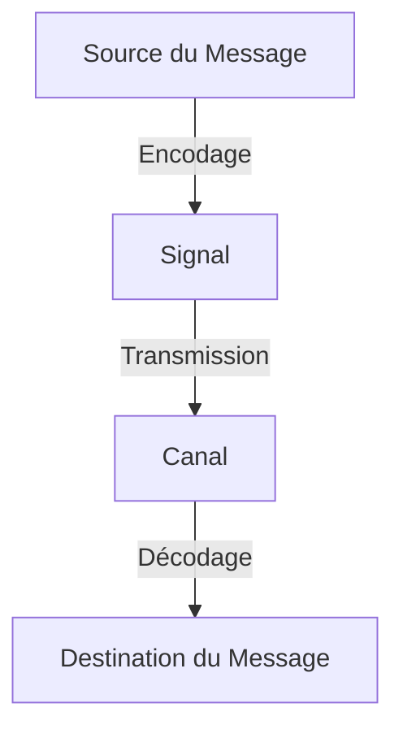

#### Schéma de l'Encapsulation des Messages

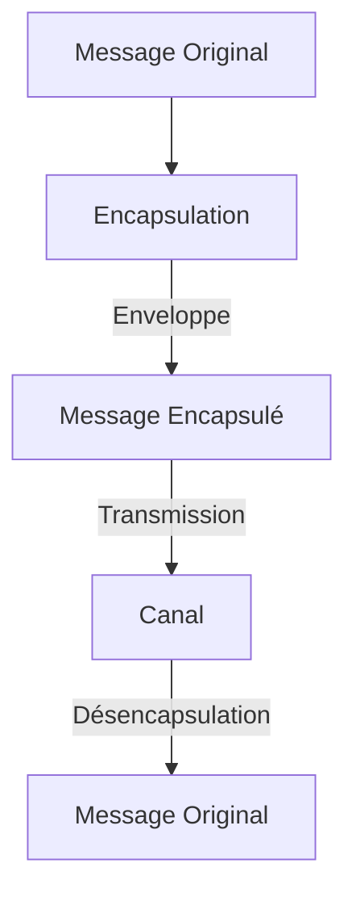

### Explications Additionnelles

- **Encodage** : Processus qui transforme les informations en un format transmissible.
- **Décodage** : Processus inverse qui récupère le format original des informations à partir du format transmis.
- **Formatage** : Structure définie d'un message adaptée au canal de communication utilisé.
- **Encapsulation** : Technique consistant à envelopper un message dans un autre format, similaire à une lettre placée dans une enveloppe.
- **Désencapsulation** : Processus de retrait du message de son enveloppe formatée pour récupérer le contenu original.

### Points Clés à Retenir

- Une communication efficace nécessite des protocoles, en plus d'une simple connexion physique entre les dispositifs.
- Les éléments cruciaux d'une communication incluent l'encodage, le formatage, le contrôle du timing et la gestion du flux.
- Les messages peuvent être adressés à un seul destinataire (unicast), à un groupe de destinataires (multicast), ou à tous les dispositifs d'un réseau (broadcast).

---
Voici une version révisée et améliorée de tes notes sur les protocoles réseau, conçue pour être plus claire, pédagogique et fluide. J'ai ajouté des éléments explicatifs et renforcé la structure globale.

---

## Vue d'Ensemble des Protocoles Réseau

Les **protocoles réseau** définissent des formats communs et des règles pour l'échange de messages entre dispositifs. Ils sont mis en œuvre à travers des logiciels, du matériel, ou les deux. Chaque protocole a sa propre fonction, format et ensemble de règles de communication.

| Type de Protocole | Description |
| --- | --- |
| **Protocoles de Communication Réseau** | Facilitent la communication entre deux ou plusieurs dispositifs sur un ou plusieurs réseaux. **Exemples** : IP (Internet Protocol), TCP (Transmission Control Protocol), HTTP (Hypertext Transfer Protocol). |
| **Protocoles de Sécurité Réseau** | Protègent les données par le biais de l'authentification, de l'intégrité et du chiffrement. **Exemples** : SSH (Secure Shell), SSL (Secure Sockets Layer), TLS (Transport Layer Security). |
| **Protocoles de Routage** | Permettent aux routeurs d'échanger des informations sur les routes, de comparer des chemins et de sélectionner le meilleur itinéraire vers la destination. **Exemples** : OSPF (Open Shortest Path First), BGP (Border Gateway Protocol). |
| **Protocoles de Découverte de Services** | Facilitent la détection automatique des dispositifs ou services sur le réseau. **Exemples** : DHCP (Dynamic Host Configuration Protocol), DNS (Domain Name System). |

### Fonctions des Protocoles Réseau

Les protocoles de communication réseau remplissent plusieurs fonctions essentielles pour garantir des échanges efficaces entre dispositifs finaux.

| Fonction | Description |
| --- | --- |
| **Adressage** | Identifie les émetteurs et récepteurs en utilisant un schéma d'adressage spécifique. **Exemples** : Ethernet, IPv4, IPv6. |
| **Fiabilité** | Assure la livraison garantie des messages, même en cas de perte ou de corruption. **Exemple** : TCP. |
| **Contrôle de Flux** | Régule le rythme de transmission des données entre les dispositifs communicants pour éviter la saturation. **Exemple** : TCP. |
| **Séquençage** | Attribue des numéros uniques à chaque segment de données pour assurer un réassemblage correct. **Exemple** : TCP. |
| **Détection d'Erreurs** | Vérifie si les données transmises ont été corrompues pendant le transfert. **Exemples** : Ethernet, IPv4, IPv6, TCP. |
| **Interface Applicative** | Contient des informations pour faciliter la communication entre les processus réseau. **Exemple** : HTTP pour accéder à une page web. |

### Interaction des Protocoles

Lorsqu'un message est envoyé sur un réseau informatique, plusieurs protocoles sont généralement impliqués, chacun jouant un rôle spécifique.

#### Exemple : Demande de Page Web

1. **HTTP** : Régule l'interaction entre un serveur web et un client web.
2. **TCP** : Gère les conversations individuelles et garantit une livraison fiable des informations.
3. **IP** : S'assure que les messages sont livrés de l'expéditeur au destinataire.
4. **Ethernet** : Facilite la livraison des messages d'une carte réseau (NIC) à une autre sur le même réseau local (LAN) Ethernet.

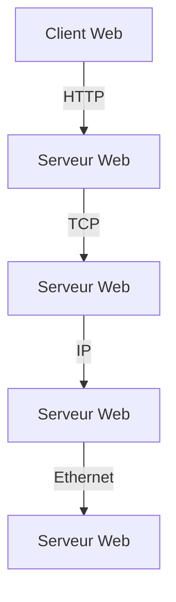

### Concepts Clés

- Les dispositifs doivent adhérer aux mêmes règles (protocoles) pour pouvoir communiquer efficacement.
- Chaque protocole a une fonction spécifique, qu'il s'agisse de communication générale, de sécurité, de routage ou de découverte de services.
- Les fonctions des protocoles comprennent l'adressage, la fiabilité, le contrôle de flux, le séquençage, la détection d'erreurs et l'interface applicative.
- Plusieurs protocoles peuvent être utilisés simultanément pour accomplir une tâche de communication sur le réseau.

---
## Suites de Protocoles

### Suites de Protocoles Réseau

Les protocoles réseau doivent souvent fonctionner ensemble pour offrir une expérience en ligne fluide. Les suites de protocoles sont conçues pour fonctionner en harmonie.

Une suite de protocoles est un groupe de protocoles interconnectés nécessaires pour effectuer une fonction de communication. 

Pour visualiser comment les protocoles d'une suite interagissent, imagine-les comme une pile. Chaque couche de la pile fournit des services à la couche supérieure et dépend des services de la couche inférieure.

### Évolution des Suites de Protocoles

Depuis les années 1970, plusieurs suites de protocoles ont été développées par des organisations de normalisation ou des vendeurs. Voici un aperçu de quelques suites de protocoles importantes :

| Couche TCP/IP | TCP/IP | ISO | AppleTalk | Novell NetWare |
| --- | --- | --- | --- | --- |
| **Application** | HTTP, DNS, DHCP, FTP | ACSE, ROSE, TRSE, SESE | AFP | NDS |
| **Transport** | TCP, UDP | TP0-TP4 | ATP, AEP, NBP, RTMP | SPX |
| **Internet** | IPv4, IPv6, ICMPv4, ICMPv6 | CONP/CMNS, CLNP/CLNS | AARP | IPX |
| **Accès Réseau** | Ethernet, ARP, WLAN | Ethernet, ARP, WLAN | Ethernet, ARP, WLAN | Ethernet, ARP, WLAN |

- **Internet Protocol Suite (TCP/IP)** : La suite de protocoles la plus couramment utilisée aujourd'hui. Maintenue par l'Internet Engineering Task Force (IETF).
- **Open Systems Interconnection (OSI)** : Développée en 1977, cette suite est principalement connue pour son modèle de référence en sept couches.
- **AppleTalk** : Une suite propriétaire lancée par Apple en 1985 et remplacée par TCP/IP en 1995.
- **Novell NetWare** : Une suite propriétaire et un système d'exploitation réseau lancé en 1983 et remplacé par TCP/IP en 1995.

### Suite de Protocoles TCP/IP

Aujourd'hui, la suite de protocoles TCP/IP inclut de nombreux protocoles et continue d'évoluer pour supporter de nouveaux services. Voici une vue d'ensemble :

| Couche | Protocoles |
| --- | --- |
| **Application** | DNS, DHCPv4, DHCPv6, SLAAC, SMTP, POP3, IMAP, FTP, SFTP, TFTP, HTTP, HTTPS, REST |
| **Transport** | TCP, UDP |
| **Internet** | IPv4, IPv6, NAT, ICMPv4, ICMPv6, ICMPv6 ND, OSPF, EIGRP, BGP |
| **Accès Réseau** | ARP, Ethernet, WLAN |

#### Aspects importants de TCP/IP

- **Protocole ouvert** : Disponible gratuitement et utilisable par tout fournisseur.
- **Protocole basé sur des normes** : Approuvé par l'industrie du réseau, assurant l'interopérabilité des produits de différents fabricants.

### Processus de Communication TCP/IP

Le processus de communication TCP/IP illustre comment les données sont transmises d'un serveur web à un client en utilisant les différentes couches de la suite de protocoles TCP/IP.

#### Étapes du Processus de Communication :

1. **Couche Application (HTTP)** : Le serveur web prépare la page HTML à envoyer et utilise HTTP pour formater les données. L'en-tête HTTP contient des informations sur la requête et la réponse.
2. **Couche Transport (TCP)** : TCP segmente les données en morceaux gérables et ajoute un en-tête pour assurer que les segments arrivent correctement et dans le bon ordre.
3. **Couche Internet (IP)** : Les segments TCP sont encapsulés dans des paquets IP. L'en-tête IP ajoute les adresses IP source et destination.
4. **Couche Accès Réseau (Ethernet)** : Les paquets IP sont encapsulés dans des trames Ethernet. Les trames sont converties en bits et transmises physiquement sur le réseau.

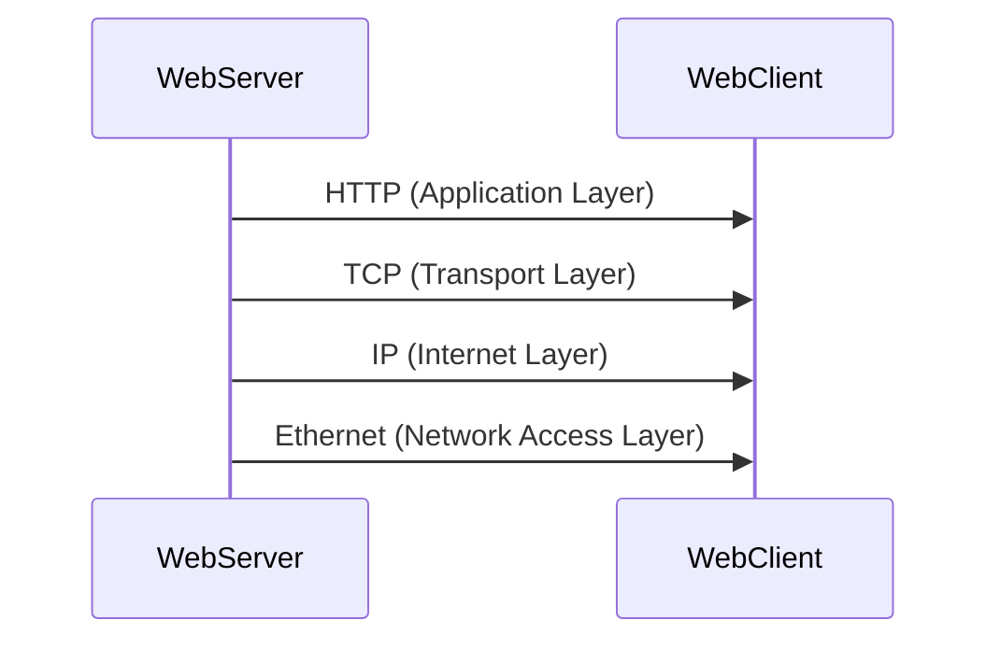

Chaque flèche représente l'ajout d'un en-tête par la couche correspondante, encapsulant les données pour la transmission vers le client.

---
## Organisations de Normalisation

Les **normes ouvertes** favorisent l'interopérabilité, la concurrence et l'innovation dans le domaine des technologies. Elles garantissent également qu'aucun produit d'une seule entreprise ne peut monopoliser le marché ou bénéficier d'un avantage injuste sur ses concurrents.

Dans le domaine des réseaux, les normes sont élaborées par des organisations internationales de normalisation. Ces organisations sont généralement neutres, à but non lucratif, et sont établies pour développer et promouvoir les concepts de normes ouvertes. Elles jouent un rôle crucial dans le maintien d'un Internet ouvert, avec des spécifications et des protocoles librement accessibles, pouvant être mis en œuvre par n'importe quel fournisseur.

### Les Principales Organisations de Normalisation

Les organisations de normalisation se répartissent en plusieurs catégories, chacune ayant des responsabilités spécifiques pour promouvoir et créer des normes dans différents domaines :

#### Normes Internet
- **Internet Society (ISOC)** : Promeut le développement ouvert et l'évolution de l'utilisation d'Internet à l'échelle mondiale.
- **Internet Architecture Board (IAB)** : Responsable de la gestion globale et du développement des normes Internet.
- **Internet Engineering Task Force (IETF)** : Développe, met à jour et maintient les technologies Internet et les protocoles TCP/IP.
- **Internet Research Task Force (IRTF)** : Axée sur la recherche à long terme liée aux protocoles Internet et TCP/IP.

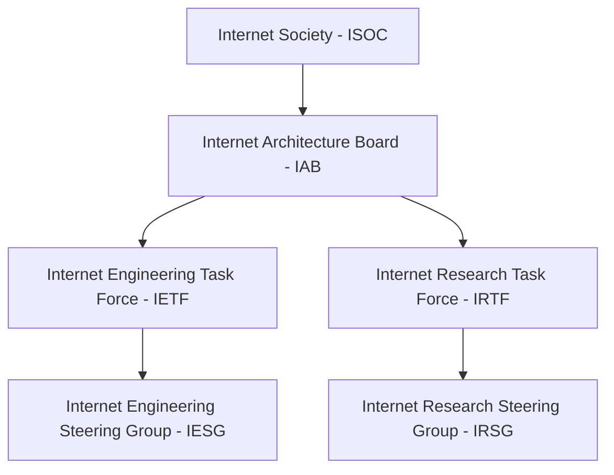

**Explication du schéma :**  
Ce schéma illustre la hiérarchie et les relations entre les principales organisations qui régissent les normes Internet.  
- **ISOC** est la base qui promeut le développement d'Internet. 
- **IAB** supervise les activités de l'IETF et de l'IRTF, assurant une cohérence dans le développement des normes.
- **IETF** se concentre sur le développement de technologies et protocoles Internet, tandis que **IRTF** se consacre à la recherche sur les protocoles Internet.
- **IESG** (Internet Engineering Steering Group) et **IRSG** (Internet Research Steering Group) sont des groupes de direction au sein de l'IETF et de l'IRTF respectivement, chargés de superviser les travaux techniques et les recherches.

#### Normes TCP/IP
- **Internet Corporation for Assigned Names and Numbers (ICANN)** : Coordonne l'allocation des adresses IP, la gestion des noms de domaine et l'attribution d'autres informations utilisées dans les protocoles TCP/IP.
- **Internet Assigned Numbers Authority (IANA)** : Supervise et gère l'allocation des adresses IP, la gestion des noms de domaine et les identifiants de protocoles pour le compte de l'ICANN.

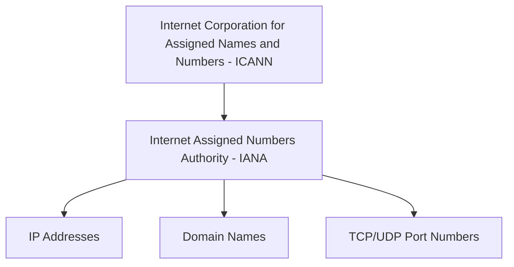

**Explication du schéma :**  
Ce schéma montre la relation entre ICANN et IANA, ainsi que les responsabilités de cette dernière.  
- **ICANN** est l'entité de coordination globale qui supervise la gestion des ressources d'identification sur Internet.
- **IANA** opère sous ICANN et est responsable de la gestion des adresses IP, des noms de domaine et des numéros de port TCP/UDP. 
- Les flèches indiquent que IANA gère ces différentes ressources au nom d'ICANN, ce qui permet de structurer l'allocation des ressources Internet de manière organisée et cohérente.

#### Normes Électroniques et de Communication
- **Institute of Electrical and Electronics Engineers (IEEE)** : Organisation dédiée à l'innovation technologique et à la création de normes dans divers domaines, y compris les télécommunications et les réseaux.
- **Electronic Industries Alliance (EIA)** : Connue pour ses normes relatives au câblage électrique, aux connecteurs et aux racks de 19 pouces utilisés pour monter les équipements de réseau.
- **Telecommunications Industry Association (TIA)** : Développe des normes de communication dans divers domaines, y compris les équipements radio, les tours cellulaires et les dispositifs VoIP.
- **International Telecommunications Union-Telecommunication Standardization Sector (ITU-T)** : Une des plus grandes et plus anciennes organisations de normalisation des communications, définissant des normes pour la compression vidéo, IPTV, et les communications à large bande.

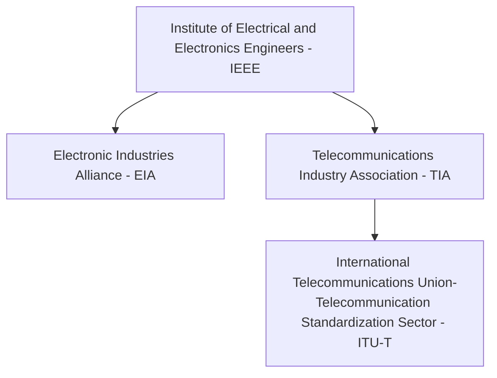

**Explication du schéma :**  
Ce schéma représente les principales organisations qui établissent des normes pour les communications et les technologies électroniques.  
- **IEEE** est une organisation clé qui élabore des normes techniques dans plusieurs domaines, y compris les réseaux.
- **EIA** et **TIA** sont des organisations qui se concentrent sur des aspects spécifiques du câblage et des communications, souvent en collaboration avec l'IEEE.
- **ITU-T** est une organisation mondiale qui établit des normes pour la communication, et elle interagit avec les autres entités pour définir des normes interopérables à l'échelle internationale.

### Importance des Normes Ouvertes

Les normes ouvertes permettent l'interopérabilité entre les produits de différents fabricants. Par exemple, lorsque vous achetez un routeur sans fil pour votre maison, vous avez le choix entre de nombreux vendeurs, chacun utilisant des protocoles standard comme IPv4, IPv6, DHCP, SLAAC, Ethernet et 802.11 WLAN. Ces normes garantissent également qu'un client utilisant le système d'exploitation Apple OS X peut télécharger une page web depuis un serveur fonctionnant sous Linux, car les deux systèmes mettent en œuvre des protocoles standards ouverts, tels que ceux de la suite de protocoles TCP/IP.

---
## Modèles de Référence

### Les Avantages d’un Modèle en Couches

Lorsque vous étudiez les réseaux, il peut être difficile de visualiser comment les paquets circulent réellement à travers le réseau, un peu comme il est difficile de voir comment les composants d'une voiture sont assemblés sur une chaîne de montage. Les modèles en couches sont utiles pour imaginer et comprendre ce qui se passe dans un réseau.

Les concepts complexes comme le fonctionnement d’un réseau peuvent être difficiles à expliquer et à comprendre. Pour cette raison, un modèle en couches est utilisé pour modulariser les opérations d'un réseau en couches gérables.

Les avantages d'utiliser un modèle en couches pour décrire les protocoles et les opérations du réseau incluent :

- Aide à la conception des protocoles, car les protocoles qui fonctionnent à une couche spécifique ont des informations définies sur lesquelles ils agissent et une interface définie avec les couches supérieures et inférieures.
- Favorise la concurrence car les produits de différents fabricants peuvent fonctionner ensemble.
- Empêche les changements technologiques ou de capacité dans une couche d'affecter les autres couches supérieures et inférieures.
- Fournit un langage commun pour décrire les fonctions et capacités du réseau.

Il existe deux modèles en couches utilisés pour décrire les opérations du réseau :

- Modèle de Référence OSI (Open System Interconnection)
- Modèle de Référence TCP/IP
### Le Modèle de Référence OSI

Le modèle de référence OSI fournit une liste complète de fonctions et de services pouvant se produire à chaque couche. Ce modèle assure la cohérence des protocoles et services réseau en décrivant ce qui doit être fait à une couche particulière, sans prescrire comment cela doit être accompli.

Il décrit également l'interaction de chaque couche avec les couches directement supérieures et inférieures. Les protocoles TCP/IP discutés dans ce cours sont structurés autour des modèles OSI et TCP/IP.

| Couche OSI          | Description                                                                                     |
|---------------------|-------------------------------------------------------------------------------------------------|
| 7 - Application     | Contient les protocoles utilisés pour les communications de processus à processus.              |
| 6 - Présentation    | Assure la représentation commune des données transférées entre les services de la couche application. |
| 5 - Session         | Offre des services à la couche présentation pour organiser son dialogue et gérer l'échange de données. |
| 4 - Transport       | Définit les services pour segmenter, transférer et réassembler les données pour des communications individuelles entre les dispositifs finaux. |
| 3 - Réseau          | Offre des services pour échanger les morceaux individuels de données sur le réseau entre les dispositifs finaux identifiés. |
| 2 - Liaison de données | Décrit les méthodes pour échanger des trames de données entre les dispositifs sur un média commun. |
| 1 - Physique        | Décrit les moyens mécaniques, électriques, fonctionnels et procéduraux pour activer, maintenir et désactiver les connexions physiques pour une transmission de bits vers et depuis un dispositif réseau. |

### Le Modèle de Protocole TCP/IP

Le modèle de protocole TCP/IP pour les communications interréseaux a été créé au début des années 1970 et est parfois appelé le modèle internet. Ce modèle correspond étroitement à la structure d'une suite de protocoles spécifique. Le modèle TCP/IP est un modèle de protocole car il décrit les fonctions qui se produisent à chaque couche des protocoles dans la suite TCP/IP.

| Couche TCP/IP       | Description                                                                                     |
|---------------------|-------------------------------------------------------------------------------------------------|
| 4 - Application     | Représente les données à l'utilisateur, plus l'encodage et le contrôle de dialogue.              |
| 3 - Transport       | Prend en charge la communication entre divers dispositifs sur des réseaux divers.                |
| 2 - Internet        | Détermine le meilleur chemin à travers le réseau.                                                |
| 1 - Accès Réseau    | Contrôle les dispositifs matériels et les médias qui composent le réseau.                        |

Les définitions des protocoles standards et des protocoles TCP/IP sont discutées dans un forum public et définies dans un ensemble de RFC (Request for Comments) disponibles publiquement. Un RFC est rédigé par des ingénieurs réseau et envoyé à d'autres membres de l'IETF pour commentaires.

### Comparaison des Modèles OSI et TCP/IP

Les protocoles qui composent la suite de protocoles TCP/IP peuvent également être décrits en termes de modèle de référence OSI. Dans le modèle OSI, la couche d'accès au réseau et la couche application du modèle TCP/IP sont divisées davantage pour décrire les fonctions discrètes qui doivent se produire à ces couches.

Au niveau de la couche d'accès réseau, la suite de protocoles TCP/IP ne spécifie pas quels protocoles utiliser lors de la transmission sur un support physique ; elle décrit seulement le transfert de la couche internet vers les protocoles réseau physiques. Les couches 1 et 2 du modèle OSI discutent des procédures nécessaires pour accéder aux médias et des moyens physiques pour envoyer des données sur un réseau.

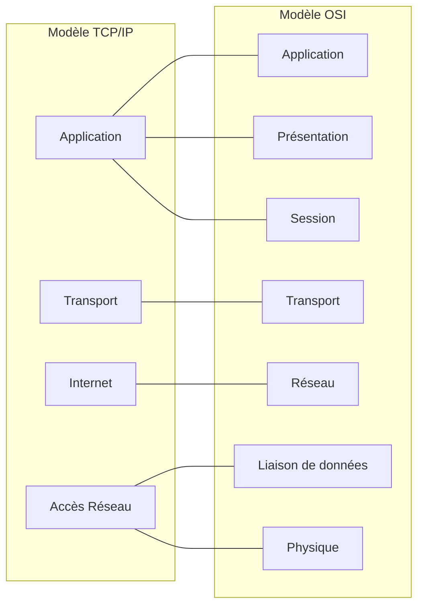

Les principales similitudes se situent dans les couches de transport et de réseau ; cependant, les deux modèles diffèrent dans la manière dont ils se rapportent aux couches supérieures et inférieures :

- La couche 3 du modèle OSI, la couche réseau, correspond directement à la couche internet du modèle TCP/IP. Cette couche est utilisée pour décrire les protocoles qui adressent et acheminent les messages à travers un internetwork.
- La couche 4 du modèle OSI, la couche transport, correspond directement à la couche transport du modèle TCP/IP. Cette couche décrit les services et les fonctions générales qui assurent la livraison ordonnée et fiable des données entre les hôtes source et destination.
- La couche application du modèle TCP/IP inclut plusieurs protocoles qui fournissent des fonctionnalités spécifiques à une variété d'applications utilisateur final. Les couches 5, 6 et 7 du modèle OSI sont utilisées comme références pour les développeurs de logiciels d'application et les fournisseurs pour produire des applications qui fonctionnent sur les réseaux.

---
## Encapsulation des Données

### Segmentation des Messages

Comprendre le modèle OSI et le modèle TCP/IP est crucial pour saisir comment les données sont encapsulées dans un réseau. Au lieu d'envoyer un grand flux de données, il est préférable de le diviser en segments plus petits, un processus appelé **segmentation**. 

#### Avantages :
- **Accélération du transfert** : Les données segmentées permettent une meilleure utilisation de la bande passante, facilitant l'envoi simultané de plusieurs communications (multiplexage).
- **Efficacité** : Si un segment échoue, seule cette partie doit être retransmise, évitant de renvoyer l'intégralité du flux.

### Séquençage

Chaque segment doit être identifié par un numéro de séquence pour garantir un réassemblage correct à la destination. Le protocole TCP s'occupe de cette tâche en s'assurant que les segments sont reçus dans le bon ordre.

### Unités de Données de Protocole (Protocol Data Units - PDU)

Lorsqu'une donnée traverse les différentes couches du modèle, chaque couche ajoute des en-têtes, un processus connu sous le nom d'**encapsulation**. La forme que prend une donnée à chaque couche est appelée **Unité de Données de Protocole (UDP)**.

#### Terminologie des PDUs :
- **Données (Data)** : Terme général au niveau de l'application.
- **Segment (Segment)** : PDU de la couche transport (TCP).
- **Paquet (Packet)** : PDU de la couche réseau (IP).
- **Trame (Frame)** : PDU de la couche de liaison de données.
- **Bits (Bits)** : PDU de la couche physique.

### Schémas

#### Processus d'Encapsulation

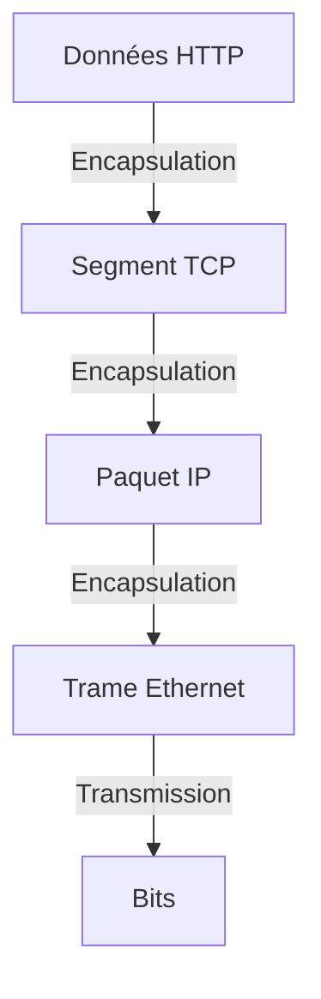

**Explication du schéma :**  
Ce schéma illustre le processus d'encapsulation des données à travers les différentes couches du modèle TCP/IP :
- **Données HTTP** : Les données initiales envoyées par la couche application (ex. une requête pour une page web).
- **Segment TCP** : Lorsque les données passent à la couche transport, un en-tête TCP est ajouté, formant un segment.
- **Paquet IP** : Le segment est ensuite encapsulé avec un en-tête IP pour former un paquet à la couche réseau.
- **Trame Ethernet** : À la couche de liaison de données, un en-tête Ethernet est ajouté, créant une trame.
- **Bits** : Finalement, la trame est convertie en bits pour être transmise sur le support physique.

### Exemples

#### Exemple d'Encapsulation

Lorsqu'une page web est envoyée d'un serveur à un client, le processus d'encapsulation se déroule comme suit :

1. **Couche Application** : Le serveur prépare les données HTML et ajoute un en-tête HTTP.
2. **Couche Transport** : Les données HTTP sont livrées à TCP, où un en-tête TCP est ajouté. Cela divise les données en segments.
3. **Couche Réseau** : Chaque segment TCP est encapsulé avec un en-tête IP, formant un paquet.
4. **Couche de Liaison de Données** : Le paquet IP est encapsulé avec des informations Ethernet, créant une trame.
5. **Couche Physique** : La trame est convertie en bits pour la transmission sur le réseau.

#### Exemple de Dé-Encapsulation

Au niveau du destinataire, le processus inverse (dé-encapsulation) se produit, consistant à retirer les en-têtes de protocole à mesure que les données montent dans la pile jusqu'à l'application finale :

1. **Couche Physique** : Les bits sont reçus et convertis en trames.
2. **Couche de Liaison de Données** : L'en-tête Ethernet est retiré, laissant le paquet IP.
3. **Couche Réseau** : L'en-tête IP est retiré, laissant le segment TCP.
4. **Couche Transport** : L'en-tête TCP est retiré, laissant les données HTTP.
5. **Couche Application** : Les données sont présentées à l'application, permettant l'affichage de la page web.

---
## Adressage Réseau

### Importance de l'Adressage

L'adressage dans un réseau est crucial pour assurer la communication entre les dispositifs. Pour que les messages segmentés circulent correctement, ils doivent être correctement adressés. Les couches réseau (Layer 3) et liaison de données (Layer 2) jouent un rôle essentiel dans la livraison des données.

#### Rôles des Couches Réseau et Liaison de Données

- **Couche Réseau (Network Layer)** : Utilise des adresses logiques (adresses IP) pour acheminer des paquets IP d'un dispositif source à une destination, potentiellement sur des réseaux différents.
- **Couche Liaison de Données (Data Link Layer)** : Utilise des adresses physiques (adresses MAC) pour transmettre des trames entre dispositifs sur le même réseau local.

#### Diagramme de l'Adressage

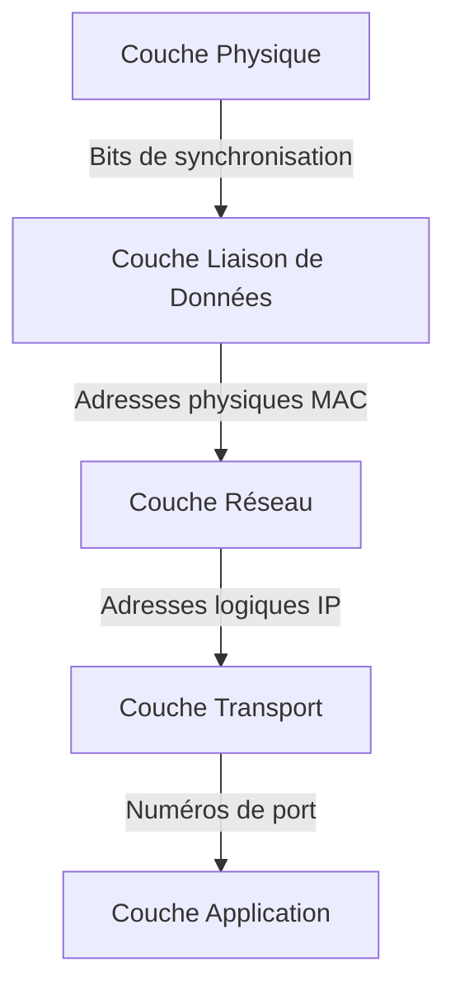

**Explication du diagramme :**  
Ce diagramme montre les différentes couches du modèle OSI et leur rôle dans l'adressage. Les adresses MAC sont utilisées pour la communication locale dans la couche de liaison de données, tandis que les adresses IP sont utilisées pour l'acheminement à travers des réseaux dans la couche réseau.

### Adresse Logique de Couche 3

Une **adresse IP** est utilisée pour identifier de manière unique un dispositif sur un réseau. Elle est essentielle pour acheminer les paquets IP.

#### Structure de l'Adresse IP

Une adresse IP se divise en deux parties :

1. **Partie Réseau (Network Portion)** : Indique le réseau auquel appartient l'adresse.
2. **Partie Hôte (Host Portion)** : Identifie un appareil spécifique sur le réseau.

#### Exemple d'Adresse IP

Imaginons une situation où :
- **Source IP** : 192.168.1.110 (PC1)
- **Destination IP** : 172.16.1.99 (Serveur Web)

Le paquet IP part de PC1, traverse des routeurs, et atteint le serveur Web.

### Communication sur le Même Réseau

#### Adresses IPv4

Supposons que PC1 souhaite communiquer avec un serveur FTP sur le même réseau :

- **Adresse IP Source** : 192.168.1.110 (PC1)
- **Adresse IP Destination** : 192.168.1.9 (Serveur FTP)

#### Diagramme de Communication Locale

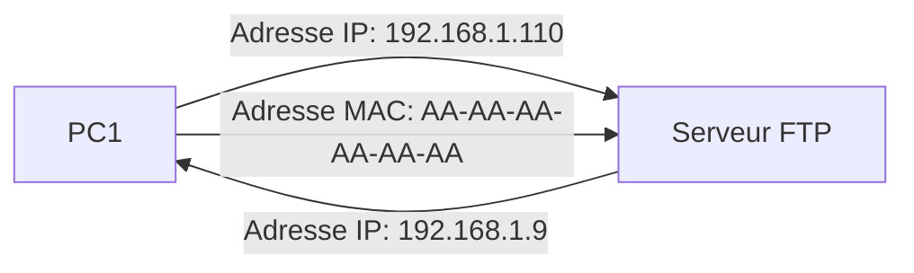

**Explication du diagramme :**  
Dans ce schéma, PC1 et le serveur FTP sont sur le même réseau. Les flèches indiquent les adresses IP et MAC utilisées pour la communication. PC1 utilise son adresse MAC pour envoyer des trames directement au serveur FTP.

#### Rôle des Adresses de Liaison de Données

- **Source MAC** : Adresse MAC de PC1 (AA-AA-AA-AA-AA-AA).
- **Destination MAC** : Adresse MAC du serveur FTP (CC-CC-CC-CC-CC-CC).

Les trames contenant le paquet IP peuvent être directement transmises entre les dispositifs.

### Communication entre Réseaux Distants

#### Exemple de Communication à Travers des Réseaux

Lorsqu'un paquet est envoyé à un serveur sur un réseau différent, les adresses IP sont également différentes.

- **Adresse IP Source** : 192.168.1.110 (PC1)
- **Adresse IP Destination** : 172.16.1.99 (Serveur Web)

#### Diagramme de Communication entre Réseaux

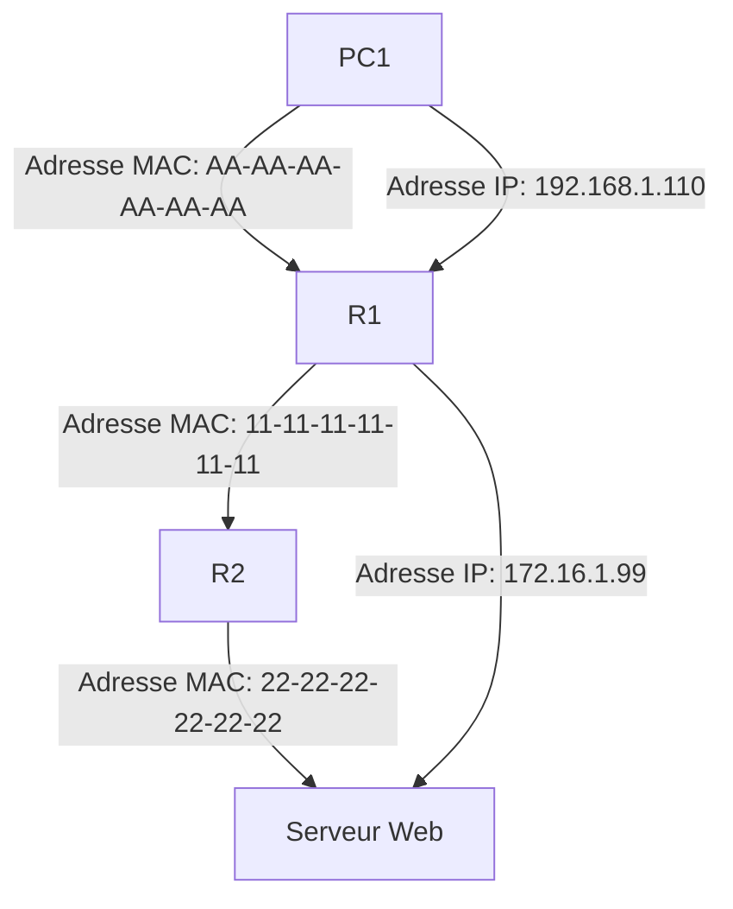

**Explication du diagramme :**  
Dans ce schéma, PC1 envoie un paquet à un serveur Web situé sur un réseau différent. Les adresses MAC des routeurs (R1 et R2) sont utilisées pour transférer le paquet d'un réseau à l'autre. Les adresses IP indiquent d'où vient le paquet et où il est censé aller.

#### Rôle des Adresses de Couche Réseau

Lorsque le paquet IP doit être envoyé à un réseau distant, il doit d'abord être envoyé à la **passerelle par défaut** (router).

- **Source MAC** : Adresse MAC de PC1 (AA-AA-AA-AA-AA-AA).
- **Destination MAC** : Adresse MAC de R1 (11-11-11-11-11-11).

Le paquet est ensuite transmis par R1 à R2, puis au serveur Web.

### Remarque

Il est impératif de configurer l'adresse IP de la passerelle par défaut sur chaque hôte du réseau local. Tous les paquets destinés à des réseaux distants doivent être envoyés à cette passerelle.

---
## Ce Que J'ai Appris Dans Ce Module

Ce module m’a permis de comprendre les concepts fondamentaux des protocoles de communication dans les réseaux informatiques. Voici les points clés :

### Les Règles de Communication

1. **Éléments de la Communication** :
   - **Expéditeur** : Source du message.
   - **Destinataire** : Destination du message.
   - **Canal** : Moyen de communication utilisé pour transmettre le message.

2. **Protocoles** :
   - Régissent l'envoi des messages et comprennent :
     - Identification de l'expéditeur et du destinataire.
     - Langue et grammaire communes.
     - Vitesse et timing de la livraison.
     - Exigences de confirmation ou d'accusé de réception.

3. **Composantes Clés des Protocoles** :
   - **Encodage du Message** : Conversion de l'information dans un format adapté pour la transmission.
   - **Décodage du Message** : Inversion de l'encodage pour interpréter l'information.
   - **Format du Message** : Déterminé par le type de message et le canal de livraison.
   - **Timing du Message** : Inclut le contrôle de flux, le délai de réponse et les méthodes d'accès.
   - **Options de Livraison du Message** : Unicast, multicast et broadcast.

### Protocoles

- Les protocoles sont mis en œuvre dans le matériel et le logiciel des dispositifs finaux et intermédiaires.
- Un message utilise généralement plusieurs protocoles, chacun ayant des fonctions et des formats distincts.
- **Protocoles Courants** :
  - **Famille Ethernet** : Comprend IP, TCP, HTTP, etc.
  - **Protocoles de Sécurité** : SSH, SSL, TLS pour l’authentification, l’intégrité et le chiffrement des données.
  - **Protocoles de Routage** : OSPF et BGP pour l'échange d'informations de routage.
  - **Protocoles de Détection** : DHCP et DNS pour la détection automatique des dispositifs/services.
- **Fonctions Clés des Protocoles** : Adressage, fiabilité, contrôle de flux, séquençage, détection d'erreurs et interface applicative.

### Suites de Protocoles

- Une **suite de protocoles** est un groupe de protocoles interconnectés nécessaires à une fonction de communication.
- Une **pile de protocoles** illustre l'implémentation de ces protocoles.
- La suite de protocoles la plus utilisée aujourd'hui est **TCP/IP**, qui couvre les couches application, transport et internet.

### Organisations de Normalisation

- **Normes Ouvertes** : Favorisent l'interopérabilité, la concurrence et l'innovation.
- Les organisations de normalisation promeuvent et créent des normes pour Internet, telles que :
  - **ISOC** (Internet Society)
  - **IAB** (Internet Architecture Board)
  - **IETF** (Internet Engineering Task Force)
  - **IRTF** (Internet Research Task Force)
- Les organisations soutenant TCP/IP incluent ICANN (Internet Corporation for Assigned Names and Numbers) et IANA (Internet Assigned Numbers Authority).
- D'autres organisations comme l'IEEE, l'EIA, la TIA et l'ITU-T se concentrent sur les normes électroniques et de communication.

### Modèles de Référence

- **Modèle OSI** : 7 Couches
  - 7 - Application
  - 6 - Présentation
  - 5 - Session
  - 4 - Transport
  - 3 - Réseau
  - 2 - Liaison de Données
  - 1 - Physique

- **Modèle TCP/IP** : 4 Couches
  - 4 - Application
  - 3 - Transport
  - 2 - Internet
  - 1 - Accès Réseau

### Encapsulation des Données

- **Segmentation des Messages** : 
  - Permet d'intercaler plusieurs conversations sur le réseau (multiplexage).
  - Augmente l’efficacité en ne retransmettant que les segments manquants.
- **TCP** : Gère le séquençage des segments.
- **Unité de Données de Protocole (UDP)** : La forme que prend une donnée à chaque couche.
- **Encapsulation** : Les données de la couche supérieure sont encapsulées en descendant vers la couche inférieure, ce processus étant inversé lors de la dé-encapsulation.

### Accès aux Données

- **Couche Réseau** : 
  - Responsable de la livraison des paquets IP de la source à la destination.
- **Couche Liaison de Données** : 
  - Gère la livraison des trames entre les cartes réseau (NIC) sur le même réseau.
- **Adresses IP** : Contiennent des parties réseau et hôte pour IPv4, ainsi que préfixe et ID d’interface pour IPv6.
- **Adresses MAC** : Utilisées sur les réseaux Ethernet pour la livraison locale.
- **Routage** : Si les dispositifs sont sur des réseaux différents, les paquets sont envoyés à un routeur ou à une passerelle par défaut.

---

[[Configuration de base IOS]]⬅️ - [[#Modèles et protocoles|Retour]]⬆️ - [[Couche Physique]]➡️