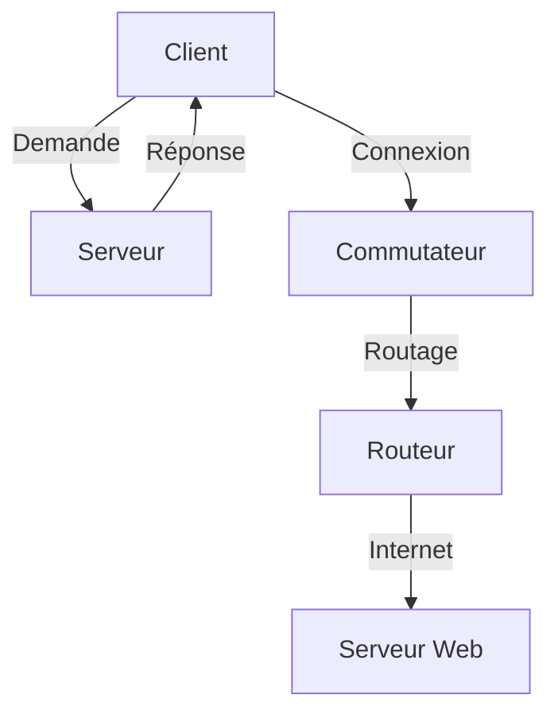

# Networking Today

--- 

## Composants du Réseau

### 1. Introduction aux Composants du Réseau (Introduction to Network Components)

Pour faire partie d'une communauté en ligne mondiale, tout appareil, que ce soit un ordinateur (computer), une tablette (tablet) ou un smartphone (smartphone), doit d'abord être connecté à un **réseau** (network), qui doit lui-même être relié à Internet. Cette section décrit les différentes parties d'un réseau. Essayez de reconnaître ces composants dans votre propre réseau domestique ou scolaire !

### 2. Rôles des Hôtes (Roles of Hosts)

Les **hôtes** (hosts), aussi appelés **périphériques finaux** (end devices), sont tous les appareils connectés à un réseau qui participent directement aux communications. On parle aussi parfois des hôtes comme des **clients** (clients). Cependant, le terme « hôte » fait spécifiquement référence aux périphériques du réseau qui se voient attribuer une **adresse IP** (IP address) pour les communications. Cette adresse identifie l'hôte ainsi que le réseau auquel il est connecté.

**Exemple** : Dans un réseau domestique, ton ordinateur, ta tablette et ton smartphone sont tous des hôtes, chacun ayant une adresse IP unique.

### 3. Serveurs et Clients (Servers and Clients)

Les **serveurs** (servers) sont des ordinateurs dotés de logiciels qui leur permettent de fournir des informations, comme des courriers électroniques (emails) ou des pages web (web pages), à d'autres **périphériques finaux** (end devices) sur le réseau. Chaque type de service nécessite un **logiciel serveur** (server software) distinct. Par exemple, pour offrir des services web, un serveur doit être équipé d'un logiciel de serveur web. Un ordinateur doté d'un logiciel serveur peut fournir des services à un ou plusieurs clients simultanément.

**Illustration** : Considère un serveur web qui héberge un site internet. Les utilisateurs (clients) utilisent leurs navigateurs pour envoyer des requêtes au serveur, qui répond avec les informations demandées.

### 4. Identification des Périphériques Terminaux (Identification of End Devices)

Les **périphériques terminaux** (end devices) sont les dispositifs réseau avec lesquels les utilisateurs sont le plus familiers. Chaque périphérique terminal d'un réseau est identifié par une **adresse unique** (unique address). Lorsqu'un périphérique terminal initie une communication, il utilise l'adresse du périphérique terminal de destination pour spécifier où le message doit être livré.

Chaque **périphérique final** (end device) constitue soit la source, soit la destination d'un message transmis à travers le réseau.

**Exemple** : Lorsque tu envoies un email depuis ton smartphone, ton appareil agit comme la source du message, tandis que l'adresse email du destinataire représente la destination.

### 5. Dispositifs Intermédiaires (Intermediary Devices)

Des **dispositifs intermédiaires** (intermediary devices) relient les différents périphériques finaux au réseau. Ils peuvent connecter plusieurs réseaux individuels pour former un **interréseau** (internetwork). Ces dispositifs assurent la **connectivité** (connectivity) et garantissent que les données sont transmises efficacement à travers le réseau.

Les périphériques intermédiaires utilisent l'adresse du périphérique final de destination et les informations concernant les interconnexions réseau pour déterminer le chemin que doivent emprunter les messages à travers le réseau. Des exemples courants de ces dispositifs incluent les **routeurs** (routers), les **commutateurs** (switches) et les **points d'accès** (access points).

**Schéma Mermaid** :

### 6. Supports Réseau (Network Media)

La communication au sein d'un réseau s'effectue à travers des **supports** (media), qui fournissent le canal permettant au message de voyager de la source à la destination.

Les réseaux modernes utilisent principalement trois types de supports pour connecter les périphériques :

- **Câbles métalliques** (metal cables) : Les données sont encodées sous forme d'**impulsions électriques** (electrical pulses).
- **Câble à fibre optique** (fiber optic cable) : Les données sont encodées sous forme de **pulsations lumineuses** (light pulses).
- **Transmission sans fil** (wireless transmission) : Les données sont codées par modulation de fréquences spécifiques d'**ondes électromagnétiques** (electromagnetic waves).

**Exemple** : Dans un bureau, le réseau local peut utiliser des câbles Ethernet (câbles métalliques) pour connecter des ordinateurs, tandis que des points d'accès Wi-Fi permettent aux ordinateurs portables de se connecter sans fil.

---

## Types Courants de Réseaux (Common Types of Networks)

Les réseaux existent dans toutes les tailles, allant de réseaux simples composés de deux ordinateurs à des réseaux reliant des millions d'appareils.

### Réseaux Domestiques Simples (Simple Home Networks)

Les **réseaux domestiques simples** (simple home networks) permettent de partager des ressources telles que des imprimantes (printers), des documents (documents), des images (pictures) et de la musique (music) entre quelques **périphériques terminaux** (end devices) locaux.

**Exemple** : Dans une maison, plusieurs appareils comme des ordinateurs, des tablettes et des imprimantes peuvent être connectés au même réseau Wi-Fi, facilitant le partage de fichiers et l'impression depuis n'importe quel appareil.

### Réseaux de Petites Entreprises et de Bureaux à Domicile (SOHO Networks)

Les **réseaux de petites entreprises et de bureaux à domicile** (small office and home office - SOHO networks) permettent aux gens de travailler à domicile ou dans un bureau distant. De nombreux travailleurs indépendants utilisent ces types de réseaux pour faire de la publicité, vendre des produits, commander des fournitures et communiquer avec des clients.

**Illustration** : Un consultant qui travaille depuis chez lui peut avoir un réseau SOHO pour accéder à Internet, partager des fichiers avec ses clients et imprimer des documents.

### Réseaux d'Entreprises et d'Organisations (Business and Organizational Networks)

Les **entreprises** (businesses) et les **grandes organisations** (large organizations) utilisent des réseaux pour fournir la **consolidation** (consolidation), le stockage (storage) et l'accès à l'information sur des **serveurs réseau** (network servers). Les réseaux fournissent également des services de messagerie électronique (email), de messagerie instantanée (instant messaging) et de collaboration entre employés. De nombreuses organisations utilisent la connexion de leur réseau à Internet pour offrir des produits et des services à leurs clients.

### Internet (Internet)

L'**Internet** est le plus grand réseau existant. En fait, le terme **Internet** signifie un "réseau de réseaux" (network of networks). C'est une collection de réseaux privés et publics interconnectés.

**Exemple** : Lorsque tu navigues sur un site web, tu accèdes à un réseau mondial qui relie des millions de serveurs et d'appareils.

### Réseaux de Pairs à Pairs (Peer-to-Peer Networks)

Dans les petites entreprises et les maisons, de nombreux ordinateurs fonctionnent à la fois comme **serveurs** (servers) et **clients** (clients) sur le réseau. Ce type de réseau est appelé un **réseau de pairs à pairs** (peer-to-peer network).

**Illustration** : Dans un réseau domestique, chaque ordinateur peut partager ses fichiers avec les autres sans nécessiter un serveur central.

### Infrastructures Réseau (Network Infrastructures)

Les infrastructures réseau varient considérablement en termes de :

- Taille de la zone couverte (size of the area covered)
- Nombre d'utilisateurs connectés (number of users connected)
- Nombre et types de services disponibles (number and types of services available)
- Domaine de responsabilité (area of responsibility)

Les deux types les plus courants d'infrastructures réseau sont les **réseaux locaux** (Local Area Networks - LANs) et les **réseaux étendus** (Wide Area Networks - WANs).

### Réseaux Locaux (LANs)

Un **réseau local** (LAN) est une infrastructure réseau qui fournit un accès aux utilisateurs et aux périphériques finaux dans une petite zone géographique. Un LAN est généralement utilisé dans un département d'une entreprise, dans une maison ou dans un réseau de petite entreprise.

**Caractéristiques des LANs :**

- Les LANs interconnectent les **périphériques finaux** (end devices) dans une zone limitée, telle qu'une maison, une école, un immeuble de bureaux ou un campus.
- Un LAN est généralement administré par une seule organisation ou un individu. Le contrôle administratif est appliqué au niveau du réseau et régule les politiques de sécurité et d'accès.
- Les LANs fournissent une **bande passante** (bandwidth) à haute vitesse aux **périphériques internes** (internal devices) et aux **dispositifs intermédiaires** (intermediary devices).

### Réseaux Étendus (WANs)

Un **réseau étendu** (WAN) est une infrastructure réseau qui s'étend sur une large zone géographique. Les WANs sont généralement gérés par des **fournisseurs de services** (service providers - SP) ou des **fournisseurs d'accès Internet** (Internet Service Providers - ISPs).

**Caractéristiques des WANs :**

- Les WANs interconnectent les LANs sur de larges zones géographiques, comme entre des villes, des États, des provinces, des pays ou des continents.
- Les WANs sont généralement administrés par plusieurs fournisseurs de services.
- Les WANs fournissent typiquement des liaisons plus lentes entre les LANs, en raison de la distance et des technologies utilisées.

### Internet et Interconnexion (Internet and Interconnection)

L'Internet est une collection mondiale de réseaux interconnectés (internetworks, ou Internet pour faire court). Certains des exemples de LANs sont connectés entre eux via une connexion WAN. Les WANs sont ensuite connectés les uns aux autres. Les WANs peuvent se connecter par des fils de cuivre (copper wires), des câbles en fibre optique (fiber-optic cables) et des transmissions sans fil (wireless transmissions).

L'Internet n'est pas la propriété d'un individu ou d'un groupe. Assurer une communication efficace à travers cette infrastructure diversifiée nécessite l'application de technologies et de normes cohérentes et reconnues, ainsi que la coopération de nombreuses agences d'administration réseau.

### Organisation de Normes (Standards Organizations)

Il existe des organisations qui ont été créées pour aider à maintenir la structure et la standardisation des protocoles et processus Internet. Ces organisations incluent :

- **Internet Engineering Task Force (IETF)** : Responsable de l'élaboration des normes techniques pour Internet.
- **Internet Corporation for Assigned Names and Numbers (ICANN)** : Gère le système de noms de domaine (DNS) et l'attribution des adresses IP.
- **Internet Architecture Board (IAB)** : Supervise les aspects techniques et organisationnels de l'Internet.

### Intranet et Extranet (Intranet and Extranet)

Il existe deux autres termes similaires au terme Internet : **intranet** (intranet) et **extranet** (extranet).

- **Intranet** : Terme souvent utilisé pour désigner une connexion privée de LANs et de WANs appartenant à une organisation. Un intranet est conçu pour être accessible uniquement par les membres, employés ou autres personnes autorisées de l'organisation.
    
    **Exemple** : Un intranet d'entreprise peut inclure des ressources comme des bases de données internes, des forums de discussion et des applications de gestion de projet.

- **Extranet** : Une organisation peut utiliser un extranet pour fournir un accès sécurisé aux personnes travaillant pour une autre organisation qui nécessitent un accès aux données de l'organisation. Voici quelques exemples d'extranets :
    
    - Une entreprise qui fournit un accès à des fournisseurs et des entrepreneurs externes.
    - Un hôpital qui fournit un système de réservation aux médecins pour qu'ils puissent prendre des rendez-vous pour leurs patients.
    - Un bureau local de l'éducation qui fournit des informations budgétaires et de personnel aux écoles de son district.

---

## Réseaux Fiables (Reliable Networks)

As-tu déjà été en train de travailler en ligne, pour te rendre compte que « l'internet ne fonctionne plus » ? Comme tu le sais maintenant, l'internet n'a pas vraiment cessé de fonctionner ; tu as juste perdu ta connexion. C'est très frustrant. Avec tant de personnes dans le monde qui dépendent de l'accès au réseau pour travailler et apprendre, il est impératif que les réseaux soient fiables. Dans ce contexte, la fiabilité signifie plus que simplement maintenir une connexion à Internet. Ce sujet se concentre sur quatre aspects de la fiabilité des réseaux.

Le rôle du réseau a évolué, passant d'un simple réseau de données à un système qui permet les connexions entre les personnes, les appareils et l'information dans un environnement réseau convergé riche en médias. Pour que les réseaux fonctionnent efficacement et se développent dans ce type d'environnement, ils doivent être construits selon une **architecture réseau standard** (standard network architecture).

Les réseaux supportent également une large gamme d'applications et de services. Ils doivent fonctionner sur différents types de câbles et de dispositifs, qui composent l'infrastructure physique. Le terme **architecture réseau** (network architecture), dans ce contexte, fait référence aux technologies qui soutiennent l'infrastructure et aux services programmés et aux règles, ou **protocoles** (protocols), qui déplacent les données à travers le réseau.

### Quatre Caractéristiques Fondamentales (Four Basic Characteristics)

Au fur et à mesure que les réseaux évoluent, nous avons identifié quatre caractéristiques de base que les architectes de réseaux doivent aborder pour répondre aux attentes des utilisateurs :

- **Tolérance aux pannes (Fault Tolerance)**
- **Scalabilité (Scalability)**
- **Qualité de service (Quality of Service - QoS)**
- **Sécurité (Security)**

#### Tolérance aux Pannes (Fault Tolerance)

Un réseau tolérant aux pannes est conçu pour limiter le nombre d'appareils affectés lors d'une panne. Il est construit pour permettre une récupération rapide lorsqu'une telle panne se produit. Ces réseaux dépendent de plusieurs chemins entre la source et la destination d'un message. Si un chemin échoue, les messages sont instantanément envoyés sur un autre lien. Avoir plusieurs chemins vers une destination est connu sous le nom de **redondance** (redundancy).

La mise en œuvre d'un réseau à **commutation de paquets** (packet switching) est un moyen par lequel les réseaux fiables fournissent de la redondance. La commutation de paquets divise le trafic en paquets qui sont routés sur un réseau partagé. Un seul message, tel qu'un e-mail ou un flux vidéo, est divisé en plusieurs blocs de message, appelés paquets. Chaque paquet contient les informations d'adressage nécessaires à la source et à la destination du message. Les routeurs au sein du réseau commutent les paquets en fonction de l'état du réseau à ce moment-là. Cela signifie que tous les paquets d'un même message peuvent emprunter des chemins très différents vers la même destination. L'utilisateur n'est pas conscient et n'est pas affecté par le routeur qui change dynamiquement le chemin lorsqu'un lien échoue.

#### Scalabilité (Scalability)

Un réseau **scalable** s'étend rapidement pour prendre en charge de nouveaux utilisateurs et applications. Il le fait sans dégrader les performances des services auxquels les utilisateurs existants accèdent. Ces réseaux sont scalables parce que les concepteurs suivent des normes et protocoles acceptés. Cela permet aux fournisseurs de logiciels et de matériel de se concentrer sur l'amélioration des produits et des services sans avoir à concevoir un nouvel ensemble de règles pour fonctionner au sein du réseau.

#### Qualité de Service (Quality of Service - QoS)

La **Qualité de Service** (QoS) est une exigence croissante pour les réseaux aujourd'hui. Les nouvelles applications disponibles pour les utilisateurs sur les réseaux, telles que les transmissions vocales et vidéo en direct, créent des attentes plus élevées quant à la qualité des services fournis. As-tu déjà essayé de regarder une vidéo avec des interruptions constantes ? À mesure que les données, la voix et le contenu vidéo continuent de converger sur le même réseau, la QoS devient un mécanisme principal pour gérer la congestion et assurer la livraison fiable du contenu à tous les utilisateurs.

La congestion se produit lorsque la demande de bande passante dépasse la quantité disponible. La bande passante du réseau est mesurée en nombre de bits pouvant être transmis en une seconde, ou **bits par seconde** (bps). Lorsque des communications simultanées sont tentées à travers le réseau, la demande pour la bande passante peut dépasser sa disponibilité, créant une congestion réseau.

Lorsque le volume de trafic est supérieur à ce qui peut être transporté à travers le réseau, les appareils conservent les paquets en mémoire jusqu'à ce que des ressources deviennent disponibles pour les transmettre. Avec une politique QoS en place, le routeur peut gérer le flux de données et de trafic vocal, donnant la priorité aux communications vocales si le réseau connaît une congestion. L'accent de la QoS est de prioriser le trafic sensible au temps.

#### Sécurité (Security)

L'infrastructure réseau, les services et les données contenues sur les appareils connectés au réseau sont des actifs personnels et commerciaux cruciaux. Les administrateurs réseau doivent aborder deux types de préoccupations en matière de sécurité réseau : la sécurité de l'infrastructure réseau et la sécurité de l'information.

1. **Sécurisation de l'infrastructure réseau** : Cela inclut la sécurisation physique des dispositifs qui fournissent la connectivité réseau et la prévention de l'accès non autorisé au logiciel de gestion qui y réside.

2. **Sécurisation des informations** : Les administrateurs réseau doivent également protéger les informations contenues dans les paquets transmis sur le réseau et celles stockées sur des appareils connectés au réseau. Pour atteindre les objectifs de sécurité du réseau, il y a trois exigences principales :
   - **Confidentialité** (Confidentiality) : La confidentialité des données signifie que seuls les destinataires prévus et autorisés peuvent accéder et lire les données.
   - **Intégrité** (Integrity) : L'intégrité des données garantit aux utilisateurs que les informations n'ont pas été altérées lors de la transmission, de l'origine à la destination.
   - **Disponibilité** (Availability) : La disponibilité des données assure aux utilisateurs un accès rapide et fiable aux services de données pour les utilisateurs autorisés.

---

## Tendances Réseaux (Network Trends)

Avec l'évolution constante des technologies et des dispositifs utilisés par les utilisateurs, les réseaux doivent s'adapter à un environnement en perpétuel changement. Voici quelques tendances clés qui impactent les organisations et les consommateurs :

- **Apportez Votre Propre Dispositif (BYOD - Bring Your Own Device)**
- **Collaboration en ligne (Online Collaboration)**
- **Communications vidéo (Video Communications)**
- **Cloud Computing (Cloud Computing)**
- **Technologies de maison intelligente (Smart Home Technologies)**
- **Réseautage Powerline (Powerline Networking)**
- **Fournisseurs de services Internet sans fil (WISP - Wireless Internet Service Providers)**

### 1. Apportez Votre Propre Dispositif (BYOD)

Le concept de **BYOD** (Bring Your Own Device) permet aux utilisateurs d'accéder à des informations et de communiquer sur un réseau d'entreprise à l'aide de leurs appareils personnels, tels que des ordinateurs portables, des tablettes, des smartphones et des liseuses. Bien que le BYOD offre une flexibilité importante aux employés et étudiants, il pose également des défis en matière de **sécurité** (security) et de gestion des dispositifs. Les entreprises doivent mettre en place des politiques claires pour garantir la protection des données.

### 2. Collaboration en ligne (Online Collaboration)

La **collaboration** (collaboration) est définie comme l'acte de travailler avec d'autres sur un projet commun. Des outils de collaboration, comme **Cisco WebEx**, permettent aux employés, étudiants, enseignants et partenaires de se connecter instantanément, de partager des informations et de travailler ensemble efficacement. La collaboration est essentielle pour le succès des entreprises et le développement des compétences en équipe chez les étudiants, favorisant ainsi l'innovation et la productivité.

### 3. Communications vidéo (Video Communications)

Les **appels vidéo** (video calls) sont devenus un outil clé pour la communication et la collaboration. Ils permettent de communiquer efficacement, peu importe la localisation géographique des participants. La **vidéo-conférence** (video conferencing) est particulièrement importante pour les équipes réparties sur plusieurs sites, favorisant les échanges et la prise de décision rapide. Avec la popularité croissante des plateformes comme **Zoom** et **Microsoft Teams**, la communication visuelle est désormais au cœur des interactions professionnelles et personnelles.

### 4. Cloud Computing (Cloud Computing)

Le **cloud computing** permet de stocker des fichiers et d'accéder à des applications via Internet. Les entreprises peuvent étendre les capacités de leur informatique sans avoir besoin d'investir dans de nouvelles infrastructures. Les services de cloud computing sont souvent disponibles à la demande et sont livrés à tout appareil, partout dans le monde, sans compromettre la sécurité.

Les **centres de données** (data centers) sont des installations utilisées pour héberger des systèmes informatiques et des composants associés. Il existe plusieurs types de cloud :

- **Cloud public** (Public Cloud) : Accessible au public, souvent proposé par des fournisseurs tiers tels qu'Amazon Web Services (AWS) ou Google Cloud.
- **Cloud privé** (Private Cloud) : Réservé à une seule organisation, offrant un contrôle total sur les données et l'infrastructure.
- **Cloud hybride** (Hybrid Cloud) : Combine des éléments des clouds public et privé pour offrir plus de flexibilité et d'options de déploiement.
- **Cloud communautaire** (Community Cloud) : Partagé par plusieurs organisations ayant des intérêts communs, offrant une solution collaborative tout en maintenant la confidentialité des données.

### 5. Technologies de Maison Intelligente (Smart Home Technologies)

La **technologie de maison intelligente** (smart home technology) intègre des appareils quotidiens pour les rendre plus automatisés et connectés. Par exemple, un **four intelligent** (smart oven) peut être programmé pour cuire des aliments à un moment précis, en tenant compte de votre emploi du temps. Les systèmes de maison intelligente améliorent le confort, la sécurité et l'efficacité énergétique.

### 6. Réseautage Powerline (Powerline Networking)

Le **réseautage Powerline** utilise le câblage électrique existant pour connecter des appareils à un réseau local (LAN). C'est une solution efficace lorsque les points d'accès sans fil ne couvrent pas toutes les zones d'une maison. Les adaptateurs Powerline permettent d'étendre facilement le réseau dans des endroits difficiles d'accès sans avoir besoin de câblage supplémentaire.

### 7. Fournisseurs de Services Internet Sans Fil (WISP)

Les **WISP** (Wireless Internet Service Providers) fournissent un accès Internet sans fil, en particulier dans les zones rurales où les services **DSL** ou câblés ne sont pas disponibles. Les abonnés utilisent une antenne installée sur leur toit pour se connecter à un point d'accès désigné. Les WISP offrent une solution pratique pour ceux qui n'ont pas accès aux infrastructures Internet traditionnelles.

---

## Sécurité des Réseaux (Network Security)

La **sécurité des réseaux** (network security) est une priorité pour les administrateurs, surtout après avoir entendu parler de violations de données ayant exposé les informations personnelles de milliers de clients. Elle est essentielle dans tous les types de réseaux, que ce soit à domicile ou dans de grandes entreprises.

### Concepts de Base

- **Sécurité des Réseaux** : C'est l'ensemble des protocoles, technologies, dispositifs et techniques utilisés pour protéger les données et atténuer les menaces.

### Menaces Externes

Les menaces externes proviennent souvent d'Internet et incluent :

- **Virus, vers et chevaux de Troie** (Viruses, Worms, and Trojans) : Logiciels malveillants s'exécutant sur l'appareil d'un utilisateur.
- **Spyware et adware** (Spyware and Adware) : Logiciels collectant secrètement des informations sur l'utilisateur.
- **Attaques zéro-day** (Zero-Day Attacks) : Se produisent le premier jour où une vulnérabilité est connue, avant qu'un correctif ne soit disponible.
- **Attaques d'acteurs malveillants** (Malicious Actor Attacks) : Des personnes malintentionnées attaquent des dispositifs ou des ressources réseau.
- **Attaques par déni de service** (Denial-of-Service Attacks) : Elles ralentissent ou font planter des applications sur un dispositif réseau.
- **Interception et vol de données** (Data Interception and Theft) : Capture d'informations privées sur le réseau d'une organisation.
- **Vol d'identité** (Identity Theft) : Vol des identifiants d'un utilisateur pour accéder à des données privées.

### Menaces Internes

Les menaces internes sont également significatives, souvent dues à :

- **Dispositifs perdus ou volés** (Lost or Stolen Devices).
- **Utilisation accidentelle des employés** (Accidental Employee Actions).
- **Employés malveillants** (Malicious Insiders), en particulier avec les stratégies **BYOD** (Bring Your Own Device).

### Approche de Sécurité en Plusieurs Couches

Une seule solution ne suffit pas pour protéger un réseau contre la diversité des menaces. Il est nécessaire d'implémenter des mesures de sécurité en plusieurs couches, par exemple :

1. **Antivirus et antispyware** (Antivirus and Anti-Spyware) : Protègent les dispositifs finaux contre les logiciels malveillants.
2. **Filtrage de pare-feu** (Firewall Filtering) : Bloque les accès non autorisés au réseau.
3. **Mises à jour régulières des logiciels** (Regular Software Updates) : Assurent que les dispositifs fonctionnent avec les dernières protections.
4. **Authentification forte** (Strong Authentication) : Utilisation de méthodes d'authentification multifactorielle pour renforcer la sécurité des accès.

### Sécurité des Réseaux Domestiques

La sécurité des réseaux domestiques est souvent basique, incluant :

- **Antivirus** et **antispyware** pour les dispositifs.
- **Filtrage de pare-feu** sur le routeur pour prévenir les accès non autorisés.
- **Mots de passe sécurisés** (Secure Passwords) pour le réseau Wi-Fi.
- **Mise à jour du firmware du routeur** (Router Firmware Update) pour patcher les vulnérabilités.

### Sécurité des Réseaux d'Entreprise

Les réseaux d'entreprise nécessitent des composants de sécurité plus avancés :

- **Systèmes de pare-feu dédiés** (Dedicated Firewall Systems) : Pour un filtrage granulaire du trafic.
- **Listes de contrôle d'accès (ACL)** (Access Control Lists) : Pour filtrer l'accès en fonction des adresses IP et des applications.
- **Systèmes de prévention d'intrusion (IPS)** (Intrusion Prevention Systems) : Pour identifier et bloquer les menaces en propagation rapide.
- **Réseaux privés virtuels (VPN)** (Virtual Private Networks) : Pour un accès sécurisé aux employés travaillant à distance.
- **Surveillance de réseau** (Network Monitoring) : Pour détecter les comportements suspects et les violations potentielles de la sécurité.

---

## Résumé du Module : Concepts Réseau (Network Concepts Summary)

### 1. L'Impact des Réseaux sur Nos Vies (The Impact of Networks on Our Lives)

Dans le monde d’aujourd’hui, les réseaux nous connectent comme jamais auparavant. Ils permettent une communication instantanée entre les individus, facilitant la transformation des idées en réalités. La création de communautés en ligne favorise l’échange d’idées et d’informations, augmentant ainsi les opportunités de productivité à l’échelle mondiale. De plus, le **cloud** (cloud computing) permet le stockage et l’accès à des documents et photos de n’importe où et à tout moment.

### 2. Composants d’un Réseau (Components of a Network)

Tous les ordinateurs connectés à un réseau qui participent à la communication sont appelés **hôtes** (hosts) ou **dispositifs de fin** (end devices). Certains de ces hôtes fonctionnent comme des **clients** (clients), tandis que d'autres agissent en tant que **serveurs** (servers). Un réseau de type **pair-à-pair** (peer-to-peer) permet à ces hôtes de communiquer directement. Les **dispositifs intermédiaires** (intermediary devices) relient les hôtes et gèrent le trafic en déterminant le chemin des messages à l'aide des adresses de destination. Les **médias** (media) fournissent le canal de communication entre la source et la destination.

### 3. Représentations et Topologies de Réseau (Network Representations and Topologies)

Les diagrammes de réseau utilisent des symboles pour représenter les différents dispositifs et connexions. On distingue :

- **Topologies physiques** (Physical Topologies) : illustrent la disposition physique des dispositifs et le câblage.
- **Topologies logiques** (Logical Topologies) : montrent les dispositifs, ports et schémas d’adressage.

### 4. Types Communs de Réseaux (Common Types of Networks)

Les réseaux domestiques relient quelques ordinateurs entre eux et à Internet. Les réseaux **bureau à domicile** (SOHO - Small Office/Home Office) permettent l'accès aux ressources partagées d'une entreprise. Les réseaux de plus grande taille, utilisés par des corporations et des écoles, peuvent comprendre des milliers de dispositifs interconnectés.

- **LAN (Réseau local - Local Area Network)** : couvre une petite zone géographique.
- **WAN (Réseau étendu - Wide Area Network)** : s'étend sur une large zone géographique.
- **Intranet** : réseau privé d’une organisation, tandis qu’un **extranet** (extranet) permet un accès sécurisé aux partenaires externes.

### 5. Connexions Internet (Internet Connections)

Les connexions Internet pour les réseaux SOHO incluent :

- **Câble** (Cable)
- **DSL (Ligne Abonnée Numérique - Digital Subscriber Line)**
- **Cellulaire** (Cellular)
- **Satellite** (Satellite)
- **Téléphone Dial-up** (Dial-up Telephone)

Les entreprises utilisent des connexions telles que :

- **Ligne louée dédiée** (Dedicated Leased Line)
- **Metro Ethernet**
- **Business DSL**

Les **réseaux convergents** (converged networks) intègrent la transmission de données, de voix et de vidéo.

### 6. Réseaux Fiables (Reliable Networks)

L’**architecture réseau** (network architecture) désigne les technologies et protocoles permettant de transférer des données. Les architectes réseau doivent considérer quatre caractéristiques principales pour répondre aux attentes des utilisateurs :

- **Tolérance aux pannes** (Fault Tolerance) : limite les impacts des défaillances par des chemins redondants.
- **Évolutivité** (Scalability) : permet d'ajouter rapidement de nouveaux utilisateurs et applications.
- **Qualité de Service (QoS - Quality of Service)** : gère la congestion et assure la livraison fiable du contenu.
- **Sécurité** (Security) : comprend la sécurité de l'infrastructure et de l'information, avec trois exigences clés : **Confidentialité** (Confidentiality), **Intégrité** (Integrity), **Disponibilité** (Availability).

### 7. Tendances Réseau (Network Trends)

Les tendances récentes affectant les organisations et les consommateurs incluent :

- **Bring Your Own Device (BYOD)** : permet l'utilisation de dispositifs personnels dans un environnement professionnel.
- **Collaboration en ligne** (Online Collaboration) : outils comme Cisco WebEx facilitent la connexion instantanée entre utilisateurs.
- **Communications vidéo** (Video Communications) : essentielles pour la collaboration et le divertissement, peu importe la localisation.
- **Cloud Computing** : permet le stockage de fichiers et l’accès aux applications via Internet.

Les types de **clouds** incluent :

- **Cloud public** (Public Cloud)
- **Cloud privé** (Private Cloud)
- **Cloud hybride** (Hybrid Cloud)
- **Cloud communautaire** (Community Cloud)

### 8. Sécurité du Réseau (Network Security)

Les menaces externes courantes comprennent :

- **Virus, vers et chevaux de Troie** (Viruses, Worms, and Trojans)
- **Spyware et adware** (Spyware and Adware)
- **Attaques par déni de service (DDoS - Distributed Denial of Service)**
- **Vol d’identité** (Identity Theft)

Les composants de sécurité de base pour un réseau domestique ou de petite entreprise incluent :

- **Antivirus et antispyware** (Antivirus and Anti-Spyware)
- **Filtrage par pare-feu** (Firewall Filtering)

Pour les réseaux d’entreprise, d'autres exigences incluent :

- **Systèmes de pare-feu dédiés** (Dedicated Firewall Systems)
- **Listes de contrôle d'accès (ACL - Access Control Lists)**
- **Systèmes de prévention d'intrusion (IPS - Intrusion Prevention Systems)**
- **Réseaux privés virtuels (VPN - Virtual Private Networks)**

### 9. Professionnel IT (IT Professional)

La certification **Cisco Certified Network Associate (CCNA)** atteste des compétences fondamentales nécessaires pour l’adoption des technologies de prochaine génération. Cette certification ouvre la voie à diverses opportunités professionnelles. Le site **netacad.com** propose un moteur de recherche pour trouver des emplois en lien avec les certifications Cisco.

---

